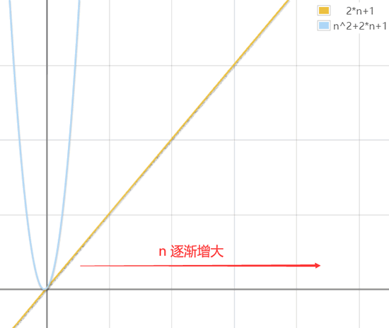

# knowledge points

## 一些数学基本知识

| 平均类型       | 概念描述                                                       | 数学定义                                                       | 应用场景（机器学习）                                       |
|----------------|----------------------------------------------------------------|----------------------------------------------------------------|-------------------------------------------------------------|
| 算术平均（Arithmetic Mean）| 所有数值的和除以数量，最常见的平均方式                         | $\bar{x} = \frac{1}{n} \sum_{i=1}^{n} x_i$                  | 特征归一化、损失函数计算（如 MSE）、权重平均等             |
| 几何平均（Geometric Mean）| 所有数值连乘后开 n 次方，适合处理比例、指数变化的数据            | $\bar{x}_g = \left( \prod_{i=1}^{n} x_i \right)^{1/n}$       | 模型融合（如 ensemble 中取 log 概率平均）、增长率分析     |
| 调和平均（Harmonic Mean） | 值的倒数平均的倒数，强调较小数值的影响                           | $\bar{x}_h = \frac{n}{\sum_{i=1}^{n} \frac{1}{x_i}}$         | F1 分数（调和平均 precision 和 recall）、速度平均等       |
| 加权平均（Weighted Mean）| 各值按权重加权求和，适合样本重要性不等的场景                     | $\bar{x}_w = \frac{\sum_{i=1}^{n} w_i x_i}{\sum_{i=1}^{n} w_i}$ | 梯度更新（如 AdaGrad）、注意力机制中的权重加权             |
| 移动平均（Moving Average）| 随时间滑动窗口计算的平均值，用于平滑时序数据                     | $\bar{x}_t = \frac{1}{k} \sum_{i=t-k+1}^{t} x_i$              | 学习率衰减（如 EMA）、时间序列预测、训练平滑等             |


### 调和平均的经典例子：平均速度问题

一个人走 2 公里，其中：

- 第 1 公里以 **60 km/h** 的速度行驶；
- 第 2 公里以 **20 km/h** 的速度行驶。

1. 问题：
他的 **平均速度** 是多少？

---

2. ❌ 错误做法（算术平均）：
$$
\text{平均速度} = \frac{60 + 20}{2} = 40 \text{ km/h}
$$
这种做法是错误的，因为每段花费的时间不同！

---

3. ✅ 正确做法（调和平均）：
   1. 第一步：计算每段所用时间
      - 第一段时间：$ t_1 = \frac{1}{60} $ 小时
      - 第二段时间：$ t_2 = \frac{1}{20} $ 小时
   2. 第二步：计算总时间
      $$
      t_{\text{总}} = \frac{1}{60} + \frac{1}{20} = \frac{1 + 3}{60} = \frac{4}{60} = \frac{1}{15} \text{ 小时}
      $$
   3. 第三步：计算平均速度（总路程 ÷ 总时间）
      $$
      v = \frac{2}{1/15} = 30 \text{ km/h}
      $$

---

4. ✅ 或者直接用调和平均公式：
   $$
   \text{调和平均} = \frac{2}{\frac{1}{60} + \frac{1}{20}} = \frac{2}{\frac{4}{60}} = \frac{2 \cdot 60}{4} = 30 \text{ km/h}
   $$

---

5. 结论：
> 当路程相同、速度不同的情况下，**平均速度应使用调和平均**，不能用算术平均。

## 一些经验

1. SQL中在当前查询语句中不能使用当前语句定义的需要输出结果列的别名。
2. 如果在pandas中使用正则，并且返回唯一的列。
   1. pandas在对一列使用正则时，可能会返回多列。
      ```python
      import re
      def extract_number(s):
         if not isinstance(s, str):
            return np.nan
         match = re.match(r'^(-?\d+)(?=\[)', s)  # 匹配 [ 前的负数/正数
         if match:
            return int(match.group(1))
         match = re.match(r'^-?\d+$', s)  # 整个字符串是负数/正数
         if match:
            return int(match.group(0))
         return np.nan
      ```
3. 在使用pandas进行数据预处理的时候一定先看一下列名和列的类型。


## 理论知识

### 大数据理论知识

大数据数据库和关系型数据库的区别在于CAP的选择不同。
大数据数据库为了满足实时性、大容量等在互联网时代对数据的要求，放弃了一致性。
而关系型数据库，为了高一致性和可用性，放弃了分区容忍性。

而多种大数据工具只是在不同性能需求的取舍中做出妥协的产物。详见NoSQL部分的内容。

#### 大数据基础概念

大数据是指规模超出传统数据库软件工具捕获、存储、管理和分析能力的数据集合。其核心价值在于通过对海里数据的分析挖掘，获取有价值的信息和知识，支持决策指定和业务优化。

1. 第一次信息化浪潮（1980年前后）
   标志：个人计算机（PC）的普及。
   解决的问题：信息处理。
   代表企业：Intel、AMD、IBM、苹果、微软、联想、戴尔、惠普等。
   主要内容：这一时期，个人计算机的出现使得计算机逐渐走入企业和家庭，极大地提高了社会生产力。个人计算机的普及标志着第一次信息化浪潮的到来。
2. 第二次信息化浪潮（1995年前后）
   标志：互联网的普及。
   解决的问题：信息传输。
   代表企业：雅虎、谷歌、阿里巴巴、百度、腾讯等。
   主要内容：互联网的普及将世界变成了“地球村”，人们可以自由地在信息海洋中遨游。这一时期，互联网的广泛应用催生了雅虎、谷歌、阿里巴巴、百度等互联网巨头，标志着第二次信息化浪潮的到来。
3. 第三次信息化浪潮（2010年前后）
   标志：大数据、云计算和物联网的快速发展。
   解决的问题：信息爆炸。
   代表企业：亚马逊、谷歌、IBM、VMware、Palantir、Hortonworks、Cloudera、阿里云等。
   主要内容：大数据、云计算和物联网的快速发展拉开了第三次信息化浪潮的大幕。这一时期，大数据时代的到来必将涌现出一批新的市场标杆企业，标志着第三次信息化浪潮的到来。

#### 大数据的特征

1. 4V特征体系
   1. volume 体量大。数据规模从TB级扩展到PB甚至ZB级。
   2. velocity 速度快。数据生成和流动速度极快，要求实时或者准实时处理。
   3. variety 类型多。包含结构化数据（数据库表格）、半结构化数据（JSON/XML）和非结构化数据（视频、社交媒体文本）等。
   4. value 价值密度第。海量数据中有价值的信息占比较低，需要通过挖掘技术提取。
2. 衍生特征
   1. 可变性 variability。数据含义可能随时间变化，如网络语义的演变。
   2. 可视化 visualization。复杂数据需要创新的展示方式。
   3. 有效性 validity。数据是否符合预期用途。

#### 应用场景
1. 商业领域
   1. 精准营销
   2. 供应链优化
2. 公共服务
   1. 指挥交通。
   2. 疫情监测。
3. 工业制造
   1. 预测性维护
   2. 质量优化
4. 金融科技
   1. 风险评估
   2. 反欺诈
5. 医疗健康
   1. 辅助诊断
   2. 药物研发

#### 大数据技术体系

核心是三篇google的论文。主要的知识点：
1. GFS google file system。主要解决大规模数据的存储问题。GFS通过将数据分割成多个块并存储在多台服务器，实现高容错性和可扩展性。
   1. HDFS：hadoop distributed file system, hadoop 分布式文件系统。是一种通过网络实现文件在多台主机上进行分布式存储的文件系统。
   2. 分布式文件系统的设计一般采用client/server 客户/服务器模式。
2. MapReduce：这篇论文阐述了google并行编程模型MapReduce，用于大规模数据集的并行计算。**MapReduce将复杂的计算过程抽象为两个函数：Map和Reduce，使得开发者可以轻松的在分布式系统上编写并行程序**。
3. BigTable。这篇论文主要介绍了google的分布式数据存储系统BigTable，用于处理海量结构化和半结构化数据。BigTable采用稀疏、分布、持续多维度的排序映射数组，具备高可靠性、高性能和可伸缩型。

##### BigTable和GFS的区别
1. 系统类型与定位
   - GFS（分布式文件系统）：
      GFS 是 底层分布式存储系统，属于大数据基础设施中的“存储层”。其核心目标是为海量数据（GB/TB 级）提供高可靠、可扩展的文件存储服务，解决传统分布式文件系统在超大规模数据下的容错、一致性和性能问题。
   - BigTable（分布式数据库）：
      BigTable 是 上层分布式数据管理系统，属于大数据基础设施中的“数据管理层”。其核心目标是基于 GFS 提供高效的 多维稀疏数据存储与访问，支持海量结构化/半结构化数据（PB 级）的随机读写，直接为上层应用（如搜索、地图、社交平台）提供数据服务。

2. 数据模型与存储方式
   - GFS：
     - 数据以 大文件 为单位存储，文件被分割为固定大小的块（通常 64MB），分散存储在集群的多个数据节点（Chunk Server）中。  
     - 采用主从架构（Master/Slave）：NameNode 管理文件元数据（如文件名、块位置），DataNode 存储实际数据块。  
     - 仅支持顺序读写（因块大小固定），不支持文件的随机修改（“一次写入、多次读取”模型）。
   - BigTable：
     - 数据模型为 多维稀疏排序映射表（Sparse Sorted Map），通过行键（Row Key）、列键（Column Key）和时间戳（Timestamp）三维索引定位数据。  
     - 采用列式存储：数据按列族（Column Family）划分，同一列族的数据存储在一起，支持高效压缩和批量读取。  
     - 支持随机读写：通过行键快速定位数据，支持单点更新和范围查询（如按行键扫描）。

3. 核心功能与依赖关系
   - GFS：
     - 核心功能是 文件存储与管理，提供高容错的分布式文件服务（如数据块冗余备份、故障节点自动恢复）。
     - 不直接处理数据计算或查询，仅为上层系统（如 MapReduce、BigTable）提供存储能力。

   - BigTable：
     - 核心功能是 结构化数据的高效存储与查询，支持海量数据的快速读写（如实时查询、批量分析）。
     - 依赖 GFS 作为底层存储（数据最终存储在 GFS 中），同时依赖 Chubby（分布式协同服务）管理元数据和故障恢复。

4. 设计目标与应用场景
   - GFS：
     - 设计目标：解决超大规模数据（GB/TB 级）的分布式存储问题，强调 容错性（硬件故障常态化）和 可扩展性（支持数千节点）。
     - 典型应用：作为 MapReduce 的输入/输出存储、日志文件存储、大数据处理的基础存储层。
   - BigTable：
     - 设计目标：解决海量结构化/半结构化数据（PB 级）的 高并发、低延迟访问 问题，支持灵活的动态扩展（横向扩展）。
     - 典型应用：谷歌内部搜索索引、地图数据、社交关系链、视频元数据等需要快速读写的场景。

5. 总结对比表

|维度|GFS|BigTable|
|---|---|---|
|系统类型|分布式文件系统（存储层）|         分布式数据库（数据管理层）|
|数据模型|大文件分块存储|多维稀疏排序映射表（行/列/时间戳）|
|核心功能|提供高容错的文件存储服务|提供高效的随机读写与结构化数据管理|
|读写特性|顺序读写为主，不支持随机修改|支持随机读写、范围查询|
|依赖关系|独立存储系统|依赖 GFS 作为底层存储|
|典型场景|大数据存储基础层（如 MapReduce 输入）|上层应用数据服务（如搜索、地图）|

关键结论
**GFS 是 BigTable 的 底层存储依赖，负责解决“数据如何存”的问题；而 BigTable 是 GFS 的 上层应用延伸，解决“数据如何高效用”的问题。二者分工明确，共同构成谷歌大数据处理的核心基础设施**。

##### HDFS

HDFS是GFS的开源实现。

1. HDFS默认块的大小是64MB。
2. 在分布式文件系统中，如果一个文件小于一个数据块的大小，它不会占用整个数据块的存储空间，而只是自己文件的大小。但是HDFS会将它作为一个块进行处理。
3. 分布式文件系统在物理结构上是有计算机集群中的多个节点构成的。分为两类：
   1. 主节点Master Node，或者称为名称节点 Name Node 。
      1. 作用：名称节点负责文件和目录的创建、删除和重命名等，同时管理着数据节点和文件块的映射关系，因此客户端只有访问名称节点才能找到请求的文件块所在的位置，进而到相应位置读取所需文件块。
   2. 从节点 Slave Node，或者被称为数据节点 Data Node 。
      1. 作用：数据节点负责数据的存储和读取，在存储时，由名称节点分配存储位置，然后由客户端把数据直接写入相应数据节点；在读取时，客户端从名称节点获得数据节点和文件块的映射关系，然后就可以到相应位置访问文件块。数据节点也要根据名称节点的命令创建、删除和复制数据块。
4. 计算机集群中的节点可能发生故障，因此为了保证数据的完整性，分布式文件系统通常采用多副本存储。文件块会被复制为多个副本，存储在不同的节点上，而且存储同一文件块的不同副本的各个节点会分布在不同的机架上。这样，**在单个节点出现故障时，就可以快速调用副本重启单个节点上的计算过程，而不用重启整个计算过程，整个机架出现故障时也不会丢失所有文件块**。文件块的大小和副本个数通常可以由用户指定。
5. 分布式文件系统的设计需求主要包括透明性、并发控制、文件复制、硬件和操作系统的异构性、可伸缩性、容错以及安全需求等。

HDFS主要实现的目标：
1. 兼容廉价的硬件设备。
2. 流数据读写。
3. 大数据集。
4. 简单的文件模型。HDFS 采用了“一次写入、多次读取”的简单文件模型，文件一旦完成写入，关闭后就无法再次写入，只能被读取。
5. 强大的跨平台兼容性。HDFS 是采用 Java 语言实现的，具有很好的跨平台兼容性，支持Java 虚拟机（Java Virtual Machine，JVM）的机器都可以运行 HDFS。

HDFS的局限性：
1. 不适合低延迟数据访问。**吞吐量高，但是延时大。** HBase适合对延时有要求的场景。
2. 无法高效存储大量小文件。
3. 支持多用户写入及任意修改文件。

读取文件的流程：
当客户端需要访问一个文件时，
1. 首先从名称节点获得组成这个文件的数据块的位置列表，
2. 然后根据位置列表获取实际存储各个数据块的数据节点的位置，
3. 最后数据节点根据数据块信息在本地 Linux 文件系统中找到对应的文件，并把数据返回给客户端。


##### master node/ name node

HDFS 中，名称节点负责管理分布式文件系统的命名空间（Namespace），保存了两个核心的数据结构:
1. FsImage 用于维护文件系统树以及文件树中所有的文件和文件夹的元数据.
2. 操作日志文件 EditLog 中记录了所有针对文件的创建、删除、重命名等操作。

名称节点记录了每个文件中各个块所在的数据节点的位置信息，**但是并不持久化地存储这些信息，而是在系统每次启动时扫描所有数据节点并重构**，得到这些信息。

##### slave node / data node
数据节点（DataNode）是分布式文件系统 HDFS 的工作节点，负责数据的存储和读取，会根据客户端或者名称节点的调度来进行数据的存储和检索，并且向名称节点定期发送自己所存储的块的列表信息。每个数据节点中的数据会被保存在各自节点的本地 Linux 文件系统中。


**HDFS 集群中只有唯一一个名称节点**，该节点负责所有元数据的管理，这种设计大大简化了分布式文件系统的结构，可以保证数据不会脱离名称节点的控制，同时，用户数据也永远不会经过名称节点，这大大减轻了中心服务器的负担，方便了数据管理。
后面Hadoop 2.0 为了提高可靠性，使用了HDFS HA技术，也就是名称节点的热备份（2个名称节点）。

HDFS集群中确实只有一个主要的名称节点（Primary NameNode），它负责管理文件系统的命名空间和客户端对文件的访问。第二名称节点（Secondary NameNode）并不是名称节点的备用节点，而是帮助主要名称节点管理元数据的辅助节点。**第二名称节点的主要功能是定期合并编辑日志（EditLog）和文件系统镜像（FsImage），以减少主要名称节点重启时的恢复时间**。因此，尽管有“第二名称节点”，HDFS集群中仍然只有一个主要的名称节点负责处理客户端的请求。

**HDFS 通信协议都是构建在 TCP/IP 基础之上的**。客户端通过一个可配置的端口向名称节点主动发起 TCP 连接，并使用客户端协议与名称节点进行交互。名称节点和数据节点之间则使用数据节点协议进行交互。客户端与数据节点的交互通过远程过程调用（Remote Procedure Call，RPC）来实现。在设计上，**名称节点不会主动发起 RPC，而是响应来自客户端和数据节点的 RPC请求**。

客户端是用户操作 HDFS 最常用的方式，HDFS 在部署时都提供了客户端。不过需要说明的是，严格来说，客户端并不算是 HDFS 的一部分。客户端可以支持打开、读取、写入等常见的操作，并且提供了类似 Shell 的命令行方式来访问 HDFS 中的数据。此外，HDFS也提供了 Java API，作为应用程序访问文件系统的客户端编程接口（。

##### HDFS 体系结构的局限性

HDFS 只设置唯一一个名称节点，这样做虽然大大简化了系统设计，但也带来了一些明显的局限性，具体如下。
1. 命名空间的限制。名称节点是保存在内存中的，因此名称节点能够容纳对象（文件、块）的个数会受到内存空间大小的限制。
2. 性能的瓶颈。整个分布式文件系统的吞吐量受限于单个名称节点的吞吐量。
3. 隔离问题。由于集群中只有一个名称节点，只有一个命名空间，因此无法对不同应用程序进行隔离。
4. 集群的可用性。一旦这个唯一的名称节点发生故障，会导致整个集群变得不可用。

##### HDFS 的存储原理

多副本存储的优势：
1. 加快数据传输速度。**当多个客户端需要同时访问同一个文件时，可以让各个客户端分别从不同的数据块副本中读取数据**，这就大大加快了数据传输速度。
2. 容易检查数据错误。HDFS 的数据节点之间通过网络传输数据，采用多个副本可以很容易判断数据传输是否出错。
3. 保证数据的可靠性。即使某个数据节点出现故障失效，也不会造成数据丢失。

##### 数据存取策略

1. HDFS 采用了以机架（Rack）为基础的数据存放策略。
2. **HDFS 默认的冗余复制因子是 3**，每一个文件块会被同时保存到 3 个地方，其中，有两个副本放在同一个机架的不同机器上面，第 3 个副本放在不同机架的机器上面，这样既可以保证机架发生异常时的数据恢复，也可以提高数据读写性能。
3. 优点：
   1. 首先，可以获得很高的数据可靠性，即使一个机架发生故障，位于其他机架上的数据副本仍然是可用的；
   2. 其次，可以在多个机架上并行读取数据，大大提高数据读取速度；最后，可以更容易地实现系统内部负载均衡和错误处理。
4. 缺点：那就是写入数据的时候不能充分利用同一机架内部机器之间的带宽。

##### 数据错误与恢复

1. 名称节点出错。Hadoop 采用两种机制来确保名称节点的安全
   1. 一是把名称节点上的元数据信息同步存储到其他文件系统，比如远程挂载的网络文件系统（Network File System，NFS）中；
   2. 二是运行一个第二名称节点，当名称节点死机以后，可以把运行第二名称节点作为一种弥补措施，利用第二名称节点中的元数据信息进行系统恢复。
2. 数据节点出错
   1. 每个数据节点会定期向名称节点发送“心跳”信息，向名称节点报告自己的状态。
   2. 每个数据节点会定期向名称节点发送“心跳”信息，向名称节点报告自己的状态。当数据节点发生故障，或者网络发生断网时，名称节点就无法收到来自一些数据节点的“心跳”信息，这时这些数据节点就会被标记为“死机”，节点上面的所有数据都会被标记为“不可读”，名称节点也不会再给它们发送任何 I/O 请求。这时，有可能出现一种情形，即由于一些数据节点的不可用，会导致一些数据块的副本数量小于冗余因子。名称节点会定期检查这种情况，一旦发现某个数据块的副本数量小于冗余因子，就会启动数据冗余复制，为它生成新的副本。
   3. HDFS 与其他分布式文件系统的最大区别就是可以调整冗余数据的位置。
3. 数据出错。网络传输和磁盘错误等因素都会造成数据错误。客户端在读取数据后，会采用 MD5 和 SHA-1对数据块进行校验，以确定读取正确的数据。在文件被创建时，客户端就会对每一个文件块进行信息摘录，并把这些信息写入同一个路径的隐藏文件里面。当客户端读取文件的时候，会先读取该信息文件，然后利用该信息文件对每个读取的数据块进行校验。如果校验出错，客户端就会请求到另外一个数据节点读取该文件块，并且向名称节点报告这个文件块有错误，名称节点会定期检查并且重新复制这个块。

##### HDFS 的数据读写过程

**实际是对上屏蔽了分布式文件存储细节，从而实现了类似桌面操作系统的上的文件读取。**

FileSystem 是一个通用文件系统的抽象基类，可以被分布式文件系统继承，所有可能使用 Hadoop 文件系统的代码都要使用到这个类。Hadoop 为 FileSystem 这个抽象类提供了多种具体的实现，DistributedFileSystem 就是 FileSystem 在 HDFS 中的实现。FileSystem 的 open()方法返回的是一个输入流 FSDataInputStream对象，在 HDFS 中具体的输入流就是 DFSInputStream；FileSystem 中的 create()方法返回的是一个输出流 FSDataOutputStream 对象，在 HDFS 中具体的输出流就是 DFSOutputStream。

数据写入时，不是通过客户端向多个数据节点发送数据的，而是客户端发给第一个节点，然后第一个节点发给第二个节点，第二个节点发给第三个节点。同时为了保证数据的准确性，第三个节点会向第二个节点发送确认包，第二个节点会向第一个节点发送确认包，然后第一个节点发给客户端进行确认。


##### Hadoop

具有以下几个方面的特性:
1. 高可靠性。
2. 高效性。
3. 高可扩展性。
4. 高容错性。
5. 成本低。Hadoop 采用廉价的计算机集群，成本比较低，普通用户也很容易用自己的 PC 搭建 Hadoop 运行环境。
6. 运行在 Linux 操作系统上。Hadoop 是基于 Java 开发的，可以较好地运行在 Linux 操作系统上。
7. 支持多种编程语言。Hadoop 上的应用程序也可以使用其他语言编写，如 C++。


|组件名称|理解|说明|
|---|---|---|
|HDFS|hadoop的GFS，存储非结构化数据|/|
|HBase|hadoop的bigtable，存储结构化数据|1. HBase 是一个提供高可靠性、高性能、可伸缩、实时读写、分布式的列式数据库，一般采用HDFS 作为其底层数据存储系统。</br>2. HBase 与传统关系数据库的一个重要区别是，前者采用基于列的存储，后者采用基于行的存储。</br> 3. HBase 是针对谷歌 BigTable 的开源实现，二者都采用了相同的数据模型，具有强大的非结构化数据存储能力。|
|Hadoop MapReduce|Hadoop的MapReduce，并行计算|1. Hadoop MapReduce 是针对谷歌 MapReduce 的开源实现。</br>2. MapReduce 是一种编程模型，用于大规模数据集（大于 1 TB）的并行运算，它将**复杂的、运行于大规模集群上的并行计算过程高度地抽象为两个函数 —Map 和 Reduce**，并且允许用户在不了解分布式系统底层细节的情况下开发并行应用程序，并将其运行于廉价的计算机集群上，完成海量数据的处理。</br>3. MapReduce 的核心思想就是“分而治之”，**它把输入的数据集切分为若干独立的数据块，分发给一个主节点管理下的各个分节点来共同并行完成；最后，通过整合各个节点的中间结果得到最终结果**。</br>|
|Hive|就是提供一个类似于SQL的对外访问工具|1. Hive 是一个基于 Hadoop 的数据仓库工具，可以用于对 Hadoop 文件中的数据集进行数据整理、特殊查询和分析存储。 </br> 2. Hive 的学习门槛较低，因为它提供了类似于关系数据库 SQL 的查询语言 —HiveQL，可以通过 HiveQL 语句快速实现简单的 MapReduce 任务，Hive 自身可以将HiveQL 语句转换为 MapReduce 任务运行，而不必开发专门的 MapReduce 应用，因而十分适合数据仓库的统计分析。|
|Pig |mapreduce的简单实现。更加接近结构查询语言的接口。|是一种数据流语言和运行环境，适合于使用 Hadoop 和 MapReduce 平台来查询大型半结构化数据集。|
|ZooKeeper|协同工作系统|是针对谷歌 Chubby 的一个开源实现，是高效和可靠的协同工作系统，提供分布式锁之类的基本服务（如统一命名服务、状态同步服务、集群管理、分布式应用配置项的管理等），用于构建分布式应用，减轻分布式应用程序所承担的协调任务。|
|Flume|日志系统|是 Cloudera 提供的一个高可用的、高可靠的、分布式的海量日志采集、聚合和传输的系统。|
|Ambari |安装hadoop几乎所有组件的工具|是一种基于 Web 的工具，支持 Apache Hadoop 集群的安装、部署、配置和管理。|
|Mahout|hadoop中的数据挖掘工具，集成了多种机器学习算法。|提供一些可扩展的机器学习领域经典算法的实现，旨在帮助开发人员更加方便快捷地创建智能应用程序。|
|Sqoop|和关系数据库之间的转化工具。|Sqoop 是 SQL-to-Hadoop 的缩写，主要用来在 Hadoop 和关系数据库之间交换数据，可以改进数据的互操作性。通过 Sqoop 可以方便地将数据从 MySQL、Oracle、PostgreSQL 等关系数据库中导入 Hadoop（可以导入 HDFS、HBase 或 Hive），或者将数据从 Hadoop 导出到关系数据库，使传统关系数据库和 Hadoop 之间的数据迁移变得非常方便。|
|YARN, Yet Another ResourceNegotiator|资源调度工具（完成3个功能资源管理、任务调度和任务监控）|YARN 包 括 ResourceManager 、 ApplicationMaster 和 NodeManager ， 其中 ， 由ResourceManager 负责资源管理，由 ApplicationMaster 负责任务调度和监控，由 NodeManager 负责执行原 TaskTracker 的任务。|
|HDFS HA, High Availability||在一个典型的 HA 集群中，一般设置两个名称节点，其中一个名称节点处于“活跃”（Active）状态，另一个处于“待命”（Standby）状态。两个名称节点需要实时同步。两种名称节点的状态同步，可以借助于一个共享存储系统来实现，比如网络文件系统（Network File System，NFS）、仲裁日志管理器（Quorum Journal Manager，QJM）或者ZooKeeper。活跃名称节点将更新数据写入共享存储系统，待命名称节点会一直监听该系统，一旦发现有新的写入，就立即从公共存储系统中读取这些数据并加载到自己的内存中，从而保证与活跃名称节点状态完全同步。|
|kafka |最初作为实时批量处理工具。后来发展称为数据交换中心，作为HDFS的缓存。|Kafka 可以同时满足在线实时处理和批量离线处理。Kafka 作为数据交换枢纽，不同类型的分布式系统（如关系数据库、NoSQL 数据库、流处理系统、批处理系统等）可以统一接入 Kafka，从而实现和Hadoop 各个组件之间的不同类型数据的实时高效交换。Kafka 是由 LinkedIn 开发的一种高吞吐量的分布式发布/订阅消息系统，用户通过 Kafka 系统可以发布大量的消息，同时能实时订阅消费消息。Kafka 设计的初衷是构建一个可以处理海量日志、用户行为和网站运营统计等的数据处理框架。|
||||


在 Hadoop 1.0 中，其核心子项目 MapReduce 1.0 既是一个计算框架，也是一个资源管理调度框架。到了 Hadoop 2.0 以后，MapReduce 1.0 中的资源管理调度功能被单独分离出来形成了 YARN，它是一个纯粹的资源管理调度框架，而不是一个计算框架；而被剥离了资源管理调度功能的MapReduce 框架就变成了 MapReduce 2.0，它是运行在 YARN 之上的一个纯粹的计算框架，不再自己负责资源调度管理服务，而是由 YARN 为其提供资源管理调度服务。


##### hadoop的改进

HDFS联邦可以解决以下问题：
1. 可扩展性问题：HDFS联邦通过设计多个相互独立的名称节点，使得HDFS的命名服务能够横向扩展。这些名称节点分别进行各自命名空间和块的管理，相互之间是联邦关系，不需要彼此协调。这种设计方式使得HDFS集群可以扩展到更多节点，不再受限于单个名称节点的内存空间。
2. 系统整体性能问题：在HDFS联邦中，多个名称节点管理不同的数据，且同时对外提供服务，从而为用户提供更高的读写吞吐率。相比之下，HDFS 1.0中的单名称节点设计会限制系统的整体性能。
3. 隔离性问题：HDFS联邦允许用户根据需要将不同业务数据交由不同名称节点管理，这样不同业务之间的影响很小。而在HDFS 1.0中，单个名称节点难以提供不同程序之间的隔离性，一个程序可能会影响其他程序的运行。
需要注意的是，HDFS联邦并不能解决单点故障问题。每个名称节点都存在单点故障问题，需要为每个名称节点部署一个后备名称节点，以应对名称节点死机后对业务产生的影响。


##### mapreduce

**Map 和 Reduce 函数都是以<key, value>作为输入，按一定的映射规则将其转换成另一个或一批<key, value>进行输出**。

|函数 |输入 |输出 |说明|
|---|---|---|---|
|Map |$<k_1 ,v_1>$| $List(<k_2,v_2 >)$|1. 将小数据集进一步解析成一批对，输入 Map 函数中进行处理 <br/> 2. 每一个输入的<k1,v1 >会输出一批<k2 ,v2>，<k2,v2>是计算的中间结果|
|Reduce |$<k_2,List(v_2)> $|$<k_3,v_3>$ |输入的中间结果<k2,List(v2)>中的 List(v2)表示一批属于同一个 k2 的value|

Map 函数的输入来自分布式文件系统的文件块，这些文件块的格式是任意的，可以是文档格式，也可以是二进制格式。
Reduce 函数的任务就是将输入的一系列具有相同键的键值对以某种方式组合起来，输出处理后的键值对，输出结果会合并成一个文件。

##### HBase

> 总结：HBase可以理解为为了快速定义的键值对存储数据库。它的为了方便快速查找，键由四个部分组成，值对应于一个cell中的内容。
> 普通关系型数据库使用行号和列号来定义一个cell，但是HBase使用了4个维度的键来定义为一个cell，加快的查询速度。
> HBase按列存储，而且把列分为了2个维度，不同的列进行了分类，方便快速查找。
> HBase的应用场景是数据不会经常变动的情况下，比如对历史数据进行分析、地理数据查询等。如果是实时交易系统则不适合使用HBase，因为需要修改一个cell中的值依然需要知道明确的行名和列名，同时执行连接操作时需要昂贵的元组重构代价。

HBase 是针对谷歌 BigTable 的开源实现，是一个**高可靠、高性能、面向列、可伸缩的分布式数据库，主要用来存储非结构化和半结构化的松散数据**。

Hadoop 生态系统中 HBase 与其他部分的关系。HBase 利用 Hadoop MapReduce来处理 HBase 中的海量数据，实现高性能计算；利用 ZooKeeper 作为协同服务，实现稳定服务和失败恢复；使用 HDFS 作为高可靠的底层存储，利用廉价集群提供海量数据存储能力。当然，HBase也可以直接使用本地文件系统而不用 HDFS 作为底层数据存储方式。不过，为了提高数据可靠性和系统的健壮性，发挥 HBase 处理大数据量等功能，一般都使用 HDFS 作为 HBase 的底层数据存储系统。此外，为了方便在 HBase 上进行数据处理，Sqoop 为 HBase 提供了高效、便捷的关系数据库管理系统（Relational DataBase Management System，RDBMS）数据导入功能，Pig 和 Hive为 HBase 提供了高层语言支持。


HBase 实际上就是一个稀疏、多维、持久化存储的映射表，它采用**行键（Row Key）、列族（Column Family）、列限定符（Column Qualifier）和时间戳（Timestamp）进行索引，每个值都是未经解释的字节数组 byte[]**。


下面以一个实例来阐释 HBase 的数据模型。图 4-2 是一张用来存储学生信息的 HBase 表，学号作为行键来唯一标识每个学生，表中设计了列族 Info 来保存学生相关信息，列族 Info 中包含 3个列 —name、major 和 email，分别用来保存学生的姓名、专业和电子邮件信息。学号为“ 201505003”的学生存在两个版本的电子邮件地址，时间戳分别为 ts1=1174184619081 和ts2=1174184620720，时间戳较大的版本的数据是最新的数据。


HBase 使用坐标来定位表中的数据，也就是说，每个值都通过坐标来访问。对于我们熟悉的关系数据库而言，数据定位可以理解为采用“二维坐标”，即根据行和列就可以确定表中一个具体的值。但是，HBase 中需要根据行键、列族、列限定符和时间戳来确定一个单元格，因此可以视为一个“四维坐标”，即［"行键", "列族", "列限定符", "时间戳"］。例如，在图 4-2 中，由行键“201505003”、列族“Info”、列限定符“email”和时间戳“ 1174184619081 ”（ ts1 ） 这 4 个 坐 标 值 确 定 的 单 元 格 ["201505003", "Info", "email","1174184619081"]，里面存储的值是“xie@qq.com”；由行键“201505003”、列族“Info”、列限定符“email”和时间戳“1174184620720”（ts2）这 4 个坐标值确定的单元格["201505003", "Info", "email","1174184620720"]，里面存储的值是“you@163.com”。如果把所有坐标看成一个整体，视为“键”，把四维坐标对应的单元格中的数据视为“值”，那么，HBase 可以看成一个键值数据库（见下表3）。

HBase 可以被视为一个键值数据库
|键|值|
|---|---
|["201505003", "Info", "email", "1174184619081"] |"xie@qq.com"|
|["201505003", "Info", "email", "1174184620720"] |"you@163.com"|

行键是一个反向URL（ 如com.baidu.www），之所以这样存放，是因为 HBase 是按照行键的字典序来排序存储数据的，采用反向 URL 的方式，可以让来自同一个网站的数据内容都保存在相邻的位置，在按照行键的值进行水平分区时，就可以尽量把来自同一个网站的数据划分到同一个分区（Region）中。

**在一个 HBase 表的概念视图中，每个行都包含相同的列族，尽管行不需要在每个列族里存储数据。**
专有名词：行存储模型（N-ary Storage Model，NSM）,列存储模型（Decomposition Storage Model，DSM）。

##### storm

1. storm的设计思想
Storm 对一些设计思想进行了抽象化，其主要术语包括 Streams、Spouts、Bolts、Topology 和 Stream Groupings。

|主要术语|说明|
|---|---|
|streams|在 Storm 对流数据 Streams 的抽象描述中，流数据是一个无限的 Tuple 序列（Tuple 即元组，是元素的有序列表，每一个 Tuple 就是一个值列表，列表中的每个值都有一个名称，并且该值可以是基本类型、字符类型、字节数组等，也可以是其他可序列化的类型）。这些Tuple 序列会以分布式并行地创建和处理。|
|spouts|Storm 认为每个 Stream 都有一个源头，并把这个源头抽象为 Spouts。Spouts 会从外部读取流数据并持续发出 Tuple。|
|bolts|Storm 将 Streams 的状态转换过程抽象为 Bolts。Bolts 既可以处理 Tuple，也可以将处理后的 Tuple 作为新的 Streams 发送给其他 Bolts。对 Tuple 的处理逻辑都被封装在 Bolts中，可执行过滤、聚合、查询等操作。|
|topology|Storm 将 Spouts 和 Bolts 组成的网络抽象成 Topology，如图 11-12 所示。Topology 是 Storm 中最高层次的抽象概念，它可以被提交到 Storm 集群执行。一个 Topology 就是一个流转换图，图中节点是一个 Spout 或 Bolt，图中的边则表示 Bolt 订阅了哪个 Stream。当 Spout 或者 Bolt 发送元组时，它会把元组发送到每个订阅了该 Stream 的 Bolt 上进行处理。Storm 中的 Topology 定义仅是一些 Thrift 结构体（Thrift 是基于二进制的高性能的通信中间件），而 Thrift 支持各种编程语言进行定义，这样一来就可以使用各种编程语言来创建、提交 Topology。|
|stream groupings|（1）ShuffleGrouping：随机分组，随机分发 Stream 中的 Tuple，保证每个 Bolt 的 Task 接收Tuple 数量大致一致。<br> （2）FieldsGrouping：按照字段分组，保证相同字段的 Tuple 分配到同一个 Task 中。<br> （3）AllGrouping：广播发送，每一个 Task 都会收到所有的 Tuple。<br>（4）GlobalGrouping：全局分组，所有的 Tuple 都发送到同一个 Task 中。 <br> （5）NonGrouping：不分组，和 ShuffleGrouping 类似，当前 Task 的执行会和它的被订阅者在同一个线程中执行。<br> （6）DirectGrouping：直接分组，直接指定由某个 Task 来执行 Tuple 的处理。<br> |

##### flink

Flink 核心组件栈分为三层：物理部署层、Runtime 核心层和 API&Libraries 层。
1. 物理部署层。Flink 的底层是物理部署层。Flink 可以采用 Local 模式运行，启动单个 JVM，也可以采用 Standalone 集群模式运行，还可以采用 YARN 集群模式运行，或者也可以运行在谷歌云服务（GCE）和亚马逊云服务（EC2）上。
2. Runtime 核心层。该层主要负责对上层不同接口提供基础服务，也是 Flink 分布式计算框架的核心实现层。该层提供了两套核心的 API：流处理（DataStream API）和批处理（DataSet API）。
3. API&Libraries 层。作为分布式数据库处理框架，Flink 提供了支撑流计算和批计算的接口，同时，在此基础上抽象出不同的应用类型的组件库，如 CEP（基于流处理的复杂事件处理库）、SQL&Table 库（既可以基于流处理，也可以基于批处理）、FlinkML（基于批处理的机器学习库）、Gelly（基于批处理的图计算库）等。

Flink 体系架构主要由两个组件组成，分别为 JobManager 和 TaskManager，Flink 体系架构也遵循 Master/Slave 架构设计原则，JobManager 为 Master 节点，TaskManager 为Slave 节点。

flink的优势
1. 同时支持高吞吐、低延迟、高性能。
2. 同时支持流处理和批处理。
3. 高度灵活的流式窗口。
4. 支持有状态计算。
5. 具有良好的容错性。
6. 具有独立的内存管理。
7. 支持迭代和增量迭代。


#### NoSQL

> nosql实际上是为了应对对ACID不敏感的场景（这些场景伴随这互联网的发展而出现的）而产生的数据库。从而可以在ACID的方面做出让步，在可扩展性、存储的多样性、更高的速度上进行极大的增强。并不能说NoSQL比SQL要更先进，而只是关注的侧重点不一样。

not only SQL.

NoSQL 的三大基石包括 CAP、BASE 和最终一致性。


| 对比指标       | NoSQL                                                                 | 关系数据库                                                                 | 备注                                                                 |
|----------------|-----------------------------------------------------------------------|--------------------------------------------------------------------------|----------------------------------------------------------------------|
| 数据库原理     | 部分支持                                                              | 完全支持                                                                 | 关系数据库有关系代数理论作为基础。NoSQL没有统一的理论基础              |
| 数据规模       | 超大                                                                  | 大                                                                       | 关系数据库很难实现横向扩展，纵向扩展的空间也比较有限，性能会随着数据规模的增大而降低。NoSQL可以很容易通过添加更多设备来支持更大规模的数据 |
| 数据库模式     | 灵活                                                                  | 固定                                                                     | 关系数据库需要定义数据库模式，严格遵守数据定义和相关约束条件。NoSQL不存在数据库模式，可以自由、灵活地定义并存储各种不同类型的数据 |
| 查询效率       | 可以实现高效的简单查询，但不具备高度结构化查询等特性，复杂查询的性能不尽如人意 | 快                                                                       | 关系数据库借助于索引机制可以实现快速查询（包括记录查询和范围查询）。很多NoSQL数据库没有面向复杂查询的索引，虽然NoSQL可以使用MapReduce来加速查询，但是在复杂查询方面的性能仍然不如关系数据库 |
| 一致性         | 弱一致性                                                              | 强一致性                                                                 | 关系数据库严格遵守事务ACID模型，可以保证事务强一致性。很多NoSQL数据库放松了对事务ACID四性的要求，而是遵守BASE模型，只能保证最终一致性 |
| 数据完整性     | 很难实现                                                              | 容易实现                                                                 | 任何一个关系数据库都可以很容易实现数据完整性，如通过主键或者非空约束来实现实体完整性，通过主键、外键来实现参照完整性，通过约束或者触发器来实现用户自定义完整性，但是在NoSQL数据库无法实现 |
| 扩展性         | 好                                                                    | 一般                                                                     | 关系数据库很难实现横向扩展，纵向扩展的空间也比较有限。NoSQL在设计之初就充分考虑了横向扩展的需求，可以通过添加廉价设备实现扩展 |
| 可用性         | 很好                                                                  | 好                                                                       | 关系数据库在任何时候都以保证数据一致性为优先目标，其次才是优化系统性能。随着数据规模的增大，关系数据库为了保证严格的一致性，只能提供相对较弱的可用性。大多数NoSQL都能提供较高的可用性 |
| 标准化         | 否                                                                    | 是                                                                       | 关系数据库已经标准化（SQL）。NoSQL还没有行业标准，不同的NoSQL数据库有不同的查询语言，很难规范应用程序接口 |
| 技术支持       | 低                                                                    | 高                                                                       | 关系数据库经过几十年的发展，已经非常成熟，Oracle等大型厂商都可以提供很好的技术支持。NoSQL在技术支持方面仍然处于起步阶段，还不成熟，缺乏有力的技术支持 |
| 可维护性       | 复杂                                                                  | 复杂                                                                     | 关系数据库需要专门的数据库管理员（DBA）维护。NoSQL数据库虽然没有关系数据库复杂，但难以维护 |

典型的 NoSQL 数据库通常包括键值数据库、列族数据库、文档数据库和图数据库。

ACID约束：
1. 原子性（Atomicity）：当用户A向用户B转账100元时，扣减用户A账户余额和增加用户B账户余额这两个操作要么同时成功，要么同时失败。如果其中一个操作失败，整个转账事务将被回滚，两个账户的余额都不会发生变化。
2. 一致性（Consistency）：在转账前后，数据库必须保证账户余额的总和不变，且每个账户的余额都必须满足非负数的约束。
3. 隔离性（Isolation）：如果有两个并发的转账操作，隔离性确保这两个操作不会互相干扰，每个转账操作在执行时仿佛是独立的，不会出现数据混乱的情况。
4. 持久性（Durability）：一旦转账事务提交，账户余额的更改将永久保存在数据库中，即使系统崩溃或断电，这些更改也不会丢失。

##### CAP

CAP 理论告诉我们，一个分布式系统不可能同时满足一致性、可用性和分区容忍性这 3 个特性，最多只能同时满足其中 2 个，正所谓“鱼和熊掌不可兼得”。如果追求一致性，就要牺牲可用性，需要处理因为系统不可用而导致的写操作失败的情况；如果要追求可用性，就要预估到可能发生数据不一致的情况，比如系统的读操作可能不能精确地读取写操作写入的最新值。


- C（Consistency）：一致性。它是指任何一个读操作总是能够读到之前完成的写操作的结果，也就是在分布式环境中，多点的数据是一致的。
- A（Availability）：可用性。它是指快速获取数据，且在确定的时间内返回操作结果。
- P（Tolerance of Network Partition）：分区容忍性。它是指当出现网络分区的情况时（即系统中的一部分节点无法和其他节点进行通信），分离的系统也能够正常运行。

##### BASE, Basically availble、Soft-state、Eventual consistency

关系数据库系统中设计了复杂的事务管理机制来保证事务在执行过程中严格满足 ACID 四性要求。关系数据库的事务管理机制较好地满足了银行等领域对数据一致性的要求，因此得到了广泛的商业应用。但是，NoSQL 数据库通常应用于 Web 2.0 网站等场景中，对数据一致性的要求并不是很高，而是强调系统的高可用性，因此为了获得系统的高可用性，可以考虑适当牺牲一致性或分区容忍性。BASE 的基本思想就是在这个基础上发展起来的，它完全不同于 ACID 模型，BASE牺牲了高一致性，从而获得可用性或可靠性，Cassandra 系统就是一个很好的实例。有意思的是，单从名字上就可以看出二者有点“水火不容”，BASE 的英文意义是碱，而 ACID 的英文含义是酸。
**BASE 的基本含义是基本可用（Basically Available）、软状态（Soft-state）和最终一致性（Eventual consistency）** 。

1. 基本可用
   基本可用是指一个分布式系统的一部分发生问题变得不可用时，其他部分仍然可以正常使用，也就是允许分区失败的情形出现。
2. 软状态
   “软状态”（Soft-state）是与“硬状态（Hard-state）”相对应的一种提法。数据库保存的数据是“硬状态”时，可以保证数据一致性，即保证数据一直是正确的。**“软状态”是指状态可以有一段时间不同步，具有一定的滞后性**。
3. 最终一致性
   一致性的类型包括强一致性和弱一致性，二者的主要区别在于在高并发的数据访问操作下，后续操作是否能够获取最新的数据。对于强一致性而言，当执行完一次更新操作后，后续的其他读操作就可以保证读到更新后的最新数据；反之，如果不能保证后续访问读到的都是更新后的最新数据，那么就是弱一致性。而**最终一致性只不过是弱一致性的一种特例，允许后续的访问操作可以暂时读不到更新后的数据，但是经过一段时间之后，用户必须读到更新后的数据**。最终一致性也是 ACID 的最终目的，只要最终数据是一致的就可以了，而不是每时每刻都保持实时一致。

#### Lambda 架构概述

Lambda 架构由 Nathan Marz 提出，旨在通过分层的方式解决大数据系统中批处理和流处理的难题。其核心思想是将数据处理分为三个主要层次：

1. 批处理层（Batch Layer）。负责对历史数据进行批量存储和处理，生成完整的数据视图，确保数据的准确性和一致性。
2. 实时层（Speed Layer）。处理最新到达的数据，以低延迟的方式提供实时数据视图，弥补批处理的延迟缺陷。
3. 服务层（Serving Layer）。将批处理层和实时层生成的结果统一为一个查询接口，向用户提供最终的查询服务。

Lambda 架构的设计目标是通过容错性、扩展性和灵活性应对大数据处理的挑战，同时兼顾数据的实时性和一致性。

##### Lambda 架构的实现
1. 数据采集：数据通过多种渠道采集进入系统，包括日志、传感器数据、用户行为记录等。典型工具包括 Apache、Kafka 和 Flume，用于保证数据传输的高吞吐量和可靠性。
2. 批处理层：批处理层使用分布式计算框架对全量数据进行存储和计算。
   1. 存储技术：如 HDFS 或 Amazon S3，用于存储历史数据。
   2. 计算框架：如 Apache Hadoop 或 Spark，对数据进行批量计算，生成不可变的结果视图。
3. 实时处理层：实时层采用流式计算框架，如 Apache Storm、Flink 或 Spark Streaming，处理新产生的数据，快速提供增量视图。
4. 服务层：服务层的核心是将批处理和实时处理结果合并，提供统一的查询接口。通常使用 NoSQL 数据库（如 Cassandra 或 HBase）存储结果，并结合搜索引擎（如 Elasticsearch）优化查询效率。

##### Lambda 架构的优点
1. 容错性强：批处理层对全量数据的处理可以保证系统的最终一致性，容错性良好。即使实时层出现故障，也不会影响最终结果。
2. 实时性与准确性的平衡：通过实时层快速提供低延迟的增量数据视图，同时由批处理层提供高精度的全量数据视图。
3. 可扩展性好：Lambda 架构使用分布式技术，能够水平扩展以处理海量数据。
4. 灵活性高：系统可以根据不同的业务需求，调整批处理与实时处理的比例，适应多样化场景。

##### Lambda 架构的缺点
1. 复杂性高：系统需要维护两套数据处理管道（批处理与实时处理），开发和运维成本较高。
2. 数据一致性挑战：批处理层和实时层可能存在一定的延迟差异，造成查询结果的不一致性，需通过复杂的合并逻辑解决。
3. 实时性与资源成本的权衡：实时层需要高性能计算资源以满足低延迟需求，增加了系统的资源开销。

##### Lambda 架构的实际应用
1. 电商推荐系统：在电商场景中，Lambda 架构被广泛用于个性化推荐。
   1. 批处理层通过分析历史购买数据，生成用户的长期偏好模型。
   2. 实时层基于用户的实时浏览行为，更新短期兴趣模型。
   3. 服务层将长期和短期模型结合，为用户提供实时精准的推荐结果。
2. 网络安全监控：在网络安全领域，Lambda 架构用于异常检测和攻击预警。
   1. 批处理层分析历史日志，识别潜在威胁模式。
   2. 实时层监控最新网络流量，快速捕捉异常行为。
   3. 服务层统一展示分析结果，为安全人员提供决策支持。
3. 智能交通系统：智能交通系统中，Lambda 架构用于交通流量分析和信号优化。
   1. 批处理层对历史交通数据进行分析，提供长期的交通流量趋势。
   2. 实时层对传感器数据进行流处理，调整信号灯时间，缓解交通拥堵。
##### Lambda 架构的优化方向
1. 结合 Kappa 架构：Kappa 架构以流处理为核心，可以简化系统复杂度。在某些场景下，可采用 Kappa 架构替代传统 Lambda 架构。
2. 引入统一存储：使用如 Apache Hudi、Delta Lake 等技术，实现批处理与流处理的数据统一存储，降低开发和维护成本。
3. 实时层的资源优化：通过动态调整计算资源分配，降低实时层的资源开销，同时满足低延迟需求。

##### 总结
Lambda 架构以其兼顾实时性与准确性的设计理念，成为大数据领域的重要解决方案。在实际应用中，架构师需要根据业务场景灵活调整架构设计，权衡复杂性与性能需求。随着大数据技术的不断发展，Lambda 架构在引入更多先进技术后，将继续为各行业的数据处理需求提供有力支持。


#### spark

spark和hadoop类似的大数据平台。Spark 可以作为一个更加快速、高效的大数据计算框架。

Spark 专注于数据的处理分析，而数据的存储还是要借助于 Hadoop 分布式文件系统 HDFS、Amazon S3 等来实现。

spark的特点：
1. 运行速度快。Spark 使用先进的有向无环图（Directed Acyclic Graph，DAG）执行引擎，以支持循环数据流与内存计算，基于内存的执行速度可比 Hadoop MapReduce 快上百倍，基于磁盘的执行速度也能快十倍左右。
2. 容易使用。Spark 支持使用 Scala、Java、Python 和 R 语言进行编程，简洁的 API 设计有助于用户轻松构建并行程序，并且可以通过 Spark Shell 进行交互式编程。
3. 通用性。Spark 提供了完整而强大的技术栈，包括 SQL 查询、流式计算、机器学习和图算法组件，这些组件可以无缝整合在同一个应用中，足以应对复杂的计算。
4. 运行模式多样。Spark 可运行于独立的集群模式中，或者运行于 Hadoop 中，也可运行于Amazon EC2 等云环境中，并且可以访问 HDFS、Cassandra、HBase、Hive 等多种数据源。

spark相比于hadoop的优势：**最主要的是提供了内存计算，在中间计算过程中提高了运算速度。**
1. 提高表达能力。Spark 的计算模式也属于 MapReduce，但不局限于 Map 和 Reduce 操作，还提供了多种数据集操作类型，编程模型比 MapReduce 更灵活。
2. 使用内存计算。Spark 提供了内存计算，中间结果直接放到内存中，带来了更高的迭代运算效率。
3. Spark 基于 DAG 的任务调度执行机制，要优于 MapReduce 的迭代执行机制。

> 在实际应用中，大数据处理主要包括以下 3 个类型。
>    1. 复杂的批量数据处理：时间跨度通常在数十分钟到数小时。
>    2. 基于历史数据的交互式查询：时间跨度通常在数十秒到数分钟。
>    3. 基于实时数据流的数据处理：时间跨度通常在数百毫秒到数秒。
>    目前，已有很多相对成熟的开源软件用于处理以上 3 种情景。比如可以利用 Hadoop MapReduce 来进行批量数据处理，可以用 Impala 来进行交互式查询（Impala 与 Hive 相似，但底   层引擎不同，提供了实时交互式 SQL 查询），对于流式数据处理可以采用开源流计算框架 Storm。   一些企业可能只会涉及其中部分应用场景，只需部署相应软件即可满足业务需求。但是对于互联网公司而言，通常会同时存在以上 3 种场景，就需要同时部署 3 种不同的软件。这样做难免会带来一些问题。
>   1. 不同场景之间输入输出数据无法做到无缝共享，通常需要进行数据格式的转换。
>   2. 不同的软件需要不同的开发和维护团队，带来了较高的使用成本。
>   3. 比较难以对同一个集群中的各个系统进行统一的资源协调和分配。

Spark 的设计遵循“一个软件栈满足不同应用场景”的理念，逐渐形成了一套完整的生态系统，既能够提供内存计算框架，也可以支持 SQL 即席查询、实时流式计算、机器学习和图计算等。Spark 可以部署在资源管理器 YARN 之上，提供一站式的大数据解决方案。因此，Spark 所提供的生态系统足以应对上述 3 种场景，即同时支持批处理、交互式查询和流数据处理。

Spark 生态系统主要包含了 Spark Core、Spark SQL、Spark Streaming、Structured Streaming、MLlib 和 GraphX 等组件

Spark 相对 Hadoop 具有较大优势，**但 Spark 并不能完全替代 Hadoop，其主要用于替代Hadoop 中的 MapReduce 计算模型**。实际上，Spark 已经很好地融入了 Hadoop 生态系统，并成为其中的重要一员，它可以借助于 YARN 实现资源调度管理，借助于 HDFS 实现分布式存储。此外，Hadoop 可以使用廉价的、异构的机器来做分布式存储与计算，但是 Spark 对硬件（内存、CPU 等）的要求稍高一些。

Spark 支持 5 种不同类型的部署方式，包括 Local、Standalone、Spark on Mesos、Spark on YARN 和 Spark on Kubernetes。

一个 RDD 就是一个分布式对象集合，本质上是一个只读的分区记录集合。RDD的英文全称是Resilient Distributed Dataset，即弹性分布式数据集。

RDD 提供了一组丰富的操作以支持常见的数据运算，分为“行动”（Action）和“转换”（Transformation）两种类型，前者用于执行计算并指定输出的形式，后者指定 RDD 之间的相互依赖关系。两类操作的主要区别是，**转换操作（如 map、filter、groupBy、join 等）接受RDD 并返回 RDD，而行动操作（如 count、collect 等）接受 RDD 但是返回非 RDD（即输出一个值或结果）**。

RDD 中不同的操作，会使得不同 RDD 分区之间会产生不同的依赖关系。DAG 调度器根据RDD 之间的依赖关系，把 DAG 划分成若干个阶段。**RDD 中的依赖关系分为窄依赖（NarrowDependency）与宽依赖（Wide Dependency），二者的主要区别在于是否包含 Shuffle 操作**。

1. 窄依赖表现为一个父 RDD 的分区对应于一个子 RDD 的分区，或多个父 RDD 的分区对应于一个子 RDD 的分区。
2. 宽依赖则表现为存在一个父 RDD 的一个分区对应一个子 RDD 的多个分区。


#### (简单)Elasticsearch
Hadoop是一个大数据的完整框架。

Elasticsearch是一个搜索引擎。

Hadoop和Elasticsearch的区别:
1. Hadoop： Hadoop是一个框架，允许使用简单的编程模型在几秒钟内跨计算机集群分析大量分布式数据及其处理。它旨在将单个服务器扩展到多台机器，每台机器都提供本地计算和存储。
2. Easticsearch： Easticsearch是一个“开源、分布式、RESTful 搜索引擎”。它是一种分析引擎，能够近乎实时地存储和搜索大量数据。Elasticsearch、Kibana、Beats 和 Logstash 是 Elastic Stack(有时称为 ELK Stack)。

下表列出了 Hadoop 和 Elasticsearch 之间的差异：
|编号	|Easticsearch	|Hadoop|
|---|---|---|
|1	|Easticsearch是一个开源、分布式、RESTful 搜索引擎	|Hadoop是一个用于可靠、可扩展、分布式计算的开源软件|
|2	|Easticsearch主要用作搜索引擎	|用于分析大量数据|
|3	|基于 REST 架构提供 API 端点以通过 HTTP 执行 CRUD 操作。	|遵循主从架构，使用 HDFS 和 MapReduce 编程存储和处理数据。|
|4	|提供基于 JSON 的全查询 DSL	|Hadoop使用 MapReduce 编程模型处理庞大的数据集群。|
|5	|全文搜索引擎，但也可以用作分析框架。	|用作在集群上存储数据和运行应用程序的工具。|
|6	|支持所有具有Java VM 的操作系统	|支持Linux、Unix 和Windows。|
|7	|SQL类查询语言	|使用 Hive 进行查询处理|
|8	|在搜索之上进行分析。	|用于在分布式环境中进行数据转换和准备数据的丰富 API，没有内存问题。|


1. Elasticsearch 概述
Elasticsearch 是一个基于 Lucene 构建的开源、分布式、RESTful **搜索引擎**。它提供了一个**分布式多用户能力的全文搜索引擎**，基于 HTTP Web 接口和无模式 JSON 文档。Elasticsearch 是用 Java 开发的，并作为 Apache 许可条款下的开源软件发布。

2. 主要特点
   Elasticsearch 具有以下主要特点：
   1. 分布式架构
   2. 高可用性
   3. 多租户支持
   4. 实时搜索
   5. 面向文档
   6. 丰富的查询语言
   7. 自动分片和复制
   8. 插件扩展机制

这些特点使其成为企业级搜索和大数据分析的理想选择。

3. 应用场景
   Elasticsearch 广泛应用于各种场景，包括：
   1. 应用程序搜索
   2. 网站搜索
   3. 企业搜索
   4. 日志处理和分析
   5. 基础设施指标和容器监测
   6. 应用程序性能监测
   7. 地理空间数据分析和可视化
   8. 安全分析
   9. 业务分析等

4. 核心概念
   1. 索引 (Index)
      索引是 Elasticsearch 中最顶层的概念，类似于传统数据库中的“数据库”。一个索引就是一个拥有相似特征的文档的集合。索引由一个名称标识，这个名称用于在对其中的文档执行索引、搜索、更新和删除操作时引用。
   2. 文档 (Document)
      文档是 Elasticsearch 中可被索引的基本信息单元。文档以 JSON 格式表示，可以包含一个或多个字段。每个文档都有一个唯一的 ID 和类型，存储在索引中。
   3. 分片 (Shard)
      分片是 Elasticsearch 分布式特性的基础。索引可以被分成多个分片，每个分片是一个完全独立的“索引”，可以分布在集群中的任何节点上。这种设计使得 Elasticsearch 能够水平扩展，处理海量数据。

5. 技术架构
   1. 集群架构
      Elasticsearch 采用分布式架构，由多个节点组成一个集群。集群中的节点可以扮演不同的角色：
      1. 主节点：负责集群管理
      2. 数据节点：存储数据
      3. 协调节点：处理请求
      这种设计提供了高可用性和容错能力。

   2. 数据存储
      Elasticsearch 使用倒排索引结构存储数据，这种结构特别适合全文搜索。数据被自动分片并在集群中分布，每个分片可以有多个副本，确保数据安全性和查询性能。

   3. 查询执行
      Elasticsearch 提供丰富的查询 DSL，支持全文搜索、结构化搜索、复杂聚合等。查询可以跨多个分片并行执行，结果会被合并后返回给用户，保证了搜索的高效性。

特性
Elasticsearch的常见特性如下
- Elasticsearch最多可扩展至PB级的结构化和非结构化数据。
- Elasticsearch可以代替MongoDB和RavenDB等文档存储。
- Elasticsearch使用非规范化来提高搜索性能。
- Elasticsearch是流行的企业搜索引擎之一，目前已被Wikipedia，The Guardian，StackOverflow，GitHub等许多大型组织使用。
- Elasticsearch是一个开放源代码，可在Apache许可版本2.0下使用。

关键概念
Elasticsearch的关键概念如下-

|关键概念|说明|
|---|---|
|节点|它指的是Elasticsearch的单个运行实例。单个物理和虚拟服务器可容纳多个节点，这取决于它们的物理资源（如RAM、存储和处理能力）的能力。|
|群集|它是一个或多个节点的集合。群集为所有数据提供了跨所有节点的集体索引和搜索功能。|
|索引|它是不同类型的文档及其属性的集合。索引还使用分片的概念来提高性能。例如，一组文档包含社交网络应用程序的数据。|
|文档|它是以JSON格式定义的特定方式的字段集合。每个文档都属于一种类型，并且位于索引内。每个文档都与一个称为UID的唯一标识符相关联。|
|碎片|索引在水平方向上细分为碎片。这意味着每个分片都包含文档的所有属性，但所包含的JSON对象的数量要少于索引。水平分隔使分片成为一个独立的节点，可以将其存储在任何节点中。主分片是索引的原始水平部分，然后将这些主分片复制到副本分片中。|
|副本|Elasticsearch允许用户创建索引和碎片的副本。复制不仅有助于在发生故障时提高数据的可用性，而且还通过在这些副本中执行并行搜索操作来提高搜索性能。|


优势
- Elasticsearch是在Java上开发的，这使得它在几乎所有平台上都兼容。
- Elasticsearch是实时的，换句话说，一秒钟后添加的文档就可以在这个引擎中搜索了
- Elasticsearch是分布式的，因此可以轻松地在任何大型组织中进行扩展和集成。
- 使用 gateway 的概念创建完整的备份非常简单，这个概念在 Elasticsearch 很常见。
- 与Apache Solr相比，在Elasticsearch中处理多租户非常容易。
- Elasticsearch使用JSON对象作为响应，这使得可以使用大量不同的编程语言来调用Elasticsearch服务器。
- 除了不支持文本渲染的文档类型外，Elasticsearch支持几乎所有文档类型。

缺点
- 在处理请求和响应数据方面，Elasticsearch不提供多语言支持（仅在JSON中可用），与Apache Solr不同，后者可以CSV，XML和JSON格式。
- 有时，Elasticsearch会出现脑裂情况的问题。

Elasticsearch和RDBMS之间的比较
在Elasticsearch中，索引类似于RDBMS（关系数据库管理系统）中的表。每个表都是行的集合，就像每个索引都是Elasticsearch中的文档的集合一样。

下表对这些术语进行了直接比较-

|Elasticsearch	|关系数据库管理系统(RDBMS)|
|---|---|
|群集	|Database|
|碎片	|碎片|
|索引	|表|
|字段	|列|
|文档	|行|

---

#### 大数据处理主要工具对比

##### 1.1 Apache Hadoop

- **核心功能**：分布式存储（HDFS）、批处理计算（MapReduce）、资源管理（YARN）
- **优点**：高容错性、低成本硬件支持、成熟生态（Hive/HBase 等）
- **缺点**：实时性差、磁盘 I/O 性能瓶颈、编程模型复杂
- **适用场景**：离线日志分析、数据仓库构建、大规模 ETL 处理

##### 1.2 Apache Spark

- **核心功能**：内存计算（RDD）、SQL 处理（Spark SQL）、流计算（Spark Streaming）、机器学习（MLlib）
- **优点**：比 Hadoop 快 10-100 倍、多语言 API 支持、统一批流处理
- **缺点**：内存消耗大、实时流处理延迟较高
- **适用场景**：交互式查询、实时分析、机器学习管道

##### 1.3 Apache Flink

- **核心功能**：事件时间处理、精确一次语义（exactly-once）、批流统一 API
- **优点**：毫秒级延迟、状态管理完善、CEP 复杂事件处理
- **缺点**：学习曲线陡峭、Checkpoint 机制影响性能
- **适用场景**：金融实时风控、物联网数据处理、复杂事件流分析

##### 1.4 其他工具对比

- **Storm**：纯流式处理框架，低延迟但功能单一
- **Kafka Streams**：轻量级流处理库，深度集成 Kafka
- **Hive**：基于 Hadoop 的数据仓库工具，适合 SQL 化批处理
- **Flink SQL**：流批统一的 SQL 接口，语法兼容标准 ANSI SQL

---

#### 大数据处理核心流程

##### 2.1 数据采集阶段

从多样化数据源获取原始数据，包括：

- **日志采集**：Flume、Logstash 收集服务器日志
- **数据库同步**：Sqoop、CDC 工具迁移关系型数据
- **消息队列**：Kafka、Pulsar 缓冲实时数据流
- **API 采集**：爬虫框架（Scrapy）、REST 接口调用

##### 2.2 数据存储阶段

根据数据类型选择存储方案：

- **分布式文件系统**：HDFS（离线大文件）、S3/OSS（对象存储）
- **NoSQL 数据库**：HBase（列式）、MongoDB（文档）、Cassandra（宽列）
- **实时存储**：Kafka（消息队列）、Redis（内存缓存）
- **数据湖**：Delta Lake、Iceberg 提供 ACID 特性

##### 2.3 数据处理阶段

关键处理技术与模式：

- **批处理**：MapReduce、Spark SQL 处理 TB 级离线数据
- **流处理**：Flink、Spark Streaming 实现秒级延迟
- **图计算**：GraphX、Neo4j 处理社交网络关系
- **机器学习**：Spark MLlib、TensorFlow 分布式训练

##### 2.4 数据分析阶段

价值提取与可视化：

- **交互式分析**：Presto、Druid 支持亚秒级查询
- **OLAP 引擎**：ClickHouse、Kylin 预计算多维分析
- **数据挖掘**：Mahout、Scikit-learn 实现聚类/分类
- **可视化工具**：Tableau、Superset 生成动态报表

##### 2.5 典型处理流程对比

- **离线分析流程**：采集 → HDFS 存储 → Hive/Spark 处理 → BI 可视化
- **实时处理流程**：Kafka 采集 → Flink 流处理 → Redis/ClickHouse 存储 → 实时大屏
- **机器学习流程**：数据湖收集 → Spark 特征工程 → TF/PyTorch 训练 → 模型服务化

```bash
[数据源] 
   ↓
[采集] → Flume / Kafka / Sqoop / Logstash
   ↓
[存储] → HDFS / HBase / Hive / Elasticsearch
   ↓
[处理] → MapReduce / Spark / Flink / Hive
   ↓
[索引] → Elasticsearch
   ↓
[查询与分析] → Kibana / HiveQL / SparkSQL / Tableau
```

---

### 机器学习理论知识

#### 机器学习基本概念

1. 定义：通过从经验中学习，使计算机能够从数据中提取出规律、模式和知识，并利用这些知识来做出预测、做出决策或执行任务，而无需明确地编程规则。
2. 各种概念的涵盖关系
3. 监督学习主要包括：线性回归、逻辑回归、决策树、随机森林、支持向量机、朴素贝叶斯、k近邻算法。
4. 各种学习定义
   1. 人工智能（AI）是所有这些领域的顶层概念。
   2. 机器学习（ML）是指让计算机系统从经验中学习，而不是直接进行编程。它是实现人工智能的一种方法。
   3. 深度学习（DL）是机器学习的一个分支，它使用人工神经网络来模拟和学习复杂的数据表示。深度学习通常涉及多层次的神经网络，它可以处理大规模的未标记数据。
   4. 强化学习（RL）是一种机器学习方法，它涉及智能体通过与环境的互动来学习行为策略，以最大化预期的累积奖励。
   5. 迁移学习（TL）是一种机器学习方法，它涉及将在一个任务中学到的知识或模型应用到另一个相关任务中，以改善性能。

#### 监督学习

1. 定义：提供输入数据和其对应的标签数据，然后搭建一个模型，模型经过训练后准确的找到输入数据和标签数据之间的最优映射关系，从而对新的未标记数据进行预测或分类。
2. 监督学习主要包括：线性回归、逻辑回归、决策树、随机森林、支持向量机、朴素贝叶斯、k近邻算法、深度学习。
3. 类别：监督学习任务主要包括分类和回归两种类型，在监督学习中，数据集中的样本被称为“训练样本”，并且每个样本都有一个输入特征和相应的标签（分类任务）或目标值（回归任务）。
   1. 分类（Classification）： 在分类任务中，目标是将输入数据分到预定义的类别中。每个类别都有一个唯一的标签。算法在训练阶段通过学习数据的特征和标签之间的关系来构建一个模型。然后，在测试阶段，模型用于预测未见过的数据的类别标签。例如，将电子邮件标记为“垃圾邮件”或“非垃圾邮件”，将图像识别为“猫”或“狗”。
   2. 回归（Regression）： 在回归任务中，目标是预测连续数值的输出。与分类不同，输出标签在回归任务中是连续的。算法在训练阶段通过学习输入特征和相应的连续输出之间的关系来构建模型。在测试阶段，模型用于预测未见过的数据的输出值。例如，预测房屋的售价、预测销售量等。
4. 监督学习算法种类众多，有着极其广泛的应用，下面是一些常见的监督学习算法：
   1. 支持向量机（Support Vector Machine，SVM）：SVM是一种用于二分类和多分类任务的强大算法。它通过找到一个最优的超平面来将不同类别的数据分隔开。SVM在高维空间中表现良好，并且可以应用于线性和非线性分类问题。
   2. 决策树（Decision Trees）：决策树是一种基于树结构的分类和回归算法。它通过在特征上进行递归的二分决策来进行分类或预测。决策树易于理解和解释，并且对于数据的处理具有良好的适应性。
   3. 逻辑回归（Logistic Regression）：逻辑回归是一种广泛应用于二分类问题的线性模型。**尽管名字中带有"回归"，但它主要用于分类任务**。逻辑回归输出预测的概率，并使用逻辑函数将连续输出映射到[0, 1]的范围内。
   4. K近邻算法（K-Nearest Neighbors，KNN）：KNN是一种基于实例的学习方法。它根据距离度量来对新样本进行分类或回归预测。KNN使用最接近的K个训练样本的标签来决定新样本的类别。
5. 应用场景。监督学习是最常见的机器学习方法之一，在各个领域都有广泛的应用，它的成功在很大程度上得益于其能够从带有标签的数据中学习，并对未见过的数据进行预测和泛化。
   1. 图像识别：监督学习在图像识别任务中非常常见。例如，将图像分类为不同的物体、场景或动作，或者进行目标检测，找出图像中特定对象的位置。
   2. 自然语言处理：在自然语言处理任务中，监督学习用于文本分类、情感分析、机器翻译、命名实体识别等。
   3. 语音识别：监督学习在语音识别领域被广泛应用，例如将语音转换为文本、说话者识别等。
   4. 医学诊断：在医学领域，监督学习可以用于疾病诊断、影像分析、药物发现等。


| 类别           | 内容说明                                                                 |
|----------------|--------------------------------------------------------------------------|
| **算法名称**    | KNN（K-Nearest Neighbors，K-近邻算法）                                   |
| **算法原理**    | 给定一个测试样本，计算它与训练集中所有样本的距离，选出最近的 K 个邻居，根据这些邻居的类别投票（分类）或求平均值（回归）作为预测结果 |
| **常用距离度量**| - 欧氏距离：$ \sqrt{\sum(x_i - y_i)^2} $<br> - 曼哈顿距离：$ \sum \|x_i - y_i\| $  <br> - 闵可夫斯基距离：$ \left( \sum \|x_i - y_i\|^p \right)^{1/p} $|
| **超参数 K 的作用** | 控制模型复杂度：K 小容易过拟合，K 大可能欠拟合，通常通过交叉验证选择最佳值        |
| **优点**        | - 简单易懂、实现方便<br> - 无需训练过程（惰性学习）<br> - 能自然支持多分类            |
| **缺点**        | - 预测时计算开销大<br> - 对高维数据效果差（维度灾难）<br> - 对特征缩放敏感             |
| **典型应用**    | - 推荐系统<br> - 图像识别<br> - 文本分类<br> - 医疗辅助诊断                        |


#### 无监督学习

1. 定义：训练数据只包含输入样本，没有相应的标签或目标。在无监督学习中数据只有特征(feature)无标签(label)，是一种机器学习的训练方式，它本质上是一个统计手段，在没有标签的数据里可以发现潜在的一些结构的一种训练方式。
2. 类别。无监督学习的特点是在训练数据中没有标签或目标值。无监督学习的目标是从数据中发现隐藏的结构和模式，而不是预测特定的标签或目标。无监督学习的主要类别包括以下几种：
   1. 聚类（Clustering）：聚类是将数据样本分成相似的组别或簇的过程。它通过**计算样本之间的相似性度量来将相似的样本聚集在一起**。聚类是无监督学习中最常见的任务之一，常用于数据分析、市场细分、图像分割等。
   2. 降维（Dimensionality Reduction）：降维是将高维数据转换为低维表示的过程，同时尽可能地保留数据的特征。**降维技术可以减少数据的复杂性、去除冗余信息，并可用于可视化数据、特征提取等**。常见的降维方法有主成分分析（PCA）和t-SNE等。
   3. 关联规则挖掘（Association Rule Mining）：关联规则挖掘用于发现数据集中项之间的关联和频繁项集。这些规则描述了数据集中不同项之间的关联性，通常在市场篮子分析、购物推荐等方面应用广泛。
   4. 异常检测（Anomaly Detection）：异常检测用于识别与大多数样本不同的罕见或异常数据点。它在检测异常事件、欺诈检测、故障检测等领域有着重要的应用。
3. 常见的无监督学习算法。无监督学习算法在不同的问题和数据集上都有广泛的应用。它们帮助我们从未标记的数据中发现有用的结构和模式，并在数据处理、可视化、聚类、降维等任务中发挥着重要的作用。以下是一些常见的无监督学习算法：
   1. K均值聚类（K-Means Clustering）：K均值聚类是一种常用的聚类算法，它将数据样本分成K个簇，使得每个样本与所属簇中心的距离最小化。**KNN是监督学习，Kmeans是无监督学习**。
   2. 主成分分析（Principal Component Analysis，PCA）：PCA是一种常用的降维算法，它通过线性变换将高维数据投影到低维空间，以保留最重要的特征。
   3. 关联规则挖掘（Association Rule Mining）：关联规则挖掘是一种发现数据集中项之间关联性的方法，它常用于市场篮子分析、购物推荐等领域。
   4. 异常检测（Anomaly Detection）：异常检测算法用于识别与大多数样本不同的罕见或异常数据点。常见的方法包括基于统计的方法、基于聚类的方法和基于生成模型的方法等。


| 算法名称        | 定义描述                                                      | 主要超参数              | 超参数作用说明                                      | 优点                                                    | 缺点                                                     | 常用场景                                |
|------------------|---------------------------------------------------------------|-------------------------|------------------------------------------------------|-----------------------------------------------------------|------------------------------------------------------------|-----------------------------------------|
| **K-Means**       | 将数据划分为 K 个簇，最小化簇内平方误差                       | `n_clusters`（簇数 K）   | 指定分成几类，影响结果质量                          | 简单高效，易于实现；可扩展性强                          | 对初始中心敏感；需预先设定 K 值；不能处理非球状簇         | 图像分割、用户聚类、市场细分              |
| **DBSCAN**        | 基于密度的聚类，发现任意形状的簇                              | `eps`, `min_samples`    | 邻域半径和最小邻居数；决定是否形成簇              | 可发现任意形状的簇；能识别噪声                          | 对参数敏感；高维数据效果差                                   | 空间聚类、异常检测、轨迹挖掘              |
| **层次聚类**      | 按照相似度构造层次树状结构进行聚类                           | `n_clusters`, `linkage` | 聚类数和距离合并策略（如平均、最远、最近）         | 结果直观，生成树状图；无须预设簇形                     | 计算复杂度高，不适合大规模数据                              | 基因数据分析、社会网络分析                |
| **PCA**           | 主成分分析，将高维数据线性降维                                | `n_components`          | 降维目标维度；控制信息保留程度                    | 可视化；压缩数据；去相关性                             | 仅限线性变换；对噪声敏感                                     | 图像压缩、特征预处理、数据可视化          |
| **孤立森林**      | 基于随机树模型的异常检测方法                                  | `n_estimators`, `max_samples` | 控制树的数量和每棵树的训练样本量              | 适用于高维数据；效率高                                 | 假设较简单；非异常检测用途不适合                              | 异常检测、欺诈识别、系统安全监控          |
| **AutoEncoder**   | 利用神经网络编码-解码结构提取特征                            | 网络层数、编码维度      | 控制表达能力和压缩程度                             | 可学习非线性特征；灵活强大                             | 训练时间长；易过拟合；调参较多                                | 特征学习、图像降噪、数据压缩              |

#### 强化学习

| 分类           | 项目                  | 内容说明                                                                                         |
|----------------|-----------------------|--------------------------------------------------------------------------------------------------|
| 基本定义       | 强化学习（RL）         | 一种让智能体（agent）通过与环境交互，学习最大化累积奖励策略的机器学习方法。                     |
| 核心机制       | 试错 + 奖励反馈         | Agent 在环境中试错行为，接收奖励信号，逐步学习最优策略。                                       |
| 状态（State）  | s                     | 环境的当前信息或观测值，如棋局状态、机器人的位置等。                                           |
| 动作（Action） | a                     | Agent 在每个状态下可执行的行为选择。                                                            |
| 策略（Policy） | π(a|s)                | 给定状态下，Agent 选择动作的概率分布或函数。                                                    |
| 奖励（Reward） | r                     | 环境对 agent 行为的反馈，用于引导 agent 的学习方向。                                             |
| 回报（Return） | G = Σγⁿrₙ             | 某一时间点起未来所有奖励的加权和，γ 为折扣因子。                                                |
| 状态值函数     | V(s)                  | 在状态 s 下，按策略 π 所能获得的期望总回报。                                                    |
| 动作值函数     | Q(s, a)               | 在状态 s 执行动作 a 后，后续按策略 π 所能获得的期望总回报。                                     |
| 策略优化方式   | 基于值 / 基于策略     | 基于值：如 DQN；基于策略：如 Policy Gradient；混合方式：如 Actor-Critic。                      |
| 折扣因子       | γ ∈ [0,1]             | 控制未来奖励的重要程度；γ 越大越看重长期收益。                                                  |
| 探索 vs 利用   | Exploration vs Exploitation | 探索未知动作 vs 利用已知最优动作之间的权衡。                                              |
| 常见算法       | Q-learning            | 值迭代方法，更新 Q 表格以逼近最优策略。                                                        |
|                | SARSA                 | 在线更新版的 Q-learning，更新受当前行为策略影响。                                                |
|                | DQN（深度 Q 网络）     | 使用神经网络近似 Q 函数，解决大状态空间问题。                                                  |
|                | Policy Gradient       | 直接优化策略的参数，以期望回报为目标函数。                                                     |
|                | A2C / A3C / PPO       | 先进 Actor-Critic 结构算法，提升稳定性与并行效率。                                              |
| 奖励稀疏问题   | Delayed Feedback       | 有些任务奖励不明显或延迟（如下棋），需辅助机制（如奖励塑形、逆向建模）。                        |
| 训练流程       | 交互 → 学习 → 更新策略 | Agent 与环境反复交互，记录轨迹，优化策略。                                                      |
| 应用领域       | 游戏、机器人控制、智能交通 | 如 AlphaGo、自动驾驶模拟、工业流程控制等。                                                     |
| 优点           | 自主学习、无需标注     | 可在无明确监督信号下学习复杂行为，具备自我改进能力。                                             |
| 缺点           | 收敛慢、不稳定、训练代价高 | 需大量试验，训练过程易震荡，样本效率低。                                                         |
| 与监督学习对比 | 无标签靠奖励反馈       | 强化学习依赖的是奖励信号而非标签数据。                                                          |
| 与 LLM 结合    | RLHF、DPO              | 用人类偏好指导大语言模型的行为对齐，强化学习成为关键微调技术之一。                              |


强化学习核心结构图（文字版）
           ┌────────────┐
           │   环境 E    │
           └────┬───────┘
                ↑ r        ↓ s
          ┌────────────┐
          │   Agent     │
          └────┬───────┘
               ↓ a（动作）
- s: 状态 State
- a: 动作 Action
- r: 奖励 Reward

### 深度学习理论知识


#### CNN的原理和实现路径

##### CNN 知识点表

| 分类           | 项目名称                 | 内容说明                                                                                                                                     |
|----------------|--------------------------|----------------------------------------------------------------------------------------------------------------------------------------------|
| 基本定义       | 卷积神经网络（CNN）       | 一种专门用于处理图像、语音等二维或三维数据的深度学习模型，具备局部感知、权重共享和层级结构的特性。                                             |
| 设计原理       | 局部连接 + 权重共享       | 通过卷积核提取局部特征，减少参数，提高泛化能力。特征提取→降维→分类。                                                                      |
| 网络结构       | 卷积层（Conv）            | 使用卷积核对输入图像局部滑动，提取空间特征（边缘、纹理等）。                                                                                |
|                | 激活层（ReLU）            | 引入非线性，常用 ReLU 作为激活函数，加速收敛。                                                                                               |
|                | 池化层（Pooling）         | 降采样层，压缩特征图大小，增强鲁棒性。常见有 MaxPooling / AvgPooling。                                                                     |
|                | 扁平层（Flatten）         | 将多维特征图展开为一维向量，连接到全连接层。                                                                                                |
|                | 全连接层（FC）            | 与传统神经网络一样用于最终分类或回归输出。                                                                                                  |
|                | 输出层（Softmax）         | 分类任务中使用 Softmax 输出各类概率。                                                                                                        |
| 卷积核参数     | Kernel Size               | 卷积核的尺寸，常见如 3×3、5×5，用于感受局部区域特征。                                                                                       |
|                | Stride（步长）            | 卷积核滑动的步幅，影响特征图尺寸。                                                                                                          |
|                | Padding（填充）           | 是否对输入边缘补 0，控制输出大小，常见 'same'、'valid'。                                                                                   |
| 特点优势       | 参数少、泛化强             | 比传统全连接网络参数少得多，适合高维数据，训练快，效果好。                                                                                  |
| 经典结构       | LeNet-5                   | 最早用于手写数字识别的 CNN，结构简单，启发后续设计。                                                                                        |
|                | AlexNet                   | ILSVRC 冠军，引入 ReLU、Dropout、数据增强，提升图像分类能力。                                                                                |
|                | VGG                       | 使用重复堆叠的小卷积核（3×3） + MaxPooling，结构规则易迁移。                                                                                 |
|                | ResNet                    | 引入残差连接解决深层 CNN 的退化问题，可训练几十上百层。                                                                                      |
|                | Inception / GoogLeNet     | 多尺度卷积模块提取不同尺寸特征，提升效率与精度。                                                                                            |
| 实现路径       | Step 1: 数据预处理        | 图像标准化、resize、增强（翻转、裁剪等）。                                                                                                  |
|                | Step 2: 构建网络结构      | 定义卷积层、池化层、激活函数、全连接层、输出层等。                                                                                          |
|                | Step 3: 前向传播          | 计算每层的输出特征图。                                                                                                                       |
|                | Step 4: 反向传播 + 更新   | 计算损失函数梯度，更新权重（通常使用 SGD、Adam 等）。                                                                                       |
|                | Step 5: 模型评估与调优    | 使用验证集计算准确率，进行超参数搜索与结构调整。                                                                                            |
| 应用场景       | 图像分类 / 目标检测 / 分割 | 在医学图像、安防、自动驾驶、遥感识别、人脸识别等领域广泛使用。                                                                              |
| 优点           | 适合图像处理、参数少       | 局部感知和权重共享极大减少计算复杂度，性能强大。                                                                                            |
| 缺点           | 需要大量标注数据           | 对数据依赖性强，训练时间长，对抗攻击脆弱，解释性较差。                                                                                      |


池化（Pooling）是卷积神经网络（CNN）中用于降低特征图维度、减少计算量、增强特征鲁棒性的一种常见操作。常见的池化方法包括：
| 池化方法               | 核心思想                  | 作用     | 是否含参数 | 常见用途                  |
| ------------------ | --------------------- | ------ | ----- | --------------------- |
| Max Pooling        | 取池化窗口中的最大值            | 保留显著特征 | 否     | CNN 中最常见池化方法          |
| Average Pooling    | 取池化窗口中的平均值            | 平滑特征   | 否     | 替代 MaxPool，减弱过拟合      |
| Global Max Pooling | 对整张特征图取最大值            | 大幅降维   | 否     | 常用于分类前最后一层，转向全连接      |
| Global Avg Pooling | 对整张特征图取平均值            | 大幅降维   | 否     | 常用于 ResNet 这类网络结构     |
| L2 Pooling         | 对池化窗口中的值计算 L2 范数      | 聚合能量   | 否     | 少见，特定任务如图像检索          |
| Stochastic Pooling | 按值的概率进行随机采样           | 增加随机性  | 否     | 避免过拟合，增加模型鲁棒性         |
| Fractional Pooling | 池化比例可以是非整数            | 更灵活的降维 | 否     | 实验性较多，灵活性高但较复杂        |
| Mixed Pooling      | 在 Max 和 Avg 之间随机或加权混合 | 综合两者优点 | 否     | 减少模型对 Max 或 Avg 的过度依赖 |
| Adaptive Pooling   | 输出大小固定，自动调整池化区域       | 控制输出维度 | 否     | PyTorch 中常用于动态输入处理    |


| 任务类型        | 推荐池化方式                     |
| ----------- | -------------------------- |
| 普通 CNN 特征提取 | Max Pooling                |
| 平滑特征提取      | Average Pooling            |
| 最后一层降维      | Global Avg/Max Pool        |
| 增加模型泛化      | Stochastic 或 Mixed Pooling |


可以认为没有最小池化-有 最小池化（Min Pooling），虽然在主流深度学习框架中不常用，但它确实是池化的一种形式。Min Pooling 是指在每个池化窗口中，选取最小值作为输出。主流框架（如 PyTorch、TensorFlow）不直接提供，但可通过 Max Pooling 变换实现。

##### 简要实现流程图（CNN 基本流程）

```css
Input Image
     ↓
  [Conv Layer 1]
     ↓
   ReLU
     ↓
  [Pooling Layer]
     ↓
  [Conv Layer 2]
     ↓
   ReLU
     ↓
  [Pooling Layer]
     ↓
   Flatten
     ↓
  [Fully Connected]
     ↓
  Softmax (for classification)
     ↓
   Prediction
```

##### CNN简要代码

```python
import torch.nn as nn

class SimpleCNN(nn.Module):
    def __init__(self, num_classes=10):
        super().__init__()
        self.conv = nn.Sequential(
            nn.Conv2d(3, 16, kernel_size=3, padding=1),
            nn.ReLU(),
            nn.MaxPool2d(2),
            nn.Conv2d(16, 32, kernel_size=3, padding=1),
            nn.ReLU(),
            nn.MaxPool2d(2)
        )
        self.fc = nn.Sequential(
            nn.Flatten(),
            nn.Linear(32 * 8 * 8, 128),
            nn.ReLU(),
            nn.Linear(128, num_classes)
        )

    def forward(self, x):
        x = self.conv(x)
        return self.fc(x)

```

#### RNN的原理和实现路径

##### RNN知识点

| 分类             | 项目名称                     | 内容说明                                                                                             |
|------------------|------------------------------|--------------------------------------------------------------------------------------------------------|
| 基本定义         | RNN（循环神经网络）           | 一类用于处理序列数据的神经网络，具有“记忆”能力，能捕捉前后时序依赖关系。                             |
| 原理             | 隐状态循环传播               | 当前时刻的输出依赖于前一时刻的隐藏状态，实现类似记忆的功能。                                          |
| 状态转移公式     | ht = f(Wx·xt + Wh·ht−1 + b)  | 输入 xt 与前一状态 ht−1 共同决定当前隐藏状态 ht，常用激活函数 f 为 tanh 或 ReLU。                      |
| 关键组成         | 输入层、隐藏状态、输出层     | 输入层接收序列数据，隐藏层循环计算状态，输出层预测或分类。                                            |
| 参数共享         | 时间步间共享参数             | 所有时间步使用相同的权重矩阵，模型更简洁，适合变长序列输入。                                          |
| 反向传播方式     | BPTT（Backprop Through Time）| 通过时间展开后进行反向传播，更新所有时间步的共享参数。                                                 |
| 常见问题         | 梯度消失 / 梯度爆炸          | 随序列长度增长，链式法则导致梯度急剧变小或变大，影响模型学习能力。                                     |
| 改进模型         | LSTM / GRU                   | 通过门机制控制信息流动，缓解长依赖问题，LSTM 有三个门，GRU 更轻量。                                     |
| 应用场景         | 语言模型、机器翻译、语音识别 | 任意需要处理有顺序关系的序列数据任务，如 NLP、语音、金融时间序列等。                                   |
| 优点             | 能处理变长输入、捕捉时序特征 | 对序列建模能力强，可用于分类、生成等多种任务。                                                         |
| 缺点             | 训练难度大，效率低            | 梯度问题 + 序列递归限制并行，训练时间较长。                                                             |
| 训练流程         | Step 1: 序列数据准备         | 将原始文本/音频等转为时间步输入的向量序列（如词向量）。                                                 |
|                  | Step 2: 定义网络结构         | 包括输入维度、隐藏层维度、输出维度等；可以是单向或双向结构。                                           |
|                  | Step 3: 前向传播             | 从 t=1 到 t=T 逐步计算隐藏状态和输出。                                                                 |
|                  | Step 4: BPTT                 | 展开时间步，进行反向传播计算并更新权重。                                                               |
|                  | Step 5: 验证与预测           | 用验证集观察预测精度，模型保存用于未来预测。                                                           |
| 拓展结构         | 双向 RNN（Bi-RNN）            | 同时考虑过去与未来信息（两个方向的隐藏状态）。                                                         |
|                  | 多层 RNN（Stacked RNN）       | 堆叠多个 RNN 层，增强非线性建模能力。                                                                  |
| 常用框架支持     | PyTorch、TensorFlow、Keras    | 均提供原生 RNN/LSTM/GRU 支持，可快速构建和训练。                                                       |
| 关键超参数       | hidden_size、num_layers、dropout | 控制模型复杂度与正则化效果，影响建模能力与过拟合风险。                                               |

##### RNN 时序展开图

```css
时刻 t-1       时刻 t        时刻 t+1
   ↓            ↓             ↓
xt-1 → [ht-1] → xt → [ht] → xt+1 → [ht+1]
           ↑         ↑          ↑
         输出 y     输出 y      输出 y
```

##### RNN 实现路径（总结）

1. 准备序列数据：如分词后编码、滑动窗口生成输入序列。
2. 构建模型结构：选择 nn.RNN / nn.LSTM / nn.GRU 等。
3. 前向传播：循环地处理输入，生成状态和输出。
4. 损失函数与优化器：选择合适的损失函数（如 CrossEntropy）与优化器（如 Adam）。
5. 训练过程：通过 BPTT 展开反向传播，并更新参数。
6. 预测与评估：输入新序列，提取模型输出结果。

```python
import torch.nn as nn

class SimpleRNN(nn.Module):
    def __init__(self, input_dim, hidden_dim, output_dim):
        super().__init__()
        self.rnn = nn.RNN(input_dim, hidden_dim, batch_first=True)
        self.fc = nn.Linear(hidden_dim, output_dim)

    def forward(self, x):
        out, _ = self.rnn(x)  # 输出 shape: (batch, seq_len, hidden)
        return self.fc(out[:, -1, :])  # 取最后一个时间步的输出

```

#### LSTM的原理和实现路径

##### LSTM知识点

| 分类             | 项目名称                  | 内容说明                                                                                                                                 |
|------------------|---------------------------|------------------------------------------------------------------------------------------------------------------------------------------|
| 基本定义         | LSTM（长短期记忆网络）     | RNN 的改进版本，具有记忆长时依赖信息的能力，通过门控机制控制信息流动，缓解梯度消失问题。                                                |
| 设计动机         | 解决 RNN 长期依赖问题       | RNN 在长序列中训练时容易出现梯度消失/爆炸，LSTM 引入记忆单元与门结构来保留长期信息。                                                     |
| 结构模块         | 记忆单元（Cell）           | 保持长期状态的核心结构，通过门机制更新或遗忘状态。                                                                                         |
|                  | 输入门（Input Gate）        | 控制当前输入信息对单元状态的影响程度。                                                                                                   |
|                  | 遗忘门（Forget Gate）       | 控制上一时刻状态在当前状态中的保留程度。                                                                                                 |
|                  | 输出门（Output Gate）        | 控制当前单元状态对输出的贡献程度。                                                                                                       |
| 核心公式         | 忘记门：fₜ = σ(Wf·[ht₋₁, xt] + bf) | 决定上一个 cell state 有多少保留。                                                                                              |
|                  | 输入门：iₜ = σ(Wi·[ht₋₁, xt] + bi) | 决定当前输入写入记忆单元的程度。                                                                                             |
|                  | 候选值：C̃ₜ = tanh(Wc·[ht₋₁, xt] + bc)| 当前信息的候选状态更新值。                                                                                              |
|                  | 状态更新：Ct = fₜ ⊙ Ct₋₁ + iₜ ⊙ C̃ₜ | 结合遗忘和输入门决定的新状态。                                                                                               |
|                  | 输出门：oₜ = σ(Wo·[ht₋₁, xt] + bo) | 决定当前单元状态输出多少。                                                                                                |
|                  | 最终输出：ht = oₜ ⊙ tanh(Ct)        | 当前时间步的输出。                                                                                                     |
| 特点             | 控制记忆与遗忘               | 门结构使 LSTM 能有效控制信息的保留与丢弃，可处理长序列依赖问题。                                                                         |
| 优点             | 抗梯度消失、适合长序列       | 能够学习跨越多个时间步的依赖，适用于文本、语音等长期关联问题。                                                                            |
| 缺点             | 结构复杂，计算开销大         | 相较于原始 RNN，参数更多、训练时间更长，部署资源消耗较大。                                                                               |
| 实现路径         | Step 1: 数据序列化           | 将原始数据（文本、音频、时间序列）编码为向量序列，常用 word embedding、特征序列。                                                       |
|                  | Step 2: 构建 LSTM 模型       | 定义 `nn.LSTM(input_dim, hidden_dim)`，可设置双向/多层结构。                                                                            |
|                  | Step 3: 前向传播             | 传入序列输入，返回每个时间步的输出与最终状态（h, c）。                                                                                   |
|                  | Step 4: 反向传播 + 优化      | 使用 BPTT（反向传播穿越时间）训练模型，优化所有参数。                                                                                     |
|                  | Step 5: 验证/预测            | 使用训练好的模型对新序列进行预测或分类，评估效果。                                                                                       |
| 常用结构拓展     | 双向 LSTM（BiLSTM）          | 同时建模前向与反向信息，提升表示能力，适用于文本分析。                                                                                    |
|                  | 多层 LSTM（Stacked）         | 堆叠多个 LSTM 层以提取更高层次特征，适合复杂序列任务。                                                                                    |
| 常见应用         | 情感分析、机器翻译、语音识别 | 任何需要捕捉上下文信息的任务，如 NLP、语音合成、金融时间序列建模等。                                                                      |
| 框架支持         | PyTorch / TensorFlow / Keras | 均提供 `LSTM` 层，支持单向/双向、多层、状态返回、dropout 等多种配置。                                                                    |
| 超参数           | hidden_size / num_layers     | 控制隐藏状态维度和网络深度，影响建模能力与过拟合风险。                                                                                   |

##### LSTM和RNN对比

| 特性      | RNN          | LSTM             |
| ------- | ------------ | ---------------- |
| 信息保留能力  | 差，难以捕捉长依赖    | 强，通过门机制保留长时信息    |
| 是否有门控   | 无            | 有输入门、遗忘门、输出门     |
| 是否易梯度消失 | 是            | 否（大大缓解）          |
| 计算复杂度   | 低            | 高（参数更多）          |
| 适用场景    | 短序列、简单时间依赖任务 | 长序列、高级语言理解、语音识别等 |

##### LSTM示例代码
```python
import torch.nn as nn

class LSTMModel(nn.Module):
    def __init__(self, input_dim, hidden_dim, output_dim):
        super().__init__()
        self.lstm = nn.LSTM(input_dim, hidden_dim, batch_first=True)
        self.fc = nn.Linear(hidden_dim, output_dim)

    def forward(self, x):
        out, (hn, cn) = self.lstm(x)        # out: (batch, seq_len, hidden_dim)
        return self.fc(out[:, -1, :])       # 取最后一个时间步的输出
```

#### 激活函数的概念

为什么要用激活函数?
如果不用激活函数，每一层输出都是上层输入的线性函数，无论神经网络有多少层，输出都是输入的线性组合，这种情况就是最原始的感知机（Perceptron）。

使用激活函数能够给神经元引入非线性因素，使得神经网络可以任意逼近任何非线性函数，使深层神经网络表达能力更加强大，这样神经网络就可以应用到众多的非线性模型中。

注意事项：
1. ReLU函数在0处确实不可导，但是在实际中却被大量使用也是事实，为什么？因为真的好用，10亿AI调参侠都在用，用了都说好。但它在0处不可导，怎么办？其实我们可以人为提供一个伪梯度，例如给它定义在0处的导数为0，其实tensorflow在实现ReLU的时候也是定义ReLU在0处的导数为0的。
2. softmax的本质是将一组实数映射为一个概率分布，使得每个值都在[0, 1] 之间，且所有值之和为 1。

| 角度        | 说明                        |
| --------- | ------------------------- |
| **归一化器**  | 将任意实数向量变为**概率分布**（总和为1）   |
| **指数放大器** | 对大的输入值放大更多，**突出最大值（置信度）** |
| **可导函数**  | 适合神经网络中的反向传播              |

| 场景          | softmax用途       |
| ----------- | --------------- |
| 多分类神经网络输出层  | 输出每个类的预测概率      |
| 注意力机制中的权重分配 | 将注意力得分转为概率/权重分布 |
| 强化学习策略选择    | 根据策略得分选择动作的概率   |

输入向量：
[1.2,0.9,0.4]
softmax后变为：
[0.49,0.36,0.15]
原始分数变成了概率值，总和为 1，最大值被“强调”。


| 激活函数       | 数学表达式                                                                 | 输出范围       | 优点                                              | 缺点                                                  | 常用场景                           |
|----------------|------------------------------------------------------------------------------|----------------|---------------------------------------------------|---------------------------------------------------------|------------------------------------|
| **Sigmoid**     | $ \sigma(x) = \frac{1}{1 + e^{-x}} $                                       | (0, 1)         | 平滑输出，概率解释                                 | 梯度消失；输出非零均值影响收敛                         | 二分类输出层；早期网络             |
| **Tanh**        | $ \tanh(x) = \frac{e^x - e^{-x}}{e^x + e^{-x}} $                           | (−1, 1)        | 输出零均值，收敛快于 Sigmoid                      | 梯度消失问题依然存在                                  | RNN、LSTM 中间层                  |
| **ReLU**        | $ f(x) = \max(0, x) $                                                      | [0, +∞)        | 简单高效，训练快                                  | 死神经元（x<0 时梯度为 0，永不激活）。无上界，训练容易发散。                   | CNN、DNN 默认首选                 |
| **Leaky ReLU**  | $ f(x) = \max(\alpha x, x), \alpha \in (0, 1) $                            | (−∞, +∞)       | 缓解 ReLU 死亡问题                                | 仍有死神经元风险，效果依赖 α                          | ReLU 改进版                       |
| **ELU**         | $ f(x) = \begin{cases} x, & x > 0 \\ \alpha(e^x - 1), & x \le 0 \end{cases} $ | (−α, +∞)       | 更好的零均值输出                                  | 计算复杂度略高于 ReLU                                  | 深层网络训练                     |
| **Swish**       | $ f(x) = x \cdot \sigma(x) $                                               | (≈−0.3, +∞)    | 平滑非线性，表现优于 ReLU                         | 计算复杂；尚不如 ReLU 广泛支持                         | Google 提出，现代深度网络         |
| **GELU**        | $ f(x) = 0.5x(1 + \tanh(\sqrt{2/\pi}(x + 0.0447x^3))) $                    | (−∞, +∞)       | 理论支持强，保留部分负值信息                      | 计算较复杂，训练稍慢                                  | Transformer、BERT、GPT 默认激活  |
| **Softmax**     | $ f_i(x) = \frac{e^{x_i}}{\sum_j e^{x_j}} $                               | (0, 1)，和为 1 | 多分类概率分布输出                                | 不适用于中间层；对异常值敏感                          | 多分类输出层                     |


补充说明：
- 值域（输出范围）：指每个激活函数的输出数值可能落在的区间；
- GELU（Gaussian Error Linear Unit）：被广泛应用于 BERT、GPT、Transformer 等模型中；
- Swish：由 Google 提出，某些模型表现优于 ReLU；
- Softmax：不是中间层激活函数，而是 多分类输出层的专用函数。


#### 梯度下降的概念

**在神经网络中先正向传播计算误差，然后反向传播计算梯度。**


| 名称                 | 定义                                                                 | 优点                                                                 | 缺点                                                                 | 常用场景                              |
|----------------------|----------------------------------------------------------------------|----------------------------------------------------------------------|----------------------------------------------------------------------|---------------------------------------|
| **批量梯度下降（BGD）** | 使用全部训练样本计算一次梯度并更新参数                                 | 梯度稳定，收敛方向准确；适合凸优化问题                                | 训练数据大时计算慢，占用内存大                                       | 小数据集；理论分析；线性模型训练       |
| **随机梯度下降（SGD）** | 每次只用一个样本计算梯度并更新参数                                     | 更新快，占用资源少；可以逃离鞍点、局部最小值                         | 收敛不稳定，波动大，难以收敛到最优                                  | 大数据集在线学习；神经网络预热阶段     |
| **小批量梯度下降（Mini-batch GD）** | 每次使用一小批样本计算梯度并更新参数                                 | 兼顾效率与稳定性；支持向量化加速和 GPU 训练                         | 性能受 batch 大小影响；仍可能陷入局部最优                           | 深度学习中最常用的优化方式              |
| **动量法（Momentum）**   | 引入“速度”变量，累积历史梯度，提高更新方向一致性                        | 加快收敛速度，减少震荡                                              | 参数调节较复杂，依赖动量系数设置                                    | 图像识别、语音识别等深度模型优化        |
| **Adam**             | 综合 Momentum 和 RMSProp，自适应学习率                                 | 学习率自动调整；收敛快；无需手动调参                                | 可能陷入局部极小或产生不收敛问题                                   | NLP、CV 等主流深度学习框架默认优化器    |
| **RMSProp**          | 每个参数使用自适应学习率，抑制震荡                                      | 对非平稳目标表现良好；适用于 RNN                                    | 超参数敏感；训练稳定性有时不如 Adam                                 | RNN、时间序列模型训练                   |

- BGD = Batch Gradient Descent
- SGD = Stochastic Gradient Descent
- Adam = Adaptive Moment Estimation
- RMSProp = Root Mean Square Propagation


### 大语言模型理论知识

#### 基本原理

| 知识点分类     | 项目名称              | 内容说明                                                                                                                                          |
|----------------|-----------------------|---------------------------------------------------------------------------------------------------------------------------------------------------|
| 模型结构       | Transformer           | 基于注意力机制的结构，包含编码器（Encoder）和解码器（Decoder），GPT 系列使用 Decoder-only。                                                     |
| 编码方式       | Tokenization          | 文本被分割成 token（子词或字符），常见算法有 BPE、WordPiece、SentencePiece。                                                                    |
| 输入表示       | Embedding             | 每个 token 会被映射为向量，包含 token embedding、position embedding（位置编码）。                                                               |
| 核心机制       | Self-Attention        | 允许模型在处理每个 token 时考虑其他 token 的信息，是 Transformer 的关键组件。                                                                   |
| 训练目标       | 自回归建模            | GPT 等模型采用自回归方式：预测下一个 token；BERT 使用掩码语言建模（Mask LM）：预测被遮盖的 token。                                              |
| 损失函数       | Cross-Entropy Loss     | 训练过程使用交叉熵损失函数来衡量预测 token 与真实 token 之间的差距。                                                                           |
| 优化器         | Adam / AdamW          | 常见优化器，具有自适应学习率，适合大规模训练；AdamW 进一步引入权重衰减防止过拟合。                                                              |
| 训练数据       | 大规模语料库          | 包括网页、书籍、百科、对话、代码等，清洗后形成数百 GB 甚至 TB 的 token 数据集。                                                                 |
| 参数规模       | 数十亿到千亿级别       | GPT-3 为 175B 参数，GPT-4 超过千亿；参数越多模型容量越大，但训练和推理成本也更高。                                                               |
| 推理方式       | Greedy / Sampling / Beam Search | 生成 token 时可以选择贪婪、温度采样、Top-k、Top-p（nucleus）等策略控制输出多样性。                                                  |
| 微调方法       | 全参微调 / LoRA / Prompt Tuning | 调整预训练模型以适应下游任务，可通过低秩适配（LoRA）减少参数开销。                                                                             |
| 长上下文处理   | Position Embedding     | 限制模型最大输入长度（例如 2048 tokens），可通过 RoPE、ALiBi、Attention Sliding 等方法扩展长文本能力。                                          |
| 多模态扩展     | 文图音编码器融合       | 大模型可通过添加图像编码器（如 CLIP）、音频编码器与文本模型配合，实现多模态输入输出（如 GPT-4V）。                                              |
| 应用场景       | 对话、翻译、摘要、编程、知识问答 | 大模型能完成多种 NLP/NLU 任务，具备“零样本”、“少样本”泛化能力。                                                                              |
| 训练挑战       | 显存、数据质量、对齐性  | 高性能显卡（如 A100）、优质数据、多轮对齐（如人类反馈 RLHF）是高质量大模型的关键。                                                             |
| 常见问题       | 幻觉、重复、偏见       | 模型可能生成虚假内容、出现重复回答或包含社会偏见；需要后处理、对齐技术修正。                                                                   |
| 安全与对齐     | RLHF / DPO / RLAIF    | 人类反馈强化学习（RLHF）或偏好优化（DPO）用于使模型输出更符合人类期望与伦理标准。                                                               |


#### transformer架构的概念

| 分类         | 知识点                  | 内容说明                                                                                                                                     |
|--------------|--------------------------|----------------------------------------------------------------------------------------------------------------------------------------------|
| 架构来源     | Transformer 论文         | 来自论文《Attention is All You Need》（Vaswani et al., 2017），首次提出无需卷积和循环结构的全注意力机制网络。                            |
| 总体结构     | Encoder-Decoder 架构     | 包含多个编码器（Encoder）和解码器（Decoder）堆叠，GPT 系列使用 Decoder-only，BERT 使用 Encoder-only。                                     |
| 核心机制     | Self-Attention（自注意力）| 输入序列中每个位置与其他所有位置计算相似度，获取加权信息。                                                                                 |
| Q/K/V        | Query/Key/Value          | 每个 token 生成 Query（查询）、Key（键）、Value（值）向量。Attention 由它们相互计算得出。                                                |
| Attention 函数 | Scaled Dot-Product Attention | 计算方式：softmax((QKᵀ)/√d) × V，用于表示上下文关系。                                                                                      |
| 多头注意力   | Multi-Head Attention     | 将注意力分多个头并行计算，提升模型表达多样性和信息覆盖能力。                                                                              |
| 残差连接     | Residual Connection       | 每个子层后有残差连接和 LayerNorm，防止梯度消失并加速收敛。                                                                               |
| 前馈网络     | Position-wise FFN        | 两层线性全连接网络 + ReLU 激活，作用于每个位置的向量。                                                                                      |
| 位置信息     | Positional Encoding      | 使用正弦余弦函数（或 RoPE、Learnable Embedding）编码 token 位置信息，因 Transformer 不具备序列感知能力。                                  |
| 正则化       | Dropout + LayerNorm      | 用于防止过拟合，LayerNorm 保证数值稳定。                                                                                                    |
| 编码器输出   | Encoder Output           | 将输入 token 序列编码为上下文相关的向量表示，供 Decoder 或下游任务使用。                                                                 |
| 解码器机制   | Masked Self-Attention    | Decoder 中使用 masked attention，防止未来 token 泄漏信息，保证自回归生成。                                                                |
| 训练任务     | 语言建模/掩码建模        | Decoder-only 训练下一个 token（GPT）；Encoder-only 训练预测掩码 token（BERT）；Encoder-Decoder 多用于翻译。                               |
| 参数数量     | 可扩展性强                | 模块高度并行，适合大规模分布式训练，可扩展到千亿参数规模。                                                                                  |
| 优点         | 并行、高效、泛化强        | 不依赖时间步，适合 GPU 并行，捕捉长距离依赖，适合预训练。                                                                                   |
| 缺点         | 长序列计算复杂度高        | Attention 计算为 O(n²)，对长文本处理效率差；需大量数据和算力。                                                                             |
| 变种         | GPT/BERT/T5/ViT          | GPT（Decoder-only）、BERT（Encoder-only）、T5（Encoder-Decoder）、ViT（视觉 Transformer）等多种架构基于 Transformer。                      |
| 应用场景     | NLP、CV、多模态           | 翻译、问答、对话生成、图像理解、代码生成、多模态对话等场景广泛应用。                                                                      |

#### 预训练的概念

| 知识点分类       | 项目                  | 内容说明                                                                                                                                 |
|------------------|-----------------------|------------------------------------------------------------------------------------------------------------------------------------------|
| 基本定义         | 预训练（Pretraining） | 在无监督或自监督数据上，对语言模型进行大规模训练，为下游任务提供通用语言理解/生成能力。                                               |
| 训练目标         | 自回归语言建模        | 预测下一个 token（如 GPT 系列），目标为最大化 $ P(x_t | x_{<t}) $。                                                                 |
|                  | 掩码语言建模          | 预测被 [MASK] 的 token（如 BERT），目标为最大化 $ P(x_{\text{mask}} | x_{\text{context}}) $。                                       |
| 数据来源         | 大规模语料库          | 包括 Wikipedia、Common Crawl、BookCorpus、Github、网页内容、对话等。                                                                  |
| 数据特性         | 多样性、高覆盖         | 预训练语料需覆盖多领域、多语体（对话、问答、代码等），清洗质量直接影响模型效果。                                                     |
| 关键技术         | Tokenization          | 使用 BPE、SentencePiece、WordPiece 等将文本切分为 token。                                                                              |
|                  | Positional Encoding   | 添加位置信息，常见有 Sinusoidal、RoPE、Learnable 位置编码。                                                                           |
|                  | Attention Mask        | 控制模型可见范围，如 causal mask 防止看到未来 token（GPT）或双向可见（BERT）。                                                        |
| 模型架构         | Transformer            | 大多数预训练模型使用 Transformer（Decoder-only、Encoder-only、Encoder-Decoder）。                                                     |
| 代表模型         | GPT / BERT / T5       | GPT 使用自回归生成，BERT 使用掩码理解，T5 将任务转化为“文本到文本”格式。                                                             |
| 预训练目标变种   | Span Masking          | 对连续 token 进行掩码（如 SpanBERT）；更适用于语言理解。                                                                              |
|                  | Permuted LM           | 打乱 token 顺序预测（如 XLNet）；捕捉更多双向依赖关系。                                                                               |
|                  | Denoising Autoencoder | 预测被破坏后的输入的原始序列（如 T5）；适应多任务建模。                                                                               |
| 训练指标         | Loss（交叉熵）        | 模型输出分布与真实 token 的 one-hot 差异，通常使用 cross-entropy loss 作为目标函数。                                                  |
| 训练规模         | Token 数 & 参数规模   | 通常以训练 token 数（如 300B tokens）与模型参数量（如 13B）衡量训练成本。                                                             |
| 训练挑战         | 长上下文建模           | 长文本建模面临 $O(n^2)$ 计算与显存挑战，需设计高效 Attention 或分段机制。                                                                |
| 对齐问题         | 仅预训练模型无对齐能力 | 预训练模型不具备对用户意图理解能力，需后续微调（SFT、RLHF）实现人类偏好对齐。                                                         |
| 演化趋势         | 多模态预训练           | 将图像、语音等模态融合进文本预训练框架中（如 GPT-4V、GIT）。                                                                          |
| 应用意义         | 通用语义知识建模       | 预训练阶段让模型掌握语言知识、常识推理、句法语义等能力，为所有下游任务提供共享语言能力基座。                                        |


#### 微调的概念

| 知识点分类       | 项目                  | 内容说明                                                                                                                                     |
|------------------|-----------------------|----------------------------------------------------------------------------------------------------------------------------------------------|
| 基本定义         | 微调（Fine-tuning）   | 在预训练模型的基础上，使用下游任务数据或领域数据进一步训练模型，以提高模型在特定任务/场景下的表现。                                      |
| 微调目的         | 适应任务或领域        | 将通用大模型调整为特定应用（如问答、医疗对话、代码生成、法律推理）所需的专业知识、格式与风格。                                           |
| 微调输入         | 标注/非标注数据       | 可以使用监督数据集（有目标输出）或指令式数据集（instruction + response）；也支持无监督（如继续预训练）。                                 |
| 常见方法         | Full fine-tuning      | 对模型所有参数进行训练，效果最好但成本最大，需大量 GPU 显存。                                                                               |
|                  | LoRA（低秩适配）      | 仅训练部分插入的低秩矩阵，大大减少训练参数和显存占用，常用于轻量定制。                                                                      |
|                  | Prefix/Prompt Tuning  | 固定模型权重，仅优化前缀/虚拟 token 嵌入，适合任务迁移或多任务场景。                                                                       |
|                  | QLoRA、AdaLoRA 等     | 更进一步压缩计算资源开销的微调方案，适用于消费级硬件。                                                                                      |
| 训练流程         | 模型 + 任务数据       | 通常包括：加载基础模型 → 加载微调配置（如 LoRA）→ 准备数据 → 训练 → 保存增量权重或全模型。                                                 |
| 样本格式         | Prompt + Completion   | 微调数据一般格式为“输入 prompt + 输出 completion”或“指令 + 回答”，用于模仿对话、生成、总结等能力。                                        |
| 常用场景         | 对话定制、知识注入    | 如将通用 GPT 模型定制为“金融助手”、“客服机器人”或“企业内训问答模型”等。                                                                  |
| 模型举例         | Alpaca / BELLE / ChatGLM-Tuning | 这些模型都是通过 SFT（监督微调）或 LoRA 技术在开源 LLM 基础上定制而来。                                                  |
| 优点             | 精准适配、效果提升    | 提高模型在目标任务上的准确性、生成质量和安全性。                                                                                             |
| 缺点             | 数据和算力需求        | 全参微调成本高、容易过拟合；小样本微调需要精心构造数据格式和指令。                                                                          |
| 安全问题         | 模型对齐不充分        | 微调若未结合人类偏好对齐（如 RLHF），可能引入偏见、攻击提示等安全风险。                                                                   |
| 对齐结合         | 微调 + RLHF / DPO     | 微调提供基础任务能力，对齐技术调整模型输出行为，使其更符合人类期望。                                                                     |
| 工具生态         | HuggingFace / PEFT    | HuggingFace Transformers + PEFT（参数高效微调库） 是当前主流微调框架，支持 LoRA、Prompt、Adapter 等方法。                                 |

#### 预训练、微调、对齐的比较

仅供参考，不是涉及考试知识点：

下面是对 预训练（Pretraining）、微调（Fine-tuning） 和 对齐（Alignment） 这三个大语言模型（LLM）关键阶段的系统对比。它们分别位于模型训练生命周期的不同阶段，各自承担着不同的目标和技术路径。


| 对比维度       | 预训练（Pretraining）                                     | 微调（Fine-tuning）                                           | 对齐（Alignment）                                             |
|----------------|------------------------------------------------------------|---------------------------------------------------------------|----------------------------------------------------------------|
| 主要目标       | 获取通用语言理解/生成能力                                 | 适配特定任务、领域或数据                                      | 调整模型行为，使其更符合人类偏好与安全规范                     |
| 输入数据       | 大规模未标注语料（网页、书籍、代码等）                   | 特定任务的标注数据、指令式数据                               | 人类反馈数据、偏好评分、多轮对话标注                          |
| 训练方式       | 自监督学习（如语言建模）                                   | 监督学习或参数高效微调（SFT、LoRA）                          | 强化学习（RLHF）、直接偏好优化（DPO）、人类反馈（RLAIF）     |
| 模型参数       | 训练全部参数                                               | 可训练全部或部分参数（如LoRA仅更新Adapter）                  | 通常在微调模型基础上训练较少参数                              |
| 成本与资源     | 非常高（计算+数据）                                        | 中等（可调节）                                                | 较高（需人类评分、多轮策略调整）                              |
| 通用性 vs 专用性 | 通用基础能力                                               | 针对特定任务优化                                              | 行为对齐，改善用户体验和安全性                                |
| 示例模型       | GPT-3, LLaMA, T5（预训练模型）                            | Alpaca, BELLE, ChatGLM-Tuning（微调模型）                    | InstructGPT, ChatGPT, Claude, GPT-4（偏好对齐模型）           |
| 典型输出       | 能理解和生成语言但格式松散或不符合意图                    | 可完成分类、摘要、问答等下游任务                              | 输出稳定、有礼貌、符合安全规范、有“意图理解”能力             |
| 输出风险       | 幻觉、偏见、毒性、格式混乱                                | 泛化能力有限，过拟合风险                                     | 安全性更强，但可能输出受限或过度过滤                         |
| 是否为最终产品 | ❌ 不适合作为最终产品                                      | ❌ 仅限特定领域或测试用                                       | ✅ 可上线服务，如 ChatGPT                                      |

#### RAG的概念


| 知识点分类       | 项目名称                  | 内容说明                                                                                                                                      |
|------------------|---------------------------|-----------------------------------------------------------------------------------------------------------------------------------------------|
| 基本定义         | RAG（检索增强生成）       | 一种将外部知识检索（Retrieval）与语言生成（Generation）结合的技术，使模型在生成内容时引用最新、真实或领域相关的信息。                    |
| 出现背景         | 解决“幻觉问题”            | LLM 生成内容可能虚构（hallucination）或落后，RAG 通过动态检索外部知识库，增强生成的真实性与准确性。                                        |
| 工作流程         | 检索 → 生成                | 用户输入 → 转为 query → 检索相关文档 → 传入 LLM → 结合上下文生成答案。                                                                     |
| 输入改写         | Query Reformulation        | 对用户 query 进行改写或扩展以提升检索质量，常用于多轮对话或复杂问答。                                                                     |
| 检索器           | 向量检索（Dense）、关键词（Sparse） | 常用 FAISS、Elasticsearch、Weaviate 等，使用嵌入模型（如 BGE、MiniLM）进行文本向量化。                                                |
| 检索内容         | 文本块（chunk）           | 将长文档分割为有上下文的片段（chunks），以便提高召回率和精度。                                                                             |
| 编码器模型       | Dual Encoder / Cross Encoder | Dual 编码高效、适合向量检索；Cross 编码精度高但慢，常用于 rerank。                                                                         |
| 生成器模型       | LLM（如 GPT、LLaMA）       | 结合检索结果与用户问题进行答案生成，采用 prompt 方式将上下文嵌入。                                                                         |
| 知识库更新       | 可动态更新                | 相较于静态 LLM，RAG 可通过更新知识库反映最新信息（如产品文档、数据库）。                                                                   |
| 系统模式         | RAG Pipeline               | pipeline 模式中检索与生成分开，易调试；也可 end-to-end 联合训练（如 DPR + BART）。                                                          |
| 优点             | 实时性强、可信度高         | 不依赖预训练数据、能及时调用外部知识，提升事实正确率与用户信任感。                                                                         |
| 缺点             | 架构复杂、检索误差传递     | 系统组成多、延迟高，检索结果不准会影响最终生成质量。                                                                                        |
| 工具框架         | LangChain / LlamaIndex     | 支持快速构建 RAG 流程，集成嵌入、检索、分块、生成、记忆等模块。                                                                            |
| 常见应用         | 企业问答、法律/医疗助手   | 在领域 QA、SaaS 文档问答、客服机器人、合规搜索等应用中广泛使用。                                                                          |
| 代表模型         | RAG（Facebook 2020）       | 基于 DPR + BART，端到端训练检索+生成模块，是经典 RAG 架构之一。                                                                             |
| 演化方向         | Retrieval + Tool Use        | 与工具使用结合，如 AutoGPT + Search API；或嵌入 Agent 思维实现更智能的信息查询与推理。                                                     |


#### 思维链的概念

| 分类             | 项目名称                     | 内容说明                                                                                                                                     |
|------------------|------------------------------|----------------------------------------------------------------------------------------------------------------------------------------------|
| 基本定义         | 思维链（Chain of Thought）    | 一种提示工程（prompting）方法，引导大模型像人类一样逐步思考和推理，通过中间步骤来解决复杂问题。                                             |
| 提出背景         | 复杂推理问题性能不足         | 为解决模型在数学推理、逻辑判断、多步骤问答中的准确率低的问题，首次由 Google 在 2022 年提出。                                                 |
| 实现方式         | 多步骤提示（Prompt）         | 在训练或推理时提示模型：**“先想一步，再回答”**，中间步骤以自然语言形式展开。                                                                 |
| 主要形式         | 手工示例（Few-shot CoT）     | 提供包含推理过程的示例（如数学题 + 解题过程）来诱导模型模仿推理步骤。                                                                       |
|                  | Zero-shot CoT（Zero-COT）    | 通过添加诸如“让我们一步一步思考”这样的提示，诱导模型主动生成中间推理步骤。                                                                 |
|                  | 自洽性链（Self-Consistency） | 多次采样不同的推理路径并选择最一致答案，提高推理稳定性与正确率。                                                                           |
|                  | 自动提示生成（Auto-CoT）     | 使用 LLM 自动生成高质量的思维链样本，以减少人工干预。                                                                                       |
| CoT 与模型能力   | 与模型规模强相关             | 小模型难以理解推理链；CoT 方法在参数量 >10B 的模型上效果显著提升。                                                                           |
| 应用场景         | 数学题解、逻辑判断、问答     | 适用于需要逐步思考的问题，如算术、日期推理、代码解释、多轮问答等。                                                                          |
| 优点             | 提升复杂推理正确率           | 将隐含的思考过程显式化，帮助模型系统化处理推理问题，提升可解释性。                                                                           |
| 缺点             | 输出长、成本高               | 生成包含思维链的回答更长，推理速度变慢，不适合实时任务。                                                                                     |
| 与 Prompting 对比| 增加推理透明性               | 普通 prompt 直接输出答案，思维链增加思考步骤，有助于 debug 和调整。                                                                         |
| 演化方向         | ReAct、Tree-of-Thoughts      | ReAct：结合“动作 + 思考”流程，适用于与环境交互的任务；ToT：多路径树状推理结构，适合复杂任务分解。                                          |
| 典型模型         | GPT-4、PaLM、ChatGPT         | 支持生成结构化推理链；PaLM 论文中对比验证了 CoT 在大模型上的性能提升显著。                                                                  |
| 技术生态         | LangChain / OpenPrompt       | 可封装 CoT Prompt 模板用于大模型调用，也支持自动构造思维链任务。                                                                             |


#### agent的概念

| 分类             | 项目名称                   | 内容说明                                                                                                                                       |
|------------------|----------------------------|------------------------------------------------------------------------------------------------------------------------------------------------|
| 基本定义         | LLM Agent（大模型智能体）  | 基于大语言模型（如 GPT-4）构建的可自主感知、推理、决策和执行的 AI 系统，能根据目标自动规划并调用工具完成复杂任务。                         |
| 架构核心         | 感知 → 思考 → 行动 → 反馈   | 类似人类智能体：接收输入 → 思考决策（Chain of Thought）→ 选择并执行工具 → 获取反馈 → 修正计划。                                           |
| 思维模式         | ReAct（Reason + Act）       | 在自然语言中交替表达“思考”与“行动”，如：“我应该先查询天气（Thought）→ 查询天气 API（Action）”。                                         |
| 工具使用         | 动态调用外部 API            | Agent 能调用数据库、搜索引擎、计算器、代码解释器、插件等工具来完成推理或操作。                                                              |
| 任务规划         | 自主多步任务分解            | 可将复杂任务（如“预订机票+安排住宿+生成日程”）自动分解为子任务并顺序执行。                                                                  |
| 状态记忆         | 任务上下文与中间状态        | 通过 memory 管理器（如 LangChain Memory）记录对话历史、工具调用结果，保持任务连贯性。                                                       |
| 典型能力         | 多轮对话、工具调用、状态管理 | 能实现动态问答、链式思考、上下文感知、多轮执行、回滚与重试。                                                                                 |
| 主要组件         | LLM + Planner + Tools + Memory | 模型负责决策，Planner 负责计划，Tools 执行动作，Memory 保持上下文。                                                                     |
| 关键技术         | Prompt Engineering、CoT、函数调用、插件系统 | Agent 基于提示生成任务规划并触发外部调用（如 OpenAI Function Call）。                                               |
| 常用框架         | LangChain、Autogen、LlamaIndex、CrewAI | 支持快速构建、配置、部署多智能体协作系统。                                                                 |
| 优点             | 自动化、任务泛化强、可拓展   | 适应场景广，可动态调用资源，能适应新的任务需求。                                                                                             |
| 缺点             | 稳定性差、易出错、效率偏低   | 依赖 LLM 的推理能力，容易出现 hallucination、死循环或错误调用工具。                                                                          |
| 典型应用         | 智能助理、自动文档分析、代码调试 | 如 ChatGPT + 插件、智能客服、AI Agent 写日报、AgentCoder 等。                                                                  |
| 多智能体协作     | Multi-Agent Systems          | 多个 Agent 可基于角色协作，如 CEO-CTO 模式、角色分工式任务链（CrewAI/Autogen）。                                                          |
| 演化方向         | Toolformer、OpenAI Assistants API | 向更稳定、可控、具备长期记忆与学习能力的 Agent 系统演进。                                                                  |

LLM Agent 架构图（文字简图）

```log
            ┌─────────────┐
            │   用户输入   │
            └─────┬───────┘
                  ↓
        ┌──────────────────┐
        │   语言模型（LLM） │
        └────────┬─────────┘
                 ↓
         ┌────────────┐
         │   思考规划   │ ←─ Chain of Thought
         └────┬───────┘
              ↓
     ┌──────────────────┐
     │   工具/函数调用   │ ←─ API, 搜索, 代码解释器等
     └────┬────────────┘
          ↓
   ┌────────────┐
   │   获取反馈   │
   └────┬───────┘
        ↓
   ┌────────────┐
   │  状态更新与记忆 │ ←─ 多轮对话、任务进度
   └────────────┘
```


## 编程基础

### 正则表达式

非常好的网站：
1. 学习使用<https://regexlearn.com/>。
2. 练习使用<https://regexone.com/>。

**正则使用时只能从前向后思考，千万不能像编程序一样某个判断条件执行之后返回的结果再给后面的判断条件接着执行**。特别是在使用断言的时候。

括号 ( ): 分组
我们可以对一个表达式进行分组，并用这些分组来引用或执行一些规则。为了给表达式分组，我们需要将文本包裹在 () 中。现在，请尝试为下方文本中的 haa 构造分组。
   1. 文本：`ha-ha,haa-haa`
   2. 正则：`(haa)`

引用组
单词 ha 和 haa 分组如下。第一组用 \1 来避免重复书写。这里的 1 表示分组的顺序。请在表达式的末尾键入 \2 以引用第二组。
   1. 文本：`ha-ha,haa-haa`
   2. 正则：`(ha)-\1,(haa)-\2`

括号 (?: ): 非捕获分组
您可以对表达式进行分组，并确保它不被引用捕获。例如，下面有两个分组，但我们用 \1 引用的第一个组实际上是指向第二个组，因为第一个是未被捕获的分组。
   1. 文本：`ha-ha,haa-haa`
   2. 正则：`(?:ha)-ha,(haa)-\1`


这几个断言的总结：
1. 正向先行断言Lookarounds: Positive Lookahead。就是从需要匹配的字符向结尾的方向看的符合条件的情况。
2. 负向先行断言Lookarounds: Negative Lookahead。就是从需要匹配的字符向结尾的方向看的**不**符合条件的情况。
3. 正向后行断言Lookarounds: Positive Lookbehind。就是从需要匹配的字符向**开头**的方向看的符合条件的情况。
4. 负向后行断言Lookarounds: Negative Lookbehind。就是从需要匹配的字符向**开头**的方向看的**不**符合条件的情况。

Lookarounds, 零宽断言
如果我们希望正在写的词语出现在另一个词语之前或之后，我们需要使用「零宽断言」。请前往下一步骤，学习如何使用「零宽断言」。

Lookarounds: Positive Lookahead
正向先行断言: (?=)
例如，我们要匹配文本中的小时值。为了只匹配后面有 PM 的数值，我们需要在表达式后面使用正向先行断言 (?=)，并在括号内的 = 后面添加 PM。
   1. 文本：`Date: 4 Aug 3PM`
   2. 正则：`\d+(?=PM)`

Lookarounds: Negative Lookahead
负向先行断言: (?!)
例如，我们要在文本中匹配除小时值以外的数字。我们需要在表达式后面使用负向先行断言 (?!)，并在括号内的 ! 后面添加 PM，从而只匹配没有 PM 的数值。
   1. 文本：`Date: 4 Aug 3PM`
   2. 正则：`\d+(?!PM)`

Lookarounds: Positive Lookbehind
正向后行断言: (?<=)
例如，我们要匹配文本中的金额数。为了只匹配前面带有 $ 的数字。我们要在表达式前面使用正向后行断言 (?<=)，并在括号内的 = 后面添加 \$。
   1. 文本：`Product Code: 1064 Price: $5`
   2. 正则：`(?<=\$)\d+`

Lookarounds: Negative Lookbehind
负向后行断言: (?<!)
例如，我们要在文本中匹配除价格外的数字。为了只匹配前面没有 $ 的数字，我们要在表达式前用负向后行断言 (?<!)，并在括号内的 ! 后面添加 \$。
   1. 文本：`Product Code: 1064 Price: $5`
   2. 正则：`(?<!\$)\d+`

Flags
标志
标志改变表达式的输出。这就是标志也称为 修饰符 的原因。标志决定表达式是否将文本视作单独的行处理，是否区分大小写，或者是否查找所有匹配项。请继续下一步步骤以学习标志。有全局标志、多行标志和忽略大小写标志。


Greedy Matching
贪婪匹配
正则表达式默认执行贪婪匹配。这意味着匹配内容会尽可能长。请看下面的示例，它匹配任何以 r 结尾的字符串，以及前面带有该字符串的文本，但它不会在第一个 r 处停止匹配。
   1. 文本：`ber beer beeer beeeer`
   2. 正则：`.*r`

Lazy Matching
懒惰匹配
与贪婪匹配不同，懒惰匹配在第一次匹配时停止。下面的例子中，在 * 之后添加 ?，将查找以 r 结尾且前面带有任意字符的第一个匹配项。这意味着本次匹配将会在第一个字母 r 处停止。
   1. 文本：`ber beer beeer beeeer`
   2. 正则：`.*?r`


#### 语法格式
语法格式：/pattern/flags
pattern：表示模式，flags表示修饰符，模式位于两个斜杠/之间。
例如：/[0-9]+/g

#### 正则表达式的模式
正则表达式的模式可以包括以下内容：
- 字面值字符：例如字母、数字、空格等，可以直接匹配它们自身。
- 特殊字符：例如点号 .、星号 *、加号 +、问号 ? 等，它们具有特殊的含义和功能。
- 字符类：用方括号 [ ] 包围的字符集合，用于匹配方括号内的任意一个字符。
- 元字符：例如 \d、\w、\s 等，用于匹配特定类型的字符，如数字、字母、空白字符等。
- 量词：例如 {n}、{n,}、{n,m} 等，用于指定匹配的次数或范围。
- 边界符号：例如 ^、$、\b、\B 等，用于匹配字符串的开头、结尾或单词边界位置。


#### 正则表达式元字符和特性
1. 字符匹配
   1. 普通字符：普通字符按照字面意义进行匹配，例如匹配字母 "a" 将匹配到文本中的 "a" 字符。
   2. 元字符：元字符具有特殊的含义，例如 \d 匹配任意数字字符，\w 匹配任意字母数字字符，. 匹配任意字符（除了换行符）等。
2. 量词
   1. *：匹配前面的模式零次或多次。
   2. +：匹配前面的模式一次或多次。
   3. ?：匹配前面的模式零次或一次。
   4. {n}：匹配前面的模式恰好 n 次。
   5. {n,}：匹配前面的模式至少 n 次。
   6. {n,m}：匹配前面的模式至少 n 次且不超过 m 次。
3. 字符类
   1. [ ]：匹配括号内的任意一个字符。例如，[abc] 匹配字符 "a"、"b" 或 "c"。
   2. [^ ]：匹配除了括号内的字符以外的任意一个字符。例如，[^abc] 匹配除了字符 "a"、"b" 或 "c" 以外的任意字符。
4. 边界匹配
   1. ^：匹配字符串的开头。
   2. $：匹配字符串的结尾。
   3. \b：匹配单词边界。
   4. \B：匹配非单词边界。
5. 分组和捕获
   1. ( )：用于分组和捕获子表达式。
   2. (?: )：用于分组但不捕获子表达式。
6. 特殊字符
   1. \：转义字符，用于匹配特殊字符本身。
   2. .：匹配任意字符（除了换行符）。
   3. |：用于指定多个模式的选择。

有个小tips，一般来说 . 点运算符就表示除换行符以外的任意字符，所以我们如果要只是搜索 . 的话就得用转义字符 \. ,但是神奇的是呢，在[ ]里，不论是直接使用点还是转义字符都可以表示.


#### 常用表达

1. 下面是一个正则表达式样本，将只选择列表中以 Google 开头的文本。
   1. `^Google`
2. 或 运算符 |。我们使用 | 运算符来过滤多个表达式。例如，过滤含有 seo 和 regex 的表达式，写下这两个单词，用 | 运算符将它们分开。
   1. `seo|regex`
3. 可选 运算符 ?。我们用它来表达一个表达式或字符是可选的。例如，我们想过滤同时包含 http 和 https 的文本。我们可以使用 或 操作符 | 来进行这个操作，但是对于这两个几乎相同的单词，有一个更好的方法。在这个例子中，字母 s 是可选的. 因此，在字母 s 的后面加上一个问号 ?
   1. `https?`
4. 任何。在正则表达式中，点 . 可以匹配任何东西，包括空格。 但使用它只能匹配单个字符。星号字符 * 的意思是匹配它前面的表达式零次或者多次。当同时使用两个字符的时候，会匹配无限长的字符。下面是各种关键词。在正则表达式的末尾添加 .* 来匹配以 how to write 开头的表达式，并匹配后面的所有内容。
   1. `how to write .*`
5. 包含。为了过滤包含我们要找的单词或短语的文本，我们在两个 .* 之间写上我们要查找的字段，以匹配所有的内容。例如，输入.*buy.*来过滤包括 buy 的内容。
   1. `.*buy.*`
6. 否定字符集 [^abc]。我们使用否定的字符集 [^] 来表示我们不希望包括的字符。把不希望被包含的字符写在方括号里，并且在开头加上这个符号。下面有 http 和 https。由于 http 出现在两者中，所以 https 也会被选中，在字母 p 后面输入 [^s] 以排除字母s。
   1. `http[^s].*`
7. 开始位置符号 ^。假设我们有一个 URL 的列表, 我们只想找到那些以 http 开头的URL。但是除了开头之外，URL还在不同的部分包含http。因此，在下面的表达式的开头添加一个符号 ^，以便过滤出那些只以 http 开头的网址。
   1. `^http[^s].*`
8. 美元符号 $ 和转义字符 \ 。我们有另外一个URL的列表。我们只想找到那些以 .htm 结尾的URL。因为点 . 是一个特殊字符，可以匹配一切字符，我们首先需要使用转义字符 \ 禁用 htm 前面的点。这适用于所有的特殊字符。然后在表达式的末尾添加一个 $ 符号。这可以确保匹配结尾的文本。
   1. `.*\.htm$`
9. 长度限制 {n}。我们可能想通过字符长度来过滤结果。例如，要过滤长度为35个字符的URL，请在点 . 的后面用大括号输入你想匹配的长度数字 {35}。
   1. `^.{35}$`
10. 长度限制（最大值） {n,m}。要过滤最大长度为 35 个字符的URL，请在点 . 的后面使用大括号，输入要使用的最大值和最小值 {1,35}。
   1. `^.{1,35}$`
11. 长度限制（最小值） {n,}。要过滤最小长度为35个字符的URL，请输入{35,}，在点的末尾使用大括号，并以逗号结束，我们将使用这个值作为最小长度。
   1. `^.{35,}$`

### 数据结构

#### 数组、链表、栈、队列、二叉树、图的概念

| 数据结构 | 准确定义 | 适用场景 | 优点 | 缺点 |
|----------|----------|----------|------|------|
| 数组 (Array) | 一组连续内存中的相同类型元素集合，支持索引访问 | 随机访问频繁的场景，如查表、缓存 | 随机访问快，内存紧凑 | 插入/删除慢，不易扩容 |
| 链表 (Linked List) | 由节点组成，每个节点包含数据域和指向下一个节点的指针 | 插入/删除频繁，元素不定 | 插入/删除灵活，动态内存分配 | 不支持随机访问，占内存多 |
| 栈 (Stack) | 先进后出（LIFO）的线性结构，仅允许在顶端操作元素 | 函数调用、撤销操作、括号匹配等 | 操作简单、实现高效 | 只能访问栈顶，查找困难 |
| 队列 (Queue) | 先进先出（FIFO）的线性结构，仅允许在一端入队，另一端出队 | 排队系统、生产者消费者模型 | 结构清晰，模拟排队自然场景 | 插入/删除位置固定，访问受限 |
| 二叉树 (Binary Tree) | 每个节点最多有两个子节点的树状结构 | 排序、查找、表达式解析等 | 层次结构清晰，递归易实现 | 可能不平衡，降低性能 |
| 图 (Graph) | 由顶点（点）和边（连接）构成的数据结构，可表示任意关系 | 路径搜索、社交网络、推荐系统等 | 可表示复杂关系 | 表示和遍历方式复杂 |


线性数据结构：
1. 线性结构的核心定义：数据元素之间仅存在 “一对一” 的线性关系，**即除第一个元素外，每个元素有且仅有一个前驱；除最后一个元素外，每个元素有且仅有一个后继**，且数据的存储和访问顺序遵循线性逻辑。
2. 二叉树是非线性结构。其核心特征是每个节点最多有两个子节点（左子树、右子树），数据元素之间呈现 “一对多” 的层次关系（如根节点对应两个子树，子节点又可对应各自的子树），不存在严格的 “一对一” 线性逻辑，因此不属于线性结构。
3. 哈希表是非线性结构。哈希表通过 “哈希函数” 将键映射到存储位置，数据元素的存储顺序与逻辑顺序无关，元素之间不存在明确的 “前驱 - 后继” 线性关系（不同键可能映射到同一哈希地址，需通过链表 / 红黑树解决冲突，进一步体现非线性），因此不属于线性结构。
4. 堆是非线性结构。堆本质是一种 “完全二叉树” 的逻辑结构（通常用数组实现存储，但逻辑上仍遵循二叉树的层次关系），每个父节点与子节点之间是 “一对多” 的关系（如父节点对应左、右两个子节点），不满足线性结构 “一对一” 的关系要求，因此不属于线性结构。

#### 数组示例

```python
arr = [10, 20, 30]
print(arr[1])     # 输出 20
arr.append(40)    # 添加元素
arr.remove(20)    # 删除元素
```

#### 链表示例

```python
class ListNode:
    def __init__(self, val):
        self.val = val
        self.next = None

# 构建链表 1 -> 2 -> 3
head = ListNode(1)
head.next = ListNode(2)
head.next.next = ListNode(3)

# 遍历链表
curr = head
while curr:
    print(curr.val)
    curr = curr.next
```

#### 栈（使用列表模拟）示例

栈的模板：

1. 基本概念
   栈(Stack) 是一种后进先出(LIFO) 的线性数据结构，只允许在同一端(栈顶) 进行插入(push)和删除(pop)操作。
   ```log
   +---+    栈顶 (Top)
   | C |  <- 最后入栈的元素
   +---+
   | B |
   +---+
   | A |  <- 最先入栈的元素
   +---+    栈底 (Bottom)
   ```
2. 核心原理
   栈的核心特性：
   - LIFO原则：最后入栈的元素最先出栈
   - 单端操作：所有操作仅在栈顶进行
   - 动态大小：栈空间可动态增长/收缩
   ```log
   Push操作:         Pop操作:
   +---+             +---+
   | C |  <- 新元素   | C | -> 被移除
   +---+             +---+
   | B |             | B |
   +---+             +---+
   | A |             | A |
   +---+             +---+
   ```
3. 主要功能与操作
   ```log
   操作示例:
   1. 创建空栈: [ ]
   2. Push A: [A]
   3. Push B: [A, B]
   4. Push C: [A, B, C]
   5. Pop: 返回C -> [A, B]
   6. Peek: 返回B (不修改栈)
   7. IsEmpty: 检查栈是否为空
   ```
   基本操作：
   1. push(item)：元素入栈
   2. pop()：移除并返回栈顶元素
   3. peek()：返回栈顶元素不移除
   4. is_empty()：检查栈是否为空
   5. size()：返回栈中元素数量

4. 典型应用场景
   ```log
   场景1: 浏览器历史记录
   [主页] -> [产品页] -> [购物车] 
   点击返回: 弹出[购物车] -> 回到[产品页]


   场景2: 函数调用栈
   main() -> funcA() -> funcB()
   funcB()返回 -> funcA()返回 -> main()继续
   ```

   函数调用栈是程序执行过程中管理函数调用关系的核心机制，采用**后进先出（LIFO）**原则。以下以main调用funcA、funcA调用funcB为例，详细说明栈的变化过程及原理，结合栈帧结构和寄存器操作分析。

5. 高级应用场景
   高级应用：
   - 深度优先搜索(DFS)
   - 回溯算法
   - 内存管理中的栈帧
   - 编译器语法分析
   - 递归函数实现


```python
stack = []
stack.append(1)     # 入栈
stack.append(2)
print(stack.pop())  # 出栈（2）
print(stack[-1])    # 查看栈顶（1）
```

#### 堆（Heap）

二叉树Python库heapq。

堆的的题目都是看得出来要用堆得。

1. 基本概念
   堆是一种特殊的完全二叉树数据结构，满足以下性质：
   - 最大堆：每个节点的值都大于或等于其子节点的值
   - 最小堆：每个节点的值都小于或等于其子节点的值
2. 完全二叉树（Complete Binary Tree）是一种特殊的二叉树结构，其核心特点是：
   分层填充规则：除最后一层外，其他层必须完全填满节点；最后一层若有空缺，节点必须严格从左向右连续排列，右侧可空缺但左侧不能中断。
3. 节点对应关系：深度为 k的完全二叉树，其 n个节点需与同深度的满二叉树中编号 1至 n的节点位置一一对应（即节点编号连续且无跳跃）。
4. 结构约束： 
   - 叶子节点仅出现在最下两层；
   - 若某节点右子树最大深度为 L，则其左子树最大深度为 L或 L+1。

#### 队列示例

```python
from collections import deque

queue = deque()
queue.append(1)       # 入队
queue.append(2)
print(queue.popleft())  # 出队（1）
print(queue[0])         # 查看队头（2）

```

#### 二叉树示例

```python
class TreeNode:
    def __init__(self, val):
        self.val = val
        self.left = None
        self.right = None

# 构建二叉树
root = TreeNode(1)
root.left = TreeNode(2)
root.right = TreeNode(3)

# 中序遍历
def inorder(node):
    if node:
        inorder(node.left)
        print(node.val)
        inorder(node.right)

inorder(root)
```

#### 深度优先和广度优先算法知识点

| 维度               | 深度优先搜索（DFS）                                 | 广度优先搜索（BFS）                                 |
|--------------------|-----------------------------------------------------|-----------------------------------------------------|
| 定义               | 一种优先深入节点子分支的遍历方式                    | 一种按层次从近到远依次遍历邻接节点的方式           |
| 核心思想           | “一条路走到底”，遇到分支回溯                       | “层层推进”，从起点开始遍历所有邻居，再邻居的邻居   |
| 数据结构           | 栈（递归栈或显式栈）                                 | 队列（FIFO）                                       |
| 实现方式           | 递归或显式使用栈                                    | 使用队列，循环处理当前层的所有节点                 |
| 遍历顺序           | 深入一个分支直到终点，再回溯                       | 先访问当前节点的所有邻居，再进入下一层             |
| 空间复杂度         | 最坏 O(h)，h 是树/图的最大深度                      | 最坏 O(w)，w 是最宽层的节点数                      |
| 时间复杂度         | O(V + E)，V 为顶点数，E 为边数                      | O(V + E)，V 为顶点数，E 为边数                      |
| 优点               | 实现简单，适用于解决路径搜索、拓扑排序等问题       | 最先找到最短路径，适用于最短路径等问题             |
| 缺点               | 可能陷入死循环（需标记访问），不保证最短路径        | 空间开销大，尤其在分支多且宽度大的图中              |
| 是否可找最短路径   | ❌ 一般不保证                                        | ✅ 保证在无权图中找到最短路径                       |
| 常见应用           | 拓扑排序、连通分量、迷宫问题、组合枚举、子集问题等 | 最短路径、图的层序遍历、网络传播问题等              |
| 遍历完整图         | 需标记 visited，避免死循环                         | 同样需标记 visited，防止重复访问                    |
| 典型例题           | 岛屿数量（LeetCode 200）、单词搜索、子集枚举       | 打开锁（LeetCode 752）、二叉树层序遍历             |

DFS 与 BFS 在迷宫类问题中的选择建议:
| 问题类型   | 推荐算法      | 说明                |
| ------ | --------- | ----------------- |
| 是否可达   | DFS / BFS | 都可，一般 DFS 更直观     |
| 最短路径   | BFS       | 层序遍历天然找最短         |
| 所有路径   | DFS       | 回溯法枚举所有路径         |
| 大图路径优化 | BFS 或 A\* | 实际路径规划更倾向 BFS+A\* |


#### 递归（递归 + 栈实现）示例代码

```python
def dfs(node, visited):
    if node in visited:
        return
    visited.add(node)
    print(node)  # 可替换为其他操作
    for neighbor in graph.get(node, []):
        dfs(neighbor, visited)

# 调用
visited = set()
dfs('A', visited)
```


#### BFS 模板（队列实现）

```python
from collections import deque

def bfs(start):
    visited = set()
    queue = deque([start])
    while queue:
        node = queue.popleft()
        if node not in visited:
            visited.add(node)
            print(node)  # 可替换为其他操作
            queue.extend(graph.get(node, []))

bfs('A')
```


#### 时间复杂度的概念

如何预估一个算法所编程序的运行时间呢？很简单，先分别计算程序中每条语句的执行次数，然后用总的执行次数间接表示程序的运行时间。
以一段简单的 C 语言程序为例，预估出此段程序的运行时间：

example 1:
```C
for(int i = 0 ; i < n ; i++)     //<- 从 0 到 n，执行 n+1 次
{
    a++;                         //<- 从 0 到 n-1，执行 n 次
}
```

可以看到，这段程序中仅有 2 行代码，其中：
- for 循环从 i 的值为 0 一直逐增至 $n$（注意，循环退出的时候 i 值为 $n$），因此 for 循环语句执行了 $n+1$ 次；
- 而循环内部仅有一条语句，a++ 从 i 的值为 0 就开始执行，i 的值每增 1 该语句就执行一次，一直到 i 的值为 $n-1$，因此，a++ 语句一共执行了 $n$ 次。
因此，整段代码中所有语句共执行了 $(n+1)+n$ 次，即 $2n+1$ 次。**数据结构中，每条语句的执行次数，又被称为该语句的频度**。整段代码的总执行次数，即整段代码的频度。

example 2:
```C
for(int i = 0 ; i < n ; i++)           // n+1
{ 
    for(int j = 0 ; j < m ; j++)       // n*(m+1)
    {
        num++;                         // n*m
    }
}
```

读者可结合注释，计算此段程序的频度为：$(n+1)+n*(m+1)+n*m$，简化后得 $2*n*m+2*n+1$。值得一提的是，不同程序的运行时间，更多场景中比较的是在最坏条件下程序的运行时间。以上面这段程序为例，最坏条件即指的是当 n、m 都为无限大时此段程序的运行时间。

要知道，当 n、m 都无限大时，我们完全就可以认为$n==m$。在此基础上，$2*n*m+2*n+1$ 又可以简化为 $2*n^2+2*n+1$，这就是此段程序在最坏情况下的运行时间，也就是此段程序的频度。

如果比较以上 2 段程序的运行时间，即比较 $2n+1$ 和 $2n^2+2n+1$ 的大小，显然当 n 无限大时，前者要远远小于后者，如下图所示。



显然，第 1 段程序的运行时间更短，运行更快。

思考一个问题，类似 $2n+1$、$2*n^2+2*n+1$ 这样的频度，还可以再简化吗？答案是肯定的。

以$2n+1$为例，当$n$无限大时，是否在 $2n$ 的基础上再做 $+1$ 操作，并无关紧要，因为 $2n$ 和 $2n+1$ 当 $n$ 无限大时，它们的值是无限接近的。甚至于我们还可以认为，当 $n$ 无限大时，是否给 $n$ 乘 2，也是无关紧要的，因为 $n$ 是无限大，$2*n$ 也是无限大。

再以无限大的思想来简化 $2*n^2+2*n+1$。当 $n$ 无限大的：
首先，常数 1 是可以忽略不计的；
其次，对于指数级的 $2*n^2$ 来说，是否在其基础上加 $2*n$，并无关紧要；
甚至于，对于是否给 $n^2$ 乘 2，也可以忽略。
因此，最终频度 $2*n^2+2*n+1$ 可以简化为 $n^2$ 。

> 实际上就是函数的变化率。谁的变化率大，最后就保留谁。

也许很多读者对于“使用无限大的思想”简化频度表达式，并不是很清楚。没关系，这里给大家总结一下，在数据结构中，频度表达式可以这样简化：
去掉频度表达式中，所有的加法常数式子。例如 $2n^2+2n+1$ 简化为 $2n^2+2n$ ；
如果表达式有多项含有无限大变量的式子，只保留一个拥有指数最高的变量的式子。例如 $2n^2+2n$ 简化为 $2n^2$；
如果最高项存在系数，且不为 1，直接去掉系数。例如 $2n^2$ 系数为 2，直接简化为 $n^2$ ；

> 事实上，对于一个算法（或者一段程序）来说，其最简频度往往就是最深层次的循环结构中某一条语句的执行次数。例如2n+1最简为n，实际上就是a++ 语句的执行次数；同样 $2n^2+2n+1$简化为$n^2$，实际上就是最内层循环中num++语句的执行次数。

得到最简频度的基础上，为了避免人们随意使用 a、b、c 等字符来表示运行时间，需要建立统一的规范。数据结构推出了大$O$记法（注意，是大写的字母$O$，不是数字0来表示算法（程序）的运行时间。发展至今，此方法已为大多数人所采纳。

大$O$记法的表示方法也很简单，格式如下：

> $O(\text{频度})$
> 其中，这里的频度为最简之后所得的频度。

例如，用大 $O$ 记法表示上面 2 段程序的运行时间，则上面第一段程序的时间复杂度为 $O(n)$，第二段程序的时间复杂度为 $O(n^2)$。

如下列举了常用的几种时间复杂度，以及它们之间的大小关系：

常见的时间复杂度量级有：

- 常数阶$$O(1)$$
- 对数阶$O(\log n)$
- 线性阶$O(n)$
- 线性对数阶$O(n \log n)$
- 平方阶$O(n^2)$
- 立方阶$O(n^3)$
- K次方阶$O(n^K)$
- 指数阶$O(2^n)$

注意，这里仅介绍了以最坏情况下的频度作为时间复杂度，而在某些实际场景中，还可以用最好情况下的频度和最坏情况下的频度的平均值来作为算法的时间复杂度。


#### 空间复杂度的概念

和时间复杂度类似，一个算法的空间复杂度，也常用大$O$记法表示。

要知道每一个算法所编写的程序，运行过程中都需要占用大小不等的存储空间，例如：
- 程序代码本身所占用的存储空间；
- 程序中如果需要输入输出数据，也会占用一定的存储空间；
- 程序在运行过程中，可能还需要临时申请更多的存储空间。

首先，程序自身所占用的存储空间取决于其包含的代码量，如果要压缩这部分存储空间，就要求我们在实现功能的同时，尽可能编写足够短的代码。

程序运行过程中输入输出的数据，往往由要解决的问题而定，即便所用算法不同，程序输入输出所占用的存储空间也是相近的。

事实上，对算法的空间复杂度影响最大的，往往是程序运行过程中所申请的临时存储空间。不同的算法所编写出的程序，其运行时申请的临时存储空间通常会有较大不同。

example 1:
```C
int n;
scanf("%d", &n);
int a[10];
```

通过分析不难看出，这段程序在运行时所申请的临时空间，并不随 n 的值而变化。而如果将第 3 行代码改为：

example 2:
```C
int a[n];
```

此时，程序运行所申请的临时空间，和$n$值有直接的关联。

所以，如果程序所占用的存储空间和输入值无关，则该程序的空间复杂度就为$$O(1)$$；反之，如果有关，则需要进一步判断它们之间的关系：
- 如果随着输入值 $n$ 的增大，程序申请的临时空间成线性增长，则程序的空间复杂度用 $O(n)$ 表示;
- 如果随着输入值 $n$ 的增大，程序申请的临时空间成 $n^2$ 关系增长，则程序的空间复杂度用 $O(n^2)$ 表示；
- 如果随着输入值 $n$ 的增大，程序申请的临时空间成 $n^3$ 关系增长，则程序的空间复杂度用 $O(n^3)$ 表示；
等等。

> 在多数场景中，一个好的算法往往更注重的是时间复杂度的比较，而空间复杂度只要在一个合理的范围内就可以。


#### 常见查找和排序算法的空间复杂度和时间复杂度

| 排序算法     | 空间复杂度 | 最好时间复杂度 | 最坏时间复杂度 | 平均时间复杂度 | 稳定性 |
|--------------|------------|----------------|----------------|----------------|--------|
| 冒泡排序     | $$O(1)$$      | $O(n) $          | $O(n^2)$          | $O(n^2)$          | 稳定   |
| 选择排序     | $O(1)$       | $O(n^2)$          | $O(n^2)$           | $O(n^2)$          | 不稳定 |
| 插入排序     | $O(1)$       | $O(n) $          | $O(n^2)$          | $O(n^2)$          | 稳定   |
| 希尔排序     | $O(1)$       | $O(n\log n)$     | $O(n^2)$          | $O(n^{1.3})~O(n \log^2 n)$ | 不稳定 |
| 归并排序     | $O(n) $      | $O(n\log n)$     | $O(n\log n)$     | $O(n\log n)$     | 稳定   |
| 快速排序     | $O(\log n)~O(n)$ | $O(n\log n)$  | $O(n^2)$          | $O(n\log n)$     | 不稳定 |
| 堆排序       | $O(1)$       | $O(n\log n)$     | $O(n\log n)$     | $O(n\log n)$     | 不稳定 |
| 计数排序     | $O(n + k)$   | $O(n + k)$       | $O(n + k)$       | $O(n + k)$       | 稳定   |
| 桶排序       | $O(n + k)$   | $O(n + k)$       | $O(n^2)$          | $O(n + k)$       | 稳定   |
| 基数排序     | $O(n + k)$   | $O(n \times k)$     | $O(n \times k)$     | $O(n \times k)$     | 稳定   |


| 查找算法         | 平均时间复杂度    | 最坏时间复杂度     | 空间复杂度     | 说明与特性                                           |
|------------------|------------------|--------------------|----------------|------------------------------------------------------|
| 顺序查找         | $O(n) $            | $O(n) $              | $O(1)$           | 简单易实现，适用于无序小数据集                      |
| 有序顺序查找     | $O(n) $            | $O(n) $              | $O(1)$           | 在有序数据中按顺序查找，略优于无序顺序查找          |
| 二分查找         | $O(\log n)$         | $O(\log n)$           | $O(1)$           | 适用于有序数组，查找效率高但需数组结构              |
| 插值查找         | O(log log n)     | $O(n) $              | $O(1)$           | 假设数据均匀分布，比二分查找更快，适用于数值密集     |
| 斐波那契查找     | $O(\log n)$         | $O(\log n)$           | $O(1)$           | 二分查找变种，利用斐波那契数列划分                   |
| 哈希查找         | $O(1)$             | $O(n)$              | $O(n) $          | 查找极快，冲突处理策略影响性能                      |
| 二叉排序树查找   | $O(\log n)$         | $O(n)$              | $O(n) $          | 平衡性影响效率，结构简单                            |
| 平衡二叉树查找   | $O(\log n)$         | $O(\log n)$           | $O(n) $          | 保证平衡，如 AVL 树、红黑树等                       |
| B 树 / B+ 树查找 | $O(\log n)$         | $O(\log n)$           | $O(n) $          | 多路平衡查找树，常用于数据库和文件系统               |
| 跳表查找         | $O(\log n)$         | $O(\log n)$           | $O(n) $          | 基于链表的多层级索引结构，适合并发和动态数据         |

### SQL

#### SQL编程注意事项

1. SQL的别名不能直接定义就在where中使用，而是需要先定义为子查询定义别名，再在外面才能使用别名。
   SQL 的执行顺序如下：
      1. FROM
      2. JOIN
      3. WHERE
      4. GROUP BY
      5. HAVING
      6. SELECT（此时才解析别名
      7. ORDER BY

#### 聚合函数

| 函数名       | 功能描述                           | 所需参数                      | 返回类型     | 适用类型        | 函数类别       |
|--------------|------------------------------------|-------------------------------|--------------|------------------|----------------|
| COUNT(expr)  | 统计行数或非 NULL 值的数量        | 表达式（列名或 *）           | 整数         | 所有类型         | 聚合统计       |
| SUM(expr)    | 返回某列所有值的总和              | 数值列                        | 数值         | 数值型           | 数值聚合       |
| AVG(expr)    | 返回某列值的平均数                | 数值列                        | 数值         | 数值型           | 数值聚合       |
| MAX(expr)    | 返回某列中的最大值                | 任意可比较列                  | 同列类型     | 数值、日期、字符串 | 比较聚合       |
| MIN(expr)    | 返回某列中的最小值                | 任意可比较列                  | 同列类型     | 数值、日期、字符串 | 比较聚合       |
| GROUP_CONCAT(expr) | 将一组值连接为字符串        | 字符串或任意类型列            | 字符串       | 所有类型         | 字符串聚合     |
| STD(expr)    | 返回样本标准差                    | 数值列                        | 数值         | 数值型           | 统计聚合       |
| STDDEV(expr) | 同上，标准差（STDDEV 是别名）     | 数值列                        | 数值         | 数值型           | 统计聚合       |
| VAR_SAMP(expr) | 样本方差                         | 数值列                        | 数值         | 数值型           | 统计聚合       |
| VAR_POP(expr)  | 总体方差                         | 数值列                        | 数值         | 数值型           | 统计聚合       |

```sql
-- 统计男性用户数量
SELECT COUNT(*) FROM user_profile WHERE gender = 'male';

-- 计算所有订单总金额
SELECT SUM(amount) FROM orders;

-- 查找最高评分用户
SELECT MAX(gpa) FROM user_profile;

-- 每个学院的平均GPA
SELECT university, AVG(gpa) FROM user_profile GROUP BY university;

-- 拼接所有用户名（以逗号分隔）
SELECT GROUP_CONCAT(name) FROM users;

-- 分组统计样本标准差
SELECT department, STD(salary) FROM employees GROUP BY department;

```

#### 非聚合函数

| 函数名         | 功能描述                           | 所需参数                           | 返回类型     | 适用类型     |
|----------------|------------------------------------|------------------------------------|--------------|--------------|
| `LENGTH(str)`  | 返回字符串的字节长度               | `str`: 字符串                      | 整数         | 字符串       |
| `CHAR_LENGTH(str)` | 返回字符串的字符数             | `str`: 字符串                      | 整数         | 字符串       |
| `CONCAT(a, b, ...)` | 拼接多个字符串                 | 多个字符串                         | 字符串       | 字符串       |
| `SUBSTRING(str, pos, len)` | 截取子串               | 字符串、起始位置、长度            | 字符串       | 字符串       |
| `LOWER(str)`   | 转换为小写                         | `str`: 字符串                      | 字符串       | 字符串       |
| `UPPER(str)`   | 转换为大写                         | `str`: 字符串                      | 字符串       | 字符串       |
| `REPLACE(str, from_str, to_str)` | 替换子串         | 原字符串、被替换、替换内容        | 字符串       | 字符串       |
| `TRIM(str)`    | 去除首尾空格                       | `str`: 字符串                      | 字符串       | 字符串       |
| `ABS(x)`       | 绝对值                             | 数值                               | 数值         | 数值         |
| `ROUND(x, d)`  | 四舍五入到 d 位小数                | 数值、精度                         | 数值         | 数值         |
| `FLOOR(x)`     | 向下取整                           | 数值                               | 数值         | 数值         |
| `CEIL(x)`      | 向上取整                           | 数值                               | 数值         | 数值         |
| `MOD(x, y)`    | 取模（余数）                       | 被除数、除数                       | 数值         | 数值         |
| `NOW()`        | 当前时间                           | 无                                 | 日期时间     | 日期         |
| `CURDATE()`    | 当前日期                           | 无                                 | 日期         | 日期         |
| `YEAR(date)`   | 提取年份                           | 日期时间                           | 整数         | 日期         |
| `MONTH(date)`  | 提取月份                           | 日期时间                           | 整数         | 日期         |
| `DAY(date)`    | 提取日期（天）                     | 日期时间                           | 整数         | 日期         |
| `DATE_FORMAT(date, fmt)` | 格式化日期字符串         | 日期、格式                         | 字符串       | 日期         |
| `IF(cond, a, b)` | 条件判断，相当于三目运算符       | 条件、值1、值2                     | 与值类型一致 | 所有类型     |
| `IFNULL(a, b)` | 如果 a 为 NULL 则返回 b           | a、b                               | 与值类型一致 | 所有类型     |
| `CASE WHEN THEN` | 条件判断                         | 条件列表                           | 任意         | 所有类型     |
| `CAST(x AS type)` | 类型转换                        | 原值、目标类型                     | 目标类型     | 所有类型     |

| 类型     | 函数类别 | 常用函数举例                                  |
| ------ | ---- | --------------------------------------- |
| 字符串函数  | 操作文本 | `LENGTH`, `CONCAT`, `SUBSTRING`, `TRIM` |
| 数值函数   | 数学处理 | `ABS`, `ROUND`, `CEIL`, `MOD`           |
| 日期函数   | 时间操作 | `NOW`, `CURDATE`, `DATE_FORMAT`         |
| 控制流函数  | 条件处理 | `IF`, `IFNULL`, `CASE`, `COALESCE`      |
| 类型转换函数 | 数据类型 | `CAST`, `CONVERT`                       |


```sql
-- 字符串拼接
SELECT CONCAT(first_name, ' ', last_name) AS full_name FROM users;

-- 四舍五入到1位小数
SELECT ROUND(score, 1) FROM exam_scores;

-- 日期格式化
SELECT DATE_FORMAT(NOW(), '%Y-%m-%d %H:%i:%s') AS current_time;

-- 条件表达式
SELECT IF(gender = 'male', '男', '女') AS gender_label FROM user_profile;
```

#### SQL日期时间处理函数

MySQL 日期时间处理函数汇总表格（常用）

| 函数名           | 功能描述                               | 示例                          | 示例结果（假设当前时间为 2025-07-25 15:30:45） |
|------------------|----------------------------------------|-------------------------------|------------------------------------------------|
| `NOW()`          | 返回当前日期和时间                     | `SELECT NOW();`              | `2025-07-25 15:30:45`                          |
| `CURDATE()`      | 返回当前日期（不含时间）               | `SELECT CURDATE();`          | `2025-07-25`                                   |
| `CURTIME()`      | 返回当前时间（不含日期）               | `SELECT CURTIME();`          | `15:30:45`                                     |
| `DATE()`         | 从日期时间中提取日期部分               | `SELECT DATE(NOW());`        | `2025-07-25`                                   |
| `TIME()`         | 从日期时间中提取时间部分               | `SELECT TIME(NOW());`        | `15:30:45`                                     |
| `YEAR()`         | 提取年份                               | `SELECT YEAR(NOW());`        | `2025`                                         |
| `MONTH()`        | 提取月份                               | `SELECT MONTH(NOW());`       | `7`                                            |
| `DAY()`          | 提取日                                 | `SELECT DAY(NOW());`         | `25`                                           |
| `HOUR()`         | 提取小时                               | `SELECT HOUR(NOW());`        | `15`                                           |
| `MINUTE()`       | 提取分钟                               | `SELECT MINUTE(NOW());`      | `30`                                           |
| `SECOND()`       | 提取秒                                 | `SELECT SECOND(NOW());`      | `45`                                           |
| `DATE_ADD()`     | 日期加法运算                           | `SELECT DATE_ADD(NOW(), INTERVAL 7 DAY);` | `2025-08-01 15:30:45`                |
| `DATE_SUB()`     | 日期减法运算                           | `SELECT DATE_SUB(NOW(), INTERVAL 1 MONTH);` | `2025-06-25 15:30:45`           |
| `DATEDIFF()`     | 计算两个日期之间的天数差               | `SELECT DATEDIFF('2025-08-01', '2025-07-25');` | `7`                     |
| `TIMEDIFF()`     | 计算两个时间之间的差值（格式：HH:MM:SS）| `SELECT TIMEDIFF('15:45:00', '14:30:00');` | `01:15:00`               |
| `STR_TO_DATE()`  | 字符串转为日期                         | `SELECT STR_TO_DATE('25/07/2025', '%d/%m/%Y');` | `2025-07-25`          |
| `DATE_FORMAT()`  | 按指定格式格式化日期时间               | `SELECT DATE_FORMAT(NOW(), '%Y年%m月%d日 %H:%i');` | `2025年07月25日 15:30`  |
| `UNIX_TIMESTAMP()` | 获取当前 UNIX 时间戳（秒）           | `SELECT UNIX_TIMESTAMP();`   | `1753447845` （示例）                          |
| `FROM_UNIXTIME()` | 将 UNIX 时间戳转换为日期时间格式      | `SELECT FROM_UNIXTIME(1753447845);` | `2025-07-25 15:30:45`         |
| `WEEK(date)`   | 返回日期是一年中的第几周（默认周日为一周开始） | `SELECT WEEK('2025-07-25');`             | `30`                                      |
| `LAST_DAY(date)` | 返回指定日期所在月份的最后一天             | `SELECT LAST_DAY('2025-07-25');`         | `2025-07-31`                               |
| `QUARTER(date)` | 返回日期是一年中的第几个季度（1-4）         | `SELECT QUARTER('2025-07-25');`          | `3`                                       |

---

1. 样例 1：过去 30 天内的数据
   ```sql
   SELECT * FROM orders
   WHERE order_time >= DATE_SUB(NOW(), INTERVAL 30 DAY);
   ```
2. 样例 2：格式化输出订单日期
   ```sql
   SELECT order_id, DATE_FORMAT(order_time, '%Y-%m-%d %H:%i') AS formatted_time
   FROM orders;
   ```
3. 样例 3：比较两个日期相差的天数
   ```sql
   SELECT DATEDIFF('2025-08-15', '2025-07-25') AS days_diff;
   ```

4. 样例 4：查询每条记录的季度
   ```sql
   SELECT order_id, QUARTER(order_date) AS quarter
   FROM orders;
   ```
5. 样例 5：获取下个月的最后一天
   ```sql
   SELECT LAST_DAY(DATE_ADD(NOW(), INTERVAL 1 MONTH)) AS next_month_end;
   ```
6. 样例 6：统计某年的每周订单数
   ```sql
   SELECT WEEK(order_date) AS week_no, COUNT(*) AS order_count
   FROM orders
   WHERE YEAR(order_date) = 2025
   GROUP BY WEEK(order_date)
   ORDER BY week_no;
   ```

#### SQL字符串处理函数

MySQL 字符串处理函数汇总表格（常用）

| 函数名             | 功能描述                                       | 示例                                      | 示例结果                   |
|--------------------|------------------------------------------------|-------------------------------------------|----------------------------|
| `LENGTH(str)`      | 返回字符串的字节长度（UTF8 中文为 3）         | `SELECT LENGTH('abc你好');`              | `9`                        |
| `CHAR_LENGTH(str)` | 返回字符串的字符数                             | `SELECT CHAR_LENGTH('abc你好');`         | `5`                        |
| `CONCAT(a, b, ...)`| 拼接多个字符串                                 | `SELECT CONCAT('Hello', ' ', 'World');`  | `Hello World`              |
| `CONCAT_WS(sep, a, b, ...)` | 用分隔符拼接多个字符串               | `SELECT CONCAT_WS('-', '2025', '07', '25');` | `2025-07-25`          |
| `LEFT(str, n)`     | 返回左边的前 n 个字符                         | `SELECT LEFT('abcdef', 3);`              | `abc`                      |
| `RIGHT(str, n)`    | 返回右边的后 n 个字符                         | `SELECT RIGHT('abcdef', 2);`             | `ef`                       |
| `SUBSTRING(str, m, n)` | 截取从第 m 位开始的 n 个字符             | `SELECT SUBSTRING('abcdef', 2, 3);`      | `bcd`                      |
| `INSTR(str, sub)`  | 返回子串首次出现的位置（从 1 开始）          | `SELECT INSTR('abcdef', 'cd');`          | `3`                        |
| `LOCATE(sub, str)` | 功能同上                                       | `SELECT LOCATE('cd', 'abcdef');`         | `3`                        |
| `REPLACE(str, a, b)` | 将字符串中所有 a 替换为 b                   | `SELECT REPLACE('1+2+3', '+', '-');`     | `1-2-3`                    |
| `REVERSE(str)`     | 字符串反转                                    | `SELECT REVERSE('abc');`                 | `cba`                      |
| `LOWER(str)`       | 转小写                                        | `SELECT LOWER('ABC');`                   | `abc`                      |
| `UPPER(str)`       | 转大写                                        | `SELECT UPPER('abc');`                   | `ABC`                      |
| `TRIM(str)`        | 去掉前后空格                                  | `SELECT TRIM('  hello  ');`              | `hello`                    |
| `LTRIM(str)`       | 去掉左边空格                                  | `SELECT LTRIM('  hello');`               | `hello`                    |
| `RTRIM(str)`       | 去掉右边空格                                  | `SELECT RTRIM('hello  ');`               | `hello`                    |
| `LPAD(str, len, pad)` | 左填充使字符串长度达到 len                 | `SELECT LPAD('42', 5, '0');`             | `00042`                    |
| `RPAD(str, len, pad)` | 右填充使字符串长度达到 len                 | `SELECT RPAD('42', 5, '0');`             | `42000`                    |
| `FORMAT(num, d)`   | 将数字格式化为带千位分隔的字符串，保留 d 位小数 | `SELECT FORMAT(12345.6789, 2);`         | `12,345.68`                |
| `ASCII(str)`                | 返回字符串首字符的 ASCII 码                         | `SELECT ASCII('A');`                            | `65`                       |
| `ORD(str)`                  | 返回多字节字符（如 UTF-8 汉字）的整数表示           | `SELECT ORD('你');`                             | `20320`                    |
| `STRCMP(str1, str2)`        | 字符串比较（等于返回0，小于返回-1，大于返回1）     | `SELECT STRCMP('abc', 'abd');`                 | `-1`                       |
| `ELT(n, str1, str2, ...)`   | 返回第 n 个字符串（类似数组下标）                   | `SELECT ELT(2, 'a', 'b', 'c');`                 | `b`                        |
| `FIELD(str, str1, str2,...)`| 返回 str 在列表中的位置（不存在返回 0）             | `SELECT FIELD('b', 'a', 'b', 'c');`             | `2`                        |
| `FIND_IN_SET(str, strlist)` | 在以逗号分隔的字符串集合中查找指定值的位置          | `SELECT FIND_IN_SET('b', 'a,b,c');`             | `2`                        |
| `REGEXP` / `RLIKE`          | 使用正则表达式进行字符串匹配                        | `SELECT 'abc123' REGEXP '[0-9]';`               | `1`（匹配）                |
| `NOT REGEXP`                | 正则不匹配                                            | `SELECT 'abc' NOT REGEXP '[0-9]';`              | `1`（不包含数字）          |
| `REGEXP_LIKE(str, pattern)` | 更现代的正则函数（MySQL 8.0+）                      | `SELECT REGEXP_LIKE('abc123', '[a-z]+[0-9]+');` | `1`（匹配）                |

---

1. 样例 1：提取姓名的前两个字母并转为大写
   ```sql
   SELECT UPPER(LEFT(name, 2)) AS initials
   FROM employees;
   ```
2. 样例 2：手机号中间部分隐藏为 ****
   ```sql
   SELECT CONCAT(LEFT(phone, 3), '****', RIGHT(phone, 4)) AS masked_phone
   FROM users;
   ```
3. 样例 3：统一格式化价格
   ```sql
   SELECT FORMAT(price, 2) AS formatted_price
   FROM products;
   ```
4. 样例 4：用 - 拼接年月日列为字符串日期
   ```sql
   SELECT CONCAT_WS('-', year_col, month_col, day_col) AS full_date
   FROM calendar;
   ```
5. 样例 5：判断字符串是否只包含数字
   ```sql
   SELECT name
   FROM users
   WHERE name REGEXP '^[0-9]+$';
   ```
6. 样例 6：获取 ASCII 值排序后的用户名
   ```sql
   SELECT name, ASCII(LEFT(name, 1)) AS ascii_val
   FROM users
   ORDER BY ascii_val;
   ```
7. 样例 7：判断两个字符串的大小关系
   ```sql
   SELECT STRCMP('apple', 'banana') AS result;
   -- 返回 -1，因为 'apple' < 'banana'
   ```
8. 样例 8：在逗号分隔的标签列表中查找关键词
   ```sql
   SELECT FIND_IN_SET('urgent', tags) AS position
   FROM tasks;
   ```

#### SQL数值与逻辑处理函数

MySQL 数值与逻辑处理函数汇总表格

| 函数名               | 功能描述                                         | 示例                                     | 示例结果     |
|----------------------|--------------------------------------------------|------------------------------------------|--------------|
| `ABS(x)`             | 返回绝对值                                       | `SELECT ABS(-10);`                       | `10`         |
| `SIGN(x)`            | 返回数字的符号：负数为 -1，0 为 0，正数为 1     | `SELECT SIGN(-5);`                       | `-1`         |
| `MOD(x, y)` 或 `x % y`| 返回 x 对 y 的模（余数）                        | `SELECT MOD(10, 3);`                     | `1`          |
| `CEIL(x)` / `CEILING(x)`| 向上取整                                     | `SELECT CEIL(3.14);`                     | `4`          |
| `FLOOR(x)`           | 向下取整                                         | `SELECT FLOOR(3.99);`                    | `3`          |
| `ROUND(x)`           | 四舍五入                                         | `SELECT ROUND(3.567);`                   | `4`          |
| `ROUND(x, d)`        | 保留 d 位小数                                   | `SELECT ROUND(3.567, 2);`                | `3.57`       |
| `TRUNCATE(x, d)`     | 截断小数位数（非四舍五入）                      | `SELECT TRUNCATE(3.567, 2);`             | `3.56`       |
| `RAND()`             | 返回 0~1 之间的随机数                            | `SELECT RAND();`                         | 如 `0.8457`  |
| `LEAST(a, b, ...)`   | 返回最小值                                       | `SELECT LEAST(3, 7, -1);`                | `-1`         |
| `GREATEST(a, b, ...)`| 返回最大值                                       | `SELECT GREATEST(3, 7, -1);`             | `7`          |
| `IF(expr, t, f)`     | 类似三目表达式，条件为真返回 t，否则返回 f      | `SELECT IF(1 < 2, 'yes', 'no');`         | `yes`        |
| `IFNULL(expr1, expr2)`| 如果 expr1 为 NULL，则返回 expr2，否则返回 expr1| `SELECT IFNULL(NULL, 'default');`        | `default`    |
| `NULLIF(a, b)`       | 如果 a=b，返回 NULL，否则返回 a                | `SELECT NULLIF(5, 5);`                   | `NULL`       |
| `CASE WHEN`          | 多条件判断逻辑                                   | 见下方样例                               | -            |


`CASE` 用于多条件判断，类似程序中的 `switch` 或多重 `if-else`。
```sql
CASE
  WHEN condition1 THEN result1
  WHEN condition2 THEN result2
  ...
  ELSE default_result
END
```

---

逻辑运算符用于连接多个条件，控制查询中的条件判断。

| 运算符 | 含义           | 示例                           | 说明                                |
|--------|----------------|--------------------------------|-------------------------------------|
| `AND`  | 逻辑与         | `WHERE age > 18 AND gender = 'M'` | 两个条件都为真时返回真             |
| `OR`   | 逻辑或         | `WHERE city = 'Beijing' OR city = 'Shanghai'` | 任一条件为真时返回真           |
| `NOT`  | 逻辑非         | `WHERE NOT active`              | 取反条件，即条件为假时返回真       |
| `XOR`  | 逻辑异或       | `WHERE condition1 XOR condition2` | 两条件中仅一个为真时返回真         |

---

1. 样例 1：对价格字段进行取整和截断
   ```sql
   SELECT 
   price,
   ROUND(price, 2) AS rounded_price,
   TRUNCATE(price, 2) AS truncated_price
   FROM products;
   ```
2. 样例 2：显示订单状态文字
   ```sql
   SELECT order_id,
   CASE 
      WHEN status = 0 THEN '未付款'
      WHEN status = 1 THEN '已付款'
      WHEN status = 2 THEN '已发货'
      ELSE '未知状态'
   END AS status_text
   FROM orders;
   ```

   ```sql
   SELECT name,
   CASE
      WHEN score >= 90 THEN '优秀'
      WHEN score >= 75 THEN '良好'
      WHEN score >= 60 THEN '及格'
      ELSE '不及格'
   END AS grade
   FROM students;
   ```
3. 样例 3：如果评分为 NULL 则默认 0 分
   ```sql
   SELECT name, IFNULL(score, 0) AS final_score
   FROM students;
   ```
4. 样例 4：判断并显示两个字段大小的比较结果
   ```sql
   SELECT a, b,
   IF(a > b, 'a大', IF(a < b, 'b大', '相等')) AS 比较结果
   FROM comparison_table;
   ```
5. 样例 5：返回最大值与最小值
   ```sql
   SELECT GREATEST(math, english, physics) AS highest_score,
         LEAST(math, english, physics) AS lowest_score
   FROM scores;
   ```
#### SQL查询语法

```sql
   SELECT [列名或表达式]
   FROM [表名]
   [WHERE 条件]
   [GROUP BY 分组列]
   [HAVING 分组后的条件]
   [ORDER BY 排序列 [ASC|DESC]]
   [LIMIT 限制行数 [OFFSET 起始位置]];
```

| 关键字        | 功能描述                      |
| ---------- | ------------------------- |
| `SELECT`   | 指定要查询的列或表达式，可使用 `*` 表示全部  |
| `FROM`     | 指定查询的数据表名                 |
| `WHERE`    | 设置过滤条件（行过滤）               |
| `GROUP BY` | 将结果按某列进行分组                |
| `HAVING`   | 对分组后的结果进行过滤（区别于 WHERE）    |
| `ORDER BY` | 设置排序规则（ASC 升序，DESC 降序）    |
| `LIMIT`    | 限制返回结果的行数，可配合 OFFSET 实现分页 |

#### SQL基础与关键词语法

核心关键词：

| 关键字              | 功能说明                                               |
| ---------------- | -------------------------------------------------- |
| `SELECT`         | 指定要查询的字段，`*` 表示所有列                                 |
| `FROM`           | 指定要查询的表                                            |
| `WHERE`          | 设置行级过滤条件                                           |
| `AND / OR / NOT` | 多条件逻辑运算符                                           |
| `IN`             | 指定值集合匹配，如 `WHERE id IN (1, 2, 3)`                  |
| `BETWEEN`        | 判断范围，如 `BETWEEN 10 AND 20`                         |
| `LIKE`           | 模糊匹配 `%` 表示任意字符，`_` 表示一个字符                         |
| `IS NULL`        | 判断是否为空                                             |
| `GROUP BY`       | 对结果进行分组                                            |
| `HAVING`         | 对分组结果做筛选（与 `WHERE` 类似但用于分组后）                       |
| `ORDER BY`       | 排序，默认升序，使用 `DESC` 表示降序                             |
| `LIMIT`          | 限制返回的结果行数，分页查询常用                                   |
| `AS`             | 字段或表的别名                                            |
| `DISTINCT`       | 去重，返回唯一值                                           |
| `JOIN`           | 多表连接查询（包括：`INNER JOIN`, `LEFT JOIN`, `RIGHT JOIN`） |
| `UNION`          | 合并多个查询结果，默认去重，`UNION ALL` 不去重                      |
| `EXISTS`         | 判断子查询是否有结果                                         |

#### SQL单表和多表查询

##### 单表查询

详见“SQL查询语法”部分。

##### 多表查询

多表查询通过 连接（JOIN） 实现，通常涉及两个或多个表之间的关联关系，如主外键。

总结：
- 单表查询适用于基础数据筛选、分组、排序；
- 多表查询依赖 JOIN，重点是主外键关系；
- 使用表别名（如 s, c）可以让 SQL 更简洁；
- JOIN 是数据分析、报表、后台查询的核心操作。

常见 JOIN 类型：

| JOIN 类型      | 描述                          |
| ------------ | --------------------------- |
| `INNER JOIN` | 内连接，仅返回两个表中匹配的记录            |
| `LEFT JOIN`  | 左连接，返回左表所有记录，右表匹配不上的补 NULL  |
| `RIGHT JOIN` | 右连接，返回右表所有记录，左表匹配不上的补 NULL  |
| `FULL JOIN`  | 全连接（MySQL 不直接支持，用 UNION 实现） |
| `CROSS JOIN` | 笛卡尔积：所有组合                   |

```sql
-- 学生表：students
+----+--------+--------+
| id | name   | class  |
+----+--------+--------+

-- 班级表：classes
+--------+-------------+
| class  | teacher     |
+--------+-------------+

```

1. 示例 1：内连接 INNER JOIN（查询每个学生及其班主任）
   ```sql
   SELECT s.name, s.class, c.teacher
   FROM students s
   INNER JOIN classes c
   ON s.class = c.class;
   ```
2. 示例 2：左连接 LEFT JOIN（包括没有匹配班级的学生）
   ```sql
   SELECT s.name, s.class, c.teacher
   FROM students s
   LEFT JOIN classes c
   ON s.class = c.class;
   ```
3. 示例 3：右连接 RIGHT JOIN（包括没有学生的班级）
   ```sql
   SELECT s.name, s.class, c.teacher
   FROM students s
   RIGHT JOIN classes c
   ON s.class = c.class;
   ```
4. 示例 7：使用别名 + 多个表字段筛选
   ```sql
   SELECT s.name, c.teacher
   FROM students AS s
   JOIN classes AS c
   ON s.class = c.class
   WHERE c.teacher = 'Mr. Wang';
   ```
5. 示例 8：跨多表查询（如三表联查）
   假设有 scores 成绩表，包含 student_id 和 course_id：
   ```sql
   SELECT s.name, c.name AS course, sc.score
   FROM students s
   JOIN scores sc ON s.id = sc.student_id
   JOIN courses c ON sc.course_id = c.id
   WHERE sc.score >= 90;
   ```


#### SQL条件查询与排序语法

用于筛选满足条件的行。

常用操作符：
| 操作符       | 说明                 | 示例                         |
|--------------|----------------------|------------------------------|
| `=`          | 等于                 | `WHERE age = 18`             |
| `<>` 或 `!=` | 不等于               | `WHERE status <> 'active'`   |
| `>`          | 大于                 | `WHERE score > 90`           |
| `<`          | 小于                 | `WHERE price < 100`          |
| `>=`         | 大于等于             | `WHERE date >= '2025-01-01'`|
| `<=`         | 小于等于             | `WHERE qty <= 10`            |
| `BETWEEN ... AND ...` | 在范围内         | `WHERE age BETWEEN 18 AND 25`|
| `IN`         | 在指定集合中         | `WHERE id IN (1, 2, 3)`      |
| `LIKE`       | 模糊匹配 `%`、`_`   | `WHERE name LIKE 'A%'`       |
| `IS NULL`    | 判断是否为空         | `WHERE end_date IS NULL`     |

```sql
-- 1. 使用 AND 和 OR 过滤数据
SELECT * FROM employees
WHERE department = 'Sales' AND (age > 30 OR salary > 8000);

-- 2. IF 函数实现简单判断
SELECT name, IF(gender = 'M', '男', '女') AS 性别
FROM students;

-- 3. IFNULL 处理 NULL 值
SELECT name, IFNULL(phone, '未填写') AS 电话
FROM contacts;

-- 4. NULLIF 避免除零错误
SELECT score / NULLIF(total, 0) AS ratio
FROM exams;

-- 5. CASE 多条件分类
SELECT name,
  CASE
    WHEN score >= 90 THEN 'A'
    WHEN score >= 80 THEN 'B'
    WHEN score >= 70 THEN 'C'
    ELSE 'F'
  END AS grade
FROM students;
```

---

用于对结果集进行排序。
```sql
ORDER BY 列名 [ASC|DESC]
```
- ASC：升序（默认）
- DESC：降序

示例：
```sql
SELECT * FROM employees
WHERE department = 'Sales' AND salary > 5000
ORDER BY hire_date DESC;
```
- 查询销售部门薪资大于 5000 的员工
- 按入职时间倒序排列

#### SQL分组查询和子查询

##### 分组查询（GROUP BY）

用于将查询结果按一个或多个字段进行分组，并对每个分组执行聚合操作（如计数、求和等）。

语法：
```sql
SELECT 列1, 聚合函数(列2), ...
FROM 表名
[WHERE 条件]
GROUP BY 列1, ...
[HAVING 分组过滤条件]
[ORDER BY 排序列];
```

关键点：
- GROUP BY 按指定字段分组；
- 聚合函数如：COUNT(), SUM(), AVG(), MAX(), MIN()；
- HAVING 对分组后的结果进行过滤（区别于 WHERE 的行过滤）；
- 非聚合字段必须出现在 GROUP BY 子句中。

1. 示例 1：按部门统计员工人数
   ```sql
   SELECT department_id, COUNT(*) AS employee_count
   FROM employees
   GROUP BY department_id;
   ```
2. 示例 2：查询平均薪资超过 6000 的部门
   ```sql
   SELECT department_id, AVG(salary) AS avg_salary
   FROM employees
   GROUP BY department_id
   HAVING avg_salary > 6000;
   ```

##### 子查询（Subquery）
子查询是嵌套在其他查询中的查询，常用于复杂筛选或计算。
位置：
- SELECT 中的列（标量子查询）
- FROM 中作为临时表（派生表）
- WHERE 或 HAVING 中作为过滤条件

子查询类型：
| 类型           | 说明                           | 示例用途             |
| ------------ | ---------------------------- | ---------------- |
| 标量子查询        | 返回单个值                        | 计算某列的最大值，作为条件    |
| 多行子查询        | 返回多行数据，常与 `IN`、`EXISTS` 联合使用 | 查找符合子查询中多值条件的数据  |
| 相关子查询        | 子查询引用外层查询的字段，针对每行计算          | 查找某员工薪资高于部门平均薪资  |
| 派生表（FROM子查询） | 子查询作为虚拟表使用                   | 临时合并计算结果，再进行关联查询 |

1. 示例 1：查询薪资高于公司平均薪资的员工
   ```sql
   SELECT name, salary
   FROM employees
   WHERE salary > (SELECT AVG(salary) FROM employees);
   ```
2. 示例 2：查询部门中薪资最高的员工
   ```sql
   SELECT e1.name, e1.department_id, e1.salary
   FROM employees e1
   WHERE e1.salary = (
   SELECT MAX(e2.salary)
   FROM employees e2
   WHERE e2.department_id = e1.department_id
   );
   ```
3. 示例 3：使用子查询作为临时表
   ```sql
   SELECT dept.department_name, emp_count
   FROM
   (SELECT department_id, COUNT(*) AS emp_count
      FROM employees
      GROUP BY department_id) AS emp_summary
   JOIN departments dept ON emp_summary.department_id = dept.id;
   ```
4. 示例 4：使用 EXISTS 判断存在性
   ```sql
   SELECT name
   FROM employees e
   WHERE EXISTS (
   SELECT 1 FROM projects p WHERE p.lead_id = e.id
   );
   ```

总结：
| 特点         | 说明                 |
| ---------- | ------------------ |
| `GROUP BY` | 用于分组和聚合            |
| `HAVING`   | 分组后的过滤             |
| 子查询        | 可嵌套任意复杂查询          |
| 相关子查询      | 子查询依赖外层查询字段，每行动态计算 |
| 派生表        | 临时表，方便复杂查询拆分       |

#### SQL注意事项

1. **在计算平均数的时候记得需要将除数去重。**
2. 当使用left join时，会出现某些行为none的情况，表明左表中有些行对应的右表为空。这个时候使用join来完成左右表同时匹配，从而去掉None数据行。

#### 示例

以MySQL为准。题目来源<https://www.nowcoder.com/exam/oj?questionJobId=10&subTabName=online_coding_page>。


样例数据：

|id	|device_id	|gender	|age	|university	|province|
|---|---|---|---|---|---|
|1	|2138	|male	|21	|北京大学	|Beijing|
|2	|3214	|male||复旦大学	|Shanghai|
|3	|6543	|female	|20	|北京大学	|Beijing|
|4	|2315	|female	|23	|浙江大学	|ZheJiang|
|5	|5432	|male	|25	|山东大学	|Shandong|

|id	|device_id	|gender	|age	|university	|gpa|
|---|---|---|---|---|---|
|1	|2138	|male	|21	|北京大学	|3.4|
|2	|3214	|male	||复旦大学	|4.0|
|3	|6543	|female	|20	|北京大学	|3.2|
|4	|2315	|female	|23	|浙江大学	|3.6|
|5	|5432	|male	|25	|山东大学	|3.8|

|id	|device_id	|gender	|age	|university	|gpa|
|---|---|---|---|---|---|
|1	|2234	|male	|21	|北京大学	|3.2|
|2	|2235	|male	|NULL	|复旦大学	|3.8|
|3	|2236	|female	|20	|复旦大学	|3.5|
|4	|2237	|female	|23	|浙江大学	|3.3|
|5	|2238	|male	|25	|复旦大学	|3.1|
|6	|2239	|male	|25	|北京大学	|3.6|
|7	|2240	|male	|NULL	|清华大学	|3.3|
|8	|2241	|female	|NULL	|北京大学	|3.7|


where中的运算符。
|运算符	|描述|
|---|---|
|=	|等于|
|<>	|不等于。注释：在 SQL 的一些版本中，该操作符可被写成 !=|
|>	|大于|
|<	|小于|
|>=	|大于等于|
|<=	|小于等于|
|BETWEEN	|在某个范围内|
|LIKE	|搜索某种模式|
|IN	|指定针对某个列的多个可能值|

1. 去重查询
   ```sql
   select distinct * from user_profile;
   ```

2. 查询前2个
   ```sql
   select * from user_profile limit 2;
   ```

3. 修改列名
   ```sql
   select device_id as user_infos_example from user_profile limit 2;
   ```

4. 多个条件组合判断
   ```sql
   select device_id, university from user_profile where province='Beijing' AND university = '北京大学';
   select device_id, gender, age, university, gpa from user_profile where gpa > 3.7 or university = '北京大学';
   select device_id, gender, age, university, gpa from user_profile where university in ('北京大学', '复旦大学', '山东大学');
   select device_id, gender, age, university, gpa from user_profile where (gpa >3.5 and university ='山东大学') or (gpa >3.8 and university='复旦大学');
   ```
5. 范围条件
   ```sql
   select device_id, gender, age ,university from user_profile where age >=24;
   select device_id, gender, age from user_profile where age >=20 and age <=23;
   select device_id, gender, age, university from user_profile where university != '复旦大学';
   select device_id, gender, age, university, gpa from user_profile where gpa > 3.5 and gender ='male';
   ```
6. 非空判断
   ```sql
   select device_id, gender, age, university from user_profile where age is not NULL;
   ```
7. 模糊查询
   **在SQL中的通配符是'%'和'-'。**
   ```sql
   select device_id, age, university from user_profile where university like '%北京%';
   ```
8. 聚合函数
   ```sql
   select max(gpa) as gpa from user_profile where university ='复旦大学';
   select count(gender) as male_num, avg(gpa) as avg_gpa from user_profile where gender ='male';
   ```
   **不同的聚合函数可以作用于不同的列上(应该是返回一个值的聚合函数)**，这是标准的 SQL 写法。常见的聚合函数（如 COUNT()、SUM()、AVG()、MAX()、MIN() 等）彼此独立工作，可以作用于任意列，只要列的数据类型与函数适配。
   ```sql
   SELECT 
      COUNT(*) AS total_rows,        -- 所有行
      COUNT(age) AS valid_ages,      -- 非 NULL 的年龄数量
      AVG(gpa) AS avg_gpa,           -- 平均绩点
      MAX(age) AS oldest,            -- 最大年龄
      MIN(gpa) AS lowest_gpa         -- 最小绩点
   FROM user_profile;
   ```
   1. 聚合函数处理 NULL 的方式不同：
      1. COUNT(column) 会忽略 NULL；
      2. SUM()、AVG() 也会忽略 NULL；
      3. MAX()、MIN() 也会忽略 NULL；
      4. COUNT(*) 不会忽略 NULL，统计总行数。
   2. 数据类型要匹配：
      1. AVG() 和 SUM() 要用于数值列（如 gpa），不能用于字符串；
      2. MAX()、MIN() 可以用于数值或字符串，但比较规则不同。
   3. 非聚合列必须包含在 GROUP BY 中，如果使用了聚合函数 + 非聚合字段的组合，例如：
      ```sql
      SELECT university, AVG(gpa) 
      FROM user_profile 
      GROUP BY university;
      ```

9. group by

   gourp by使用时的逻辑：**？？？**。
   ```sql
   select
      gender,
      university,
      count(device_id) as user_num,
      round(avg(active_days_within_30), 1) as avg_active_day,
      round(avg(question_cnt), 1) as avg_question_cnt
   from
      user_profile
   group by
      gender,
      university
   order by
      gender, university;
   ```

   **在SQL中增加 HAVING 子句原因是，WHERE 关键字无法与聚合函数一起使用。HAVING 子句可以让我们筛选分组后的各组数据。**
   ```sql
   select
      university,
      round(avg(question_cnt), 1) as avg_question_cnt,
      round(avg(answer_cnt), 1) as avg_answer_cnt
   from
      user_profile
   group by
      university
   having
      avg_question_cnt < 5
      or avg_answer_cnt < 20;
   ```

   ```sql
   select
      university,
      avg(question_cnt) as avg_question_cnt
   from
      user_profile
   group by
      university
   order by
      avg_question_cnt;
   ```

10. 联合查询
    示例 ：question_practice_detail
   
   |id	|device_id	|question_id|result|
   |---|---|---|---|
   |1	|2138	|111	|wrong|
   |2	|3214|112	|wrong|
   |3	|3214|113	|wrong|
   |4	|6543	|114	|right|
   |5	|2315	|115	|right|
   |6	|2315	|116	|right|
   |7	|2315	|117	|wrong|
    
   示例：user_profile
   |id	|device_id	|gender	|age	|university	|gpa	|active_days_within_30|   question_cnt|   answer_cnt|
   |---|---|---|---|---|---|---|---|---|
   |1	|2138	|male	|21	|北京大学	|3.4	|7	|2	|12|
   |2	|3214	|male	|   |复旦大学	|4.0	|15	|5	|25|
   |3	|6543	|female	|20	|北京大学	|3.2	|12	|3	|30|
   |4	|2315	|female	|23	|浙江大学	|3.6	|5	|1	|2|
   |5	|5432	|male	|25	|山东大学	|3.8	|20	|15	|70|
   |6	|2131	|male	|28	|山东大学	|3.3	|15	|7	|13|
   |7	|4321	|female	|26	|复旦大学	|3.6	|9	|6	|52|
    
    
    ```sql
    select
      question_practice_detail.device_id,
      question_practice_detail.question_id,
      question_practice_detail.result
   from
      question_practice_detail
      left join user_profile on question_practice_detail.device_id = user_profile.device_id
   where
      university = '浙江大学';
    ```


    ```sql
    select
      user_profile.university,
      round(count(question_practice_detail.question_id), 1) / count(distinct(user_profile.device_id)) as avg_answer_cnt
   from
      user_profile
      left join question_practice_detail on user_profile.device_id = question_practice_detail.device_id
   group by
      user_profile.university
   order by
      user_profile.university;
    ```
11. join 和 left join的区别会导致查询出来的结果中可能包含none的分组
   ```sql
   select
      up.university,
      qd.difficult_level,
      round(count(qpd.question_id)/count(distinct up.device_id), 4) AS avg_answer_cnt
   from
      user_profile as up
      join question_practice_detail as qpd on up.device_id = qpd.device_id
      join question_detail as qd on qpd.question_id = qd.question_id
   group by up.university, qd.difficult_level
   order by up.university, qd.difficult_level;
   ```
   ```sql
   select
      up.university,
      qd.difficult_level,
      round(
         count(qpd.question_id) / count(distinct up.device_id),
         4
      ) AS avg_answer_cnt
   from
      user_profile as up
      join question_practice_detail as qpd on up.device_id = qpd.device_id
      join question_detail as qd on qpd.question_id = qd.question_id
   group by
      up.university,
      qd.difficult_level
   having
      up.university = '山东大学';
   ```
12. case when 的用法
   ```sql
   select
      case
         when age < 25
         or age is null then '25岁以下'
         else '25岁及以上'
      end as age_cut,
      count(device_id) as number
   from
      user_profile
   group by
      age_cut;
   ```

   ```sql
   select
      device_id,
      gender,
      case
         when age < 20 then '20岁以下'
         when age >= 20
         and age <= 24 then '20-24岁'
         when age >= 25 then '25岁及以上'
         else '其他' end as age_cut
   from user_profile;
   ```

13. 常用函数
    1. 时间函数
   ```sql
   select
      EXTRACT(
         DAY
         FROM
            qpd.date
      ) as day,
      count(question_id) as question_cnt
   from
      question_practice_detail as qpd
   group by
      qpd.date
   having
      qpd.date > '2021-08-01'
      and qpd.date < '2021-08-31';
   ```


### python（主要是numpy, pandas, scikit-learn的手册）

#### Python的变量类型

Python的数据类型主要分为基本数据类型和容器类型两大类：

1. 基本数据类型
   1. ‌整型（int）‌：表示整数，如10、-20。 ‌
   2. ‌浮点型（float）‌：表示带小数的数，如3.14、-0.5。 ‌
   3. ‌复数型（complex）‌：支持虚数运算，如3+2j。 ‌
   4. ‌布尔型（bool）‌：表示真假，仅有True、False两种值。 ‌
   5. ‌字符串（str）‌：用引号包裹的文本，如"hello"。 ‌
   6. ‌字节（bytes）‌：用于存储二进制数据，如b"data"。 ‌
2. 容器类型
   1. 列表（list）‌：有序可变序列，如[1, 2, 3]。 ‌
   2. ‌元组（tuple）‌：有序不可变序列，如(1, "a")。 ‌
   3. ‌字典（dict）‌：键值对存储，如{"name": "Alice"}。 ‌
   4. 集合（set）‌：无序不重复元素集合，如{1, 2, 3}。 ‌
   5. ‌不可变集合（frozenset）‌：不可修改的集合，如frozenset([1, 2])。 ‌
3. 其他类型
   1. ‌NoneType‌：表示空值，唯一实例为None。 ‌
   2. ‌范围（range）‌：生成数值序列的工具，如range(10)。 ‌
   3. ‌字节数组（bytearray）‌：可修改的二进制数据序列。 ‌
以上类型中，整型、浮点型、复数型、布尔型、字符串属于不可变类型；列表、元组、字典、集合等属于可变类型。


#### python中制表符的含义

在Python中，缩进具有非常特殊的意义，它是Python语法结构的一部分，用于定义代码块的范围和层次。与其他编程语言（如C、Java、JavaScript等）使用花括号 {} 来界定代码块不同，Python依靠缩进来区分不同的代码块。这使得Python代码在视觉上更加整洁和易读，但也要求开发者严格遵守缩进规则。

#### 异常处理语句
1. try/except语句：用于捕获并处理异常。基本语法如下：
   ```python
   try:
      # 可能会抛出异常的代码块
   except ExceptionType:
      # 处理特定异常的代码块
   except (ExceptionType1, ExceptionType2):
      # 同时处理多种异常的代码块
   except:
      # 处理所有其他异常的代码块
   else:
      # 如果try代码块没有抛出异常，则执行else代码块
   finally:
      # 无论是否抛出异常，都会执行finally代码块
   ```
2. raise语句：用于主动抛出异常。基本语法如下：
   ```python
   raise ExceptionType("错误信息")
   ```
3. assert语句：用于断言某个条件为真，如果条件为假，则抛出 AssertionError 异常。基本语法如下：
   ```python
   assert condition, "错误信息"
   ```
4. with语句：用于管理资源，如文件操作，确保资源在使用后被正确释放。基本语法如下：
   ```python
   with open("file.txt", "r") as file:
      # 文件操作代码
   ```


#### 列表推导式

在Python中，列表推导式（List Comprehension）是一种简洁且高效的方式来创建列表。它允许你从一个现有的可迭代对象（如列表、元组、字典等）中生成一个新的列表，同时可以对元素进行过滤和转换。
基本语法
列表推导式的基本语法如下：
```python
pythonnew_list = [expression for item in iterable if condition]
```
- expression：对每个元素进行的操作或计算。
- item：从可迭代对象中取出的每个元素。
- iterable：原始的可迭代对象，如列表、元组、字符串等。
- condition（可选）：筛选条件，只有满足条件的元素会被包含在新列表中。

#### lambda
在Python中，lambda函数（也称为匿名函数）是一种简洁的定义小型函数的方法。它不需要使用def关键字来命名函数，而是使用lambda关键字。Lambda函数通常用于需要函数对象的地方，但不想使用完整的函数定义。
Lambda函数的基本语法
```python
pythonlambda 参数列表: 表达式
```
- 参数列表：可以有零个或多个参数，用逗号分隔。
- 表达式：一个单一的表达式，其计算结果作为函数的返回值。

#### pass作用

在Python中，pass 是一个特殊的保留关键字，被称为“无操作”（no-operation）语句。它的主要作用是在语法上占据一个位置，表示什么也不做。尽管 pass 不执行任何操作，但在某些情况下，它是必需的，以确保代码的语法正确。

pass 的主要用途
1. 占位符： 当你在编写代码时，可能需要一个代码块（如 if、for、def 等）的结构，但暂时还没有实现具体的功能。这时，可以使用 pass 作为占位符，避免因缺少代码块而导致语法错误。
2. 满足语法要求： 在一些需要代码块的语法结构中，如果你不想执行任何操作，可以使用 pass。例如，在定义一个空的类或函数时。
3. 避免错误： 在开发过程中，有时你可能只想定义一个框架，具体的实现细节稍后再补充。使用 pass 可以防止因缺少必要代码块而导致的错误。


#### math

| 方法 | 描述 |
|------|------|
| `math.acos(x)` | 返回 x 的反余弦，结果范围在 0 到 π 之间。 |
| `math.acosh(x)` | 返回 x 的反双曲余弦值。 |
| `math.asin(x)` | 返回 x 的反正弦值，结果范围在 -π/2 到 π/2 之间。 |
| `math.asinh(x)` | 返回 x 的反双曲正弦值。 |
| `math.atan(x)` | 返回 x 的反正切值，结果范围在 -π/2 到 π/2 之间。 |
| `math.atan2(y, x)` | 返回给定 X 和 Y 坐标值的反正切值，结果在 -π 到 π 之间。 |
| `math.atanh(x)` | 返回 x 的反双曲正切值。 |
| `math.ceil(x)` | 将 x 向上舍入到最接近的整数。 |
| `math.comb(n, k)` | 返回从 n 项中不重复无顺序地选择 k 项的组合数。 |
| `math.copysign(x, y)` | 返回一个基于 x 的绝对值和 y 的符号的浮点数。 |
| `math.cos(x)` | 返回 x 弧度的余弦值。 |
| `math.cosh(x)` | 返回 x 的双曲余弦值。 |
| `math.degrees(x)` | 将弧度转换为角度。 |
| `math.dist(p, q)` | 返回点 p 和 q 之间的欧几里得距离。 |
| `math.erf(x)` | 返回 x 的误差函数值。 |
| `math.erfc(x)` | 返回 x 处的互补误差函数。 |
| `math.exp(x)` | 返回 e 的 x 次幂。 |
| `math.expm1(x)` | 返回 e 的 x 次幂减 1（更精确）。 |
| `math.fabs(x)` | 返回 x 的绝对值（浮点数）。 |
| `math.factorial(x)` | 返回 x 的阶乘（非负整数）。 |
| `math.floor(x)` | 将 x 向下舍入到最接近的整数。 |
| `math.fmod(x, y)` | 返回 x/y 的浮点余数。 |
| `math.frexp(x)` | 返回 x 的尾数和指数 `(m, e)`，使得 `x == m * 2**e`。 |
| `math.fsum(iterable)` | 返回可迭代对象中所有元素的精确浮点和。 |
| `math.gamma(x)` | 返回 x 的伽马函数值。 |
| `math.gcd(x, y)` | 返回整数 x 和 y 的最大公约数。 |
| `math.hypot(*coordinates)` | 返回欧几里得范数。 |
| `math.isclose(a, b)` | 判断 a 和 b 是否接近。 |
| `math.isfinite(x)` | 判断 x 是否有限（非无穷大、非 NaN）。 |
| `math.isinf(x)` | 判断 x 是否为无穷大。 |
| `math.isnan(x)` | 判断 x 是否为 NaN（不是数字）。 |
| `math.isqrt(x)` | 返回 x 的整数平方根。 |
| `math.ldexp(x, i)` | 返回 `x * (2**i)`，frexp 的反函数。 |
| `math.lgamma(x)` | 返回 \|Γ(x)\| 的自然对数。 |
| `math.log(x[, base])` | 返回 x 的对数，默认以 e 为底，可指定 base。 |
| `math.log10(x)` | 返回以 10 为底的对数。 |
| `math.log1p(x)` | 返回 `log(1 + x)`，适用于 x 接近 0。 |
| `math.log2(x)` | 返回以 2 为底的对数。 |
| `math.perm(n, k=None)` | 返回从 n 项中按顺序选 k 项的排列数。 |
| `math.pow(x, y)` | 返回 x 的 y 次幂（浮点数）。 |
| `math.prod(iterable)` | 返回可迭代对象所有元素的乘积。 |
| `math.radians(x)` | 将角度转换为弧度。 |
| `math.remainder(x, y)` | 返回 x 除以 y 的 IEEE 754 余数。 |
| `math.sin(x)` | 返回 x 弧度的正弦值。 |
| `math.sinh(x)` | 返回 x 的双曲正弦值。 |
| `math.sqrt(x)` | 返回 x 的平方根。 |
| `math.tan(x)` | 返回 x 弧度的正切值。 |
| `math.tanh(x)` | 返回 x 的双曲正切值。 |
| `math.trunc(x)` | 返回 x 的整数部分（去掉小数部分）。 |

## 数据处理能力

### 数据预处理

#### 噪声处理


定义：测试变量中的随机错误或偏差，包括错误值、偏离期望的孤立点值。
方式：

方法分类：
|方法|作用|
|---|---|
|z-score|检测|
|箱线图|检测|
|孤立森林|检测|
|插值/均值填充 |去除|

| 方法       | 适用数据  | 是否考虑分布 | 优点       | 缺点         |
| -------- | ----- | ------ | -------- | ---------- |
| Z-score  | 正态分布  | ✅ 是    | 简单高效     | 对非正态不适用，敏感 |
| 箱线图（IQR） | 任意分布  | ❌ 否    | 鲁棒，适用性强  | 不适合多维      |
| 孤立森林     | 多维/任意 | ❌ 否    | 支持高维，效果好 | 可解释性差，需调参  |


| 方法                             | 定义                     | 公式                                                                                              | 适用场景            | 优点                                       | 缺点                                  |                           |                              |
| ------------------------------ | ---------------------- | ----------------------------------------------------------------------------------------------- | --------------- | ---------------------------------------- | ----------------------------------- | ------------------------- | ---------------------------- |
| **Z-score**<br>（标准差法）          | 利用数据点与均值的标准差距离识别异常     | $z = \frac{x - \mu}{\sigma}$<br>( \left                                                         | z\right         | > 3 \Rightarrow \text{异常} )              | 数据**近似正态分布**，特征为连续数值                | - 简单快速<br>- 实现方便<br>- 易解释 | - 对**非正态数据不适用**<br>- 对极端值不鲁棒 |
| **箱线图法**<br>（IQR）              | 基于四分位数和 IQR 判断离群值      | $IQR = Q3 - Q1$<br>$x < Q1 - 1.5 \times IQR$<br>$x > Q3 + 1.5 \times IQR \Rightarrow \text{异常}$ | 任意分布、**单变量**检测  | - 不依赖分布假设<br>- 鲁棒性强                      | - 难以扩展到多维特征<br>- 不适用于微小偏离检测         |                           |                              |
| **孤立森林**<br>（Isolation Forest） | 通过构建随机树来隔离样本，平均路径越短越异常 | 无显式数学公式<br>基于树的平均路径长度和孤立得分                                                                      | 多维特征、海量数据、非线性关系 | - 适用于**高维、多样化数据**<br>- 不需要归一化<br>- 检测能力强 | - 可解释性弱<br>- 参数（如 contamination）需调优 |                           |                              |


基于统计的箱线图（IQR）
上边界=Q3 + k * IQR
下边界=Q1 - k* IQR
其中，
Q1 第25百分位数
Q3 第75百分位数。
IQR Q3-Q1 (四分位距)
k 阈值系数，默认1.5

```python
Q1 = dataframe.quantile(0.25)
Q3 = dataframe.quantile(0.75)
iqr = Q3 - Q1

lower_bound = Q1 - 1.5 * iqr
uppper_bound = Q3 + 1.5 * iqr
```

箱型图常用于查看异常值的情况。

孤立森林

```python
from sklearn.ensemble import IsolationForest

iso_forest = IsolationForest(n_estimators=100, # 树的数量。
                              contamination=0.1,  # 异常值比例估计。
                              random_state=42)
```


```python
import pandas as pd
import numpy as np
from sklearn.ensemble import IsolationForest
import matplotlib.pyplot as plt

# 构造示例数据
np.random.seed(0)
data = np.concatenate([np.random.normal(50, 5, 100), [120, 130, 140]])  # 添加3个异常值
df = pd.DataFrame({'value': data})

```

```python
from scipy.stats import zscore

df['zscore'] = zscore(df['value'])
df['is_outlier_z'] = df['zscore'].abs() > 3

```

```python
Q1 = df['value'].quantile(0.25)
Q3 = df['value'].quantile(0.75)
IQR = Q3 - Q1

lower_bound = Q1 - 1.5 * IQR
upper_bound = Q3 + 1.5 * IQR

df['is_outlier_iqr'] = (df['value'] < lower_bound) | (df['value'] > upper_bound)

```

```python
clf = IsolationForest(contamination=0.03, random_state=0)
df['is_outlier_iforest'] = clf.fit_predict(df[['value']]) == -1
```

#### 重复数据处理

```python
df.duplicated(subset=NOne, keep='first', inplace=False)
```

选择所有非重复行。
```python
unique_df = df[~df.duplicated()]
```

#### 错误数据

1. 不符合逻辑、不符合格式等的数据。
2. 对错误数据进行修正。
3. 错误数据的标记与记录。

#### 数据规约

**通过技术手段减少数据规模（如特征的维度或样本的数量）同时尽可能的保留关键信息。**
作用：提升模型效率、降低计算成本。

数据规约
1. 维度规约
   1. 过滤法。卡方检验法，方差选择法等。
   2. 包装法。递归消除特征法。
   3. 嵌入法。基于惩罚项、树模型选择法等。
2. 数量规约
   1. 抽样。
   2. 分箱。
   3. 聚类。
3. 数据压缩

##### 维度规约

| 方法类别               | 定义                    | 常用方法                                | 优点             | 缺点               | 适用场景            |
| ------------------ | --------------------- | ----------------------------------- | -------------- | ---------------- | --------------- |
| **过滤法** (Filter)   | 基于统计特征对各特征独立评估，无需模型参与 | 方差选择法、皮尔逊相关系数、卡方检验、信息增益、互信息         | 计算快，易解释，适合高维数据 | 不考虑特征间关联 & 与模型无关 | 高维数据初筛、预处理阶段    |
| **包装法** (Wrapper)  | 通过训练模型评估特征子集性能，选择最优组合 | 递归特征消除（RFE）、前向选择、后向剔除、SFS/SBS       | 与模型结合，精度高      | 计算开销大，易过拟合       | 小数据集、对准确性要求高    |
| **嵌入法** (Embedded) | 特征选择过程嵌入模型训练中，由模型自身选择 | Lasso（L1 正则）、决策树/随机森林、XGBoost 特征重要性 | 结合模型，效率高，适中稳定性 | 与特定模型绑定，难泛化      | 中大规模数据，模型稳定性较强时 |


| 方法类型 | 是否依赖模型 | 是否训练模型    | 示例方法           |
| ---- | ------ | --------- | -------------- |
| 过滤法  | ❌ 否    | ❌ 否       | 方差选择、卡方检验      |
| 包装法  | ✅ 是    | ✅ 是       | RFE、SFS        |
| 嵌入法  | ✅ 是    | ✅ 是（嵌入过程） | Lasso、树模型特征重要性 |


###### 过滤法

| 方法          | 定义                   | 数学公式                                                                                                     | 优点             | 缺点               | 适用场景            |           |
| ----------- | -------------------- | -------------------------------------------------------------------------------------------------------- | -------------- | ---------------- | --------------- | --------- |
| **方差选择法**   | 去除方差低（即信息量少）的特征      | $\text{Var}(X) = \frac{1}{n} \sum_{i=1}^n (x_i - \bar{x})^2$                                             | 快速、简单，适用于数值型数据 | 不考虑标签信息          | 高维稀疏数据，如文本向量    |           |
| **皮尔逊相关系数** | 评估每个特征与标签的线性相关性      | $r_{xy} = \frac{\sum(x_i - \bar{x})(y_i - \bar{y})}{\sqrt{\sum(x_i - \bar{x})^2 \sum(y_i - \bar{y})^2}}$ | 易于解释，衡量线性关系强度  | 只能衡量线性相关，受异常值影响大 | 连续特征与二分类标签的线性评估 |           |
| **卡方检验**    | 衡量离散特征和类标之间的关联性      | $\chi^2 = \sum \frac{(O - E)^2}{E}$                                                                      | 快速，适用于分类问题     | 要求非负整数输入，需离散化    | 文本分类、词袋模型等离散特征  |           |
| **信息增益**    | 衡量特征对目标变量的信息贡献（熵的减少） | ( IG(Y, X) = H(Y) - H(Y                                                                                  | X) )           | 直观，可解释性强         | 偏向类别较多的特征       | 决策树模型特征选择 |
| **互信息**     | 衡量两个变量之间的依赖性（非线性也可）  | $I(X; Y) = \sum_{x, y} P(x,y) \log \frac{P(x,y)}{P(x)P(y)}$                                              | 可衡量非线性关系       | 计算代价大，依赖分布估计     | 图像识别、复杂特征选择     |           |

1. 方差法
```python
from sklearn.feature_selection import VarianceThreshold
import numpy as np

X = np.array([[0, 2, 0], [0, 1, 4], [0, 1, 3]])
selector = VarianceThreshold(threshold=0.1)
X_new = selector.fit_transform(X)
print(X_new)

```
2. 皮尔逊相关系数
```python
import pandas as pd
from scipy.stats import pearsonr

# 示例数据
df = pd.DataFrame({
    'feature1': [1, 2, 3, 4, 5],
    'feature2': [10, 20, 10, 30, 50],
    'target': [0, 1, 0, 1, 1]
})

corr, _ = pearsonr(df['feature1'], df['target'])
print(f"Pearson correlation (feature1, target): {corr:.3f}")

```
3. 卡方检验
```python
from sklearn.feature_selection import SelectKBest, chi2
from sklearn.preprocessing import MinMaxScaler
import numpy as np

X = np.array([[1, 2, 3], [2, 4, 6], [3, 6, 9], [4, 8, 12]])
y = np.array([0, 1, 0, 1])

# 特征需要为非负
X = MinMaxScaler().fit_transform(X)

X_new = SelectKBest(score_func=chi2, k=2).fit_transform(X, y)
print(X_new)

```

4. 信息增益（决策树实现）
```python
from sklearn.feature_selection import SelectKBest
from sklearn.feature_selection import mutual_info_classif
import numpy as np

X = np.array([[1, 2], [2, 3], [3, 4], [4, 5]])
y = np.array([0, 1, 0, 1])

selector = SelectKBest(score_func=mutual_info_classif, k=1)
X_new = selector.fit_transform(X, y)
print(X_new)

```
5. 互信息（非线性特征筛选）
```python
from sklearn.feature_selection import mutual_info_classif

X = [[0, 1], [1, 1], [0, 0], [1, 0]]
y = [0, 1, 0, 1]

mi = mutual_info_classif(X, y)
print(f"Mutual Information: {mi}")

```

###### 包装法

包装法的特点总结：
| 优点            | 缺点           |
| ------------- | ------------ |
| 能捕捉特征之间的相互作用  | 计算开销较大       |
| 基于模型评估结果，精度较高 | 依赖模型选择，可能过拟合 |


1. 递归消除特征法：recursive feature elimination 是一种基于模型的特征选择方法，通过迭代移除对模型贡献最小的特征，逐步筛选处最有特征子集。
   1. 引入了其他的模型，来对特征进行评定。
   2. 过滤法直接是使用的特征之间的统计特性来对特征进行选择。


| 参数名                    | 含义                                                           |
| ---------------------- | ------------------------------------------------------------ |
| `estimator`            | 基模型（如 `LogisticRegression`、`SVC`、`RandomForestClassifier` 等） |
| `n_features_to_select` | 最终保留的特征数（默认选择一半）                                             |
| `step`                 | 每次移除的特征个数或比例（如 1 或 0.1）                                      |
| `verbose`              | 日志输出（0为不输出）                                                  |
| `importance_getter`    | 指定从模型中获取特征重要性的方法（默认是 `.coef_` 或 `.feature_importances_`）     |


```python
from sklearn.feature_selection import RFE
from sklearn.linear_model import LogisticRegression
from sklearn.datasets import load_iris

X, y = load_iris(return_X_y=True)
model = LogisticRegression(max_iter=1000)
rfe = RFE(estimator=model, n_features_to_select=2)
X_selected = rfe.fit_transform(X, y)

print("Selected features:", rfe.support_)  # Boolean mask
print("Feature ranking:", rfe.ranking_)
```


| 方法名称                                   | 简要说明                                 |
| -------------------------------------- | ------------------------------------ |
| **RFE（Recursive Feature Elimination）** | 递归地训练模型并移除最不重要的特征，直到达到预期数量。          |
| **RFECV（RFE + 交叉验证）**                  | 在 RFE 的基础上加入交叉验证，自动选择最优的特征数。         |
| **Sequential Feature Selector（SFS）**   | 逐步添加/删除特征（向前选择或向后消除），直到满足条件。         |
| **Genetic Algorithm（遗传算法）**            | 通过进化方式搜索特征子集，适用于大规模组合搜索。             |
| **Simulated Annealing（模拟退火）**          | 基于概率跳跃优化思想，适合复杂特征空间。                 |
| **Bayesian Optimization Wrapper**      | 用贝叶斯优化寻找最佳特征子集。                      |
| **Exhaustive Feature Selector**        | 枚举所有可能的特征组合，找出表现最好的子集（计算代价极大，仅限小规模）。 |

1. RFECV（递归特征消除 + 交叉验证）
自动判断最优特征数。
```python
from sklearn.feature_selection import RFECV
from sklearn.linear_model import LogisticRegression
from sklearn.datasets import load_iris

X, y = load_iris(return_X_y=True)
estimator = LogisticRegression(max_iter=1000)
selector = RFECV(estimator, step=1, cv=5)
selector.fit(X, y)
print("Optimal number of features:", selector.n_features_)
```

2. Sequential Feature Selector（向前/向后）
通过 mlxtend 库实现向前选择或向后剔除。
```python
from mlxtend.feature_selection import SequentialFeatureSelector as SFS
from sklearn.neighbors import KNeighborsClassifier
from sklearn.datasets import load_iris

X, y = load_iris(return_X_y=True)
knn = KNeighborsClassifier(n_neighbors=3)
sfs = SFS(knn, 
          k_features=3, 
          forward=True,  # False 为向后剔除
          floating=False,
          scoring='accuracy',
          cv=5)
sfs = sfs.fit(X, y)
print("Selected features:", sfs.k_feature_idx_)
```


###### 嵌入法

定义：基于惩罚项的维度规约通过向损失函数添加正则化项，在模型训练过程中自动筛选特征。
核心思想：压缩不相关特征的权重系数，实现特征选择与模型复杂度空值的双重目标。

| 方法名称              | 简要说明                                                  | 常用模型/工具                                     |
| ----------------- | ----------------------------------------------------- | ------------------------------------------- |
| **L1 正则化（Lasso）** | 对模型加 L1 惩罚项，使不重要特征权重变为 0，达到选择特征的目的。                   | `Lasso`, `LogisticRegression(penalty='l1')` |
| **决策树特征重要性**      | 基于决策树分裂节点时的信息增益或基尼指数评估特征重要性。                          | `RandomForest`, `XGBoost`, `LightGBM`       |
| **基于系数的线性模型选择**   | 在线性回归、逻辑回归中，使用系数大小作为特征重要性依据。                          | `LinearRegression`, `Ridge`, `ElasticNet`   |
| **基于正则化路径的特征选择**  | 比如 `LARS`, `LassoCV`，通过正则路径自动选择特征。                    | `sklearn.linear_model.LassoCV`              |
| **嵌入式模型特征选择工具类**  | 使用模型中的 `.coef_` 或 `.feature_importances_` 自动选择高重要性特征。 | `SelectFromModel`（scikit-learn 提供）          |

嵌入法的典型特点
| 优点            | 缺点                 |
| ------------- | ------------------ |
| 训练和特征选择一体，效率高 | 依赖模型本身，不一定适合所有数据类型 |
| 通常比过滤法更准确     | 不易解释（如复杂模型）        |

使用 L1 正则的逻辑回归作为嵌入法
```python
from sklearn.linear_model import LogisticRegression
from sklearn.feature_selection import SelectFromModel
from sklearn.datasets import load_iris

X, y = load_iris(return_X_y=True)
model = LogisticRegression(penalty='l1', solver='liblinear')
selector = SelectFromModel(model)
selector.fit(X, y)

# 查看被选中的特征
print("Selected features (boolean mask):", selector.get_support())

```
使用 GBDT 作为嵌入法
```python
from sklearn.datasets import load_iris
from sklearn.ensemble import GradientBoostingClassifier
from sklearn.feature_selection import SelectFromModel
import pandas as pd

# 1. 加载数据
iris = load_iris()
X, y = iris.data, iris.target
feature_names = iris.feature_names

# 2. 训练 GBDT 模型
gbdt = GradientBoostingClassifier(n_estimators=100, learning_rate=0.1, random_state=42)
gbdt.fit(X, y)

# 3. 查看特征重要性
importances = gbdt.feature_importances_
for name, importance in zip(feature_names, importances):
    print(f"{name}: {importance:.4f}")

# 4. 使用 SelectFromModel 选择重要特征
selector = SelectFromModel(gbdt, prefit=True, threshold='mean')
X_selected = selector.transform(X)
selected_features = [name for name, mask in zip(feature_names, selector.get_support()) if mask]

print("\n被选中的特征有：", selected_features)
print("新数据集的形状：", X_selected.shape)
```

##### 数量规约

减少数据的样本数量。行数减少。

###### 抽样

1. 均匀数据用简单随机抽样
   ```python
   import pandas as pd
   from sklearn.datasets import load_iris

   # 1. 加载数据
   iris = load_iris(as_frame=True)
   df = iris.frame

   # 2. 简单随机抽样（例如抽取30%）
   simple_sample = df.sample(frac=0.3, random_state=42)

   print("简单随机抽样结果（前5行）：")
   print(simple_sample.head())
   ```
2. 分层数据用分层抽样
   ```python
   import pandas as pd
   from sklearn.datasets import load_iris
   from sklearn.model_selection import StratifiedShuffleSplit

   # 1. 加载数据集
   iris = load_iris(as_frame=True)
   df = iris.frame
   X = df.drop(columns='target')
   y = df['target']

   # 2. 创建 StratifiedShuffleSplit 对象
   #    n_splits=1 表示只划分一次；test_size=0.7 表示保留70%做测试，30%为样本
   splitter = StratifiedShuffleSplit(n_splits=1, test_size=0.7, random_state=42)

   # 3. 获取划分后的索引
   for train_idx, _ in splitter.split(X, y):
      stratified_sample = df.iloc[train_idx]

   # 4. 查看分层抽样后每类样本数量
   print("分层抽样后每类样本数量：")
   print(stratified_sample['target'].value_counts())
   ```

   | 参数                | 说明                      |
   | ----------------- | ----------------------- |
   | `n_splits=1`      | 划分的次数（只要一次抽样可以设为1）      |
   | `test_size=0.7`   | 测试集比例，这里我们保留30%作为“样本”   |
   | `random_state=42` | 固定随机种子，保证结果可复现          |
   | `.split(X, y)`    | 按 `y` 的类别比例对 `X` 进行分层划分 |

3. 流式数据用蓄水池抽样
   从一个未知大小的或不能全部加载进内存的序列中，等概率随机抽取 k 个样本。
   蓄水池抽样的原理（用于数据流）
   - 初始化一个大小为 k 的蓄水池，将前 k 个元素放入。
   - 从第 k+1 个元素开始，第 i 个元素以概率 k/i 替换蓄水池中的某个元素。
   - 最终，蓄水池中的每个元素都有相同概率被选中。

4. 应用场景
   数据量太大不能全部加载到内存

   数据是流式输入（如实时日志、传感器数据、网络流量等）

   要从数据流中随机抽取样本，保持等概率抽样

   | 特点     | 说明               |
   | ------ | ---------------- |
   | 内存效率高  | 只需 O(k) 空间       |
   | 适用于数据流 | 不需要知道数据总长度       |
   | 等概率    | 保证每个样本被选中的概率相同   |
   | 实现简单   | 可在线使用、嵌入到流式处理框架中 |


###### 数据聚合


```python
from sklearn.datasets import load_iris
from sklearn.cluster import KMeans
import pandas as pd

# 加载数据
iris = load_iris()
X = iris.data
y = iris.target  # 原始标签（非必须）

# 使用 KMeans 聚类
kmeans = KMeans(n_clusters=3, random_state=42)
kmeans.fit(X)

# 方法一：使用聚类标签作为新特征（降维为 1 维）
X_reduced_labels = kmeans.labels_.reshape(-1, 1)

# 方法二：使用聚类中心向量代替原始样本（降维为 k 维，每行是对应中心）
X_reduced_centroids = kmeans.cluster_centers_[kmeans.labels_]

# 打印降维后的结果
print("原始特征维度：", X.shape)
print("使用聚类标签的特征维度：", X_reduced_labels.shape)
print("使用聚类中心的特征维度：", X_reduced_centroids.shape)
```

###### 分箱

分箱，将连续型数据划分为离散的区间（箱），将数据转换为离散型变量。常见的有等宽分箱、等频分箱、卡方分箱。
| 方法     | 含义   | 分箱标准     | 适用场景            |
| ------ | ---- | -------- | --------------- |
| `cut`  | 等宽分箱 | 每个箱宽度相同  | 数据分布比较均匀时       |
| `qcut` | 等频分箱 | 每个箱样本数相近 | 数据分布偏斜时，避免极端不平衡 |


```python
import pandas as pd
import numpy as np

# 生成一些连续值
np.random.seed(0)
data = pd.DataFrame({
    'score': np.random.uniform(0, 100, 20)
})
print(data.head())
```
方法一：pd.cut（等宽分箱）
```python
# 将 score 划分为 4 个等宽区间
data['cut_bin'] = pd.cut(data['score'], bins=4)

# 显示每个样本属于哪个区间
print(data[['score', 'cut_bin']])
print(pd.cut(data['score'], bins=4).value_counts())
```

方法二：pd.qcut（等频分箱）
```python
# 将 score 划分为 4 个等频区间
data['qcut_bin'] = pd.qcut(data['score'], q=4)

print(data[['score', 'qcut_bin']])
print(pd.qcut(data['score'], q=4).value_counts())
```

##### 数据压缩

对数据本身的压缩，从而降低数据占用的存储空间的。一般是修改数据的存储格式。

#### 数据降维

定义：将原始的样本映射到维度更低的样本空间中。列数减少。

##### PCA

无监督降维。

PCA通过线性变换将数据投影到主成分的方向上，保留数据的主要特征，借助正交变化，将其分量相关的原随机向量转化成其分量不相关的新随机向量。

通过创建一个替换的、更小的变量集来组合属性的基本要素，去掉一些不相关的信息和噪音，数据得到精简的同时又尽可能多的保存了原数据集的有用信息。

PCA步骤：
1. 数据标准化。
2. 计算协方差矩阵。
3. 特征值分解。
4. 主成分投影。
5. 累计方差贡献率。

##### LDA

LDA是一种又监督降维与分类方法，核心思想是**最大化类间差异，最小化类内差异**，通过寻找最佳投影方向将高维数据映射到低维空间，使得同类样本尽可能聚集，不同类样本尽可能远离。

步骤：
1. 类内散度矩阵。
2. 类间散度矩阵。
3. 冠以特征方程
4. 投影后数据。

```python
from sklearn.discriminant_analysis import LinearDiscriminantAnalysis as LDA
```

##### LLE

LLE是一种非线性降维方法，核心思想：通过保持高维数据的局部线性结构，将数据映射到低维空间中。通过假设每个数据点可以由其邻近点的线性组合重构，并在低维空间中保持这种重构关系不变，从而揭示数据内在几何结构，适用于流行数据（如瑞士卷、手写数字），能解释非线性结构。

步骤：
1. 计算局部重构权重。
2. 低维嵌入优化。

```python
from sklearn.manifold import LocallyLinearEmbedding as LLE
```

> 维度规约和数据降维的区别：**维度规约只是删除了部分特征**，从而达到降维的目的。而**数据降维是生成了新的特征，新特征和原始特征有关系**。数据降维是把原始特征重构了，而维度规约只是删除了部分特征。


> 特征工程的目的是**提升机器学习模型性能**的关键环节，核心目标是通过**数据预处理、特征变换和构造**，将原始数据转化为更适合模型训练的形式。

#### 删除

dataframe.drop()方法的使用
```python
import pandas as pd
df = pd.read_csv('./data/data.csv')
df.drop()
```
##### DataFrame.drop()方法的参数说明

| 参数名       | 类型                           | 默认值       | 功能描述                                          |
| --------- | ---------------------------- | --------- | --------------------------------------------- |
| `labels`  | 单个标签或列表                      | 必填        | 要删除的行或列的标签名（根据 `axis` 决定是行还是列）                |
| `axis`    | 0 或 1 / 'index' or 'columns' | 0         | 指定操作的轴：`0` 删除行，`1` 删除列                        |
| `index`   | 标签或标签列表                      | None      | 指定要删除的行（代替 `labels=... , axis=0`）             |
| `columns` | 标签或标签列表                      | None      | 指定要删除的列（代替 `labels=..., axis=1`）              |
| `level`   | int 或 level 名称               | None      | 多层索引时，指定要删除的级别                                |
| `inplace` | bool                         | False     | 是否原地修改 DataFrame。如果为 `True`，则不返回新的对象，直接修改原始数据 |
| `errors`  | `'raise'` 或 `'ignore'`       | `'raise'` | 如果找不到标签，是否报错。设为 `'ignore'` 则跳过不存在的标签          |

##### 不同情况下使用 DataFrame.drop() 的不同删除场景示例

| 目的             | 示例代码                                                           |
| -------------- | -------------------------------------------------------------- |
| 删除行（按索引）       | `df.drop(0)`<br>`df.drop([0, 2])`<br>`df.drop(index=[0, 2])`   |
| 删除列（按列名）       | `df.drop('Age', axis=1)`<br>`df.drop(columns=['Age', 'Name'])` |
| 删除不存在的列，忽略错误   | `df.drop('WrongCol', axis=1, errors='ignore')`                 |
| 原地删除列          | `df.drop('Age', axis=1, inplace=True)`                         |
| 多层索引中删除特定级别的标签 | `df.drop('A', level=0)`                                        |
| 结合多个条件后删除指定行   | `df.drop(df[df['Age'] < 18].index)`                            |


#### 填充

dataframe.fillna()方法的使用
```python
df.fillna()
```

1. 替换缺失值。
2. 使用前一个非缺失值的填充。
3. 替换指定值。
4. 替换各列的第一个nan值。

##### DataFrame.fillna()方法的参数说明

| 参数名        | 类型                                       | 默认值     | 功能描述                                       |
| ---------- | ---------------------------------------- | ------- | ------------------------------------------ |
| `value`    | 标量、dict、Series、DataFrame                 | 必填项     | 指定用于填充 `NaN` 的值，可以是具体值，也可以是列名和填充值组成的字典     |
| `method`   | `'backfill'`/`'bfill'`/`'pad'`/`'ffill'` | `None`  | 指定填充方式：`pad/ffill` 用前一个值填充，`bfill` 用后一个值填充 |
| `axis`     | `{0 or ‘index’, 1 or ‘columns’}`         | `None`  | 指定按行（0）或按列（1）方向进行填充                        |
| `inplace`  | `bool`                                   | `False` | 是否在原始数据上修改。如果为 `True`，则不返回新的对象             |
| `limit`    | `int`                                    | `None`  | 限制每列或每行最多填充的个数                             |
| `downcast` | `dict` 或 `str`                           | `None`  | 控制结果类型向更小的数据类型转换（如从 float64 降到 float32）    |

##### 不同情况下使用 DataFrame.fillna() 不同填充场景示例

| 填充场景             | 示例代码                                 |
| ---------------- | ------------------------------------ |
| 用固定值填充所有空值       | `df.fillna(0)`                       |
| 用列的平均值填充空值       | `df.fillna(df.mean())`               |
| 用字典分别对每列填充空值     | `df.fillna({'A': 0, 'B': 1})`        |
| 使用前一个非空值填充（向前填充） | `df.fillna(method='ffill')`          |
| 使用后一个非空值填充（向后填充） | `df.fillna(method='bfill')`          |
| 限制向前填充最多1个空值     | `df.fillna(method='ffill', limit=1)` |
| 原地填充空值，不返回新对象    | `df.fillna(0, inplace=True)`         |

##### DataFrame.fillna() 的示例代码

```python
import pandas as pd
import numpy as np

df = pd.DataFrame({
    'A': [1, 2, np.nan, 4],
    'B': [np.nan, 2, 3, 4]
})

# 1. 所有空值填 0
df1 = df.fillna(0)

# 2. 每列用均值填充
df2 = df.fillna(df.mean())

# 3. 用字典分别填充
df3 = df.fillna({'A': 100, 'B': -1})

# 4. 向前填充
df4 = df.fillna(method='ffill')

# 5. 限制最多填充一个空值
df5 = df.fillna(method='ffill', limit=1)
```

##### 对指定列的填充


| 需求            | 推荐方式                                      |
| ------------- | ----------------------------------------- |
| 填充某一列         | `df['col'] = df['col'].fillna(...)`       |
| 填充多个列相同值      | `df[['col1','col2']] = ...`               |
| 每列不同值填充       | `df.fillna({'col1': val1, 'col2': val2})` |
| 统一逻辑逐列处理（如均值） | `for col in cols: ...`                    |


```python
import pandas as pd
import numpy as np

df = pd.DataFrame({
    'A': [1, np.nan, 3],
    'B': [np.nan, 5, 6],
    'C': [7, 8, np.nan]
})

# 只填充 A 列
df['A'] = df['A'].fillna(0)
df['A'] = df['A'].fillna(df['A'].mean())


# 同时填充 A 和 C 列
df[['A', 'C']] = df[['A', 'C']].fillna(0)
```

##### 填充中位数、众数（最频繁值）等其他方式的填充

| 填充方法        | 说明             | 适用数据类型   | 实现方式（示例）                                                                           | 适用场景             |
| ----------- | -------------- | -------- | ---------------------------------------------------------------------------------- | ---------------- |
| 固定值填充       | 用指定值填充空缺       | 所有类型     | `df['col'] = df['col'].fillna(0)`                                                  | 快速占位，无需统计分析      |
| 均值填充        | 用列的平均值填充       | 数值型      | `df['col'] = df['col'].fillna(df['col'].mean())`                                   | 数值平滑、适用于正态分布数据   |
| 中位数填充       | 用列的中位数填充       | 数值型      | `df['col'] = df['col'].fillna(df['col'].median())`                                 | 抗离群值，适用于偏态分布数据   |
| 众数（最频繁值）填充  | 用列中出现次数最多的值填充  | 数值/类别型   | `df['col'] = df['col'].fillna(df['col'].mode()[0])`                                | 类别字段常用，可保持数据分布   |
| 前向填充（ffill） | 用前一个非空值填充      | 时间序列/顺序型 | `df['col'] = df['col'].fillna(method='ffill')`                                     | 连续观测数据如传感器、时间序列等 |
| 后向填充（bfill） | 用后一个非空值填充      | 时间序列/顺序型 | `df['col'] = df['col'].fillna(method='bfill')`                                     | 补齐末尾数据           |
| 插值填充        | 根据上下值进行线性/时间插值 | 数值型/时间型  | `df['col'] = df['col'].interpolate()`                                              | 缺失值较少，需保留趋势性     |
| 分组内填充       | 每个组内分别计算填充值    | 数值/类别型   | `df['col'] = df.groupby('group')['col'].transform(lambda x: x.fillna(x.median()))` | 分群统计填充，保持组内一致性   |


```python
import pandas as pd
import numpy as np

df = pd.DataFrame({
    'A': [1, np.nan, 3, 4],
    'B': ['x', np.nan, 'x', 'y'],
    'group': ['g1', 'g1', 'g2', 'g2']
})

# 中位数填充
df['A_median'] = df['A'].fillna(df['A'].median())

# 众数填充
df['B_mode'] = df['B'].fillna(df['B'].mode()[0])

# 固定值填充
df['A_fixed'] = df['A'].fillna(0)

# 分组内中位数填充
df['A_group_median'] = df.groupby('group')['A'].transform(lambda x: x.fillna(x.median()))
```


```python

```

```python

```


##### 正则化

| 项目            | L1 范数（Lasso）                                               | L2 范数（Ridge）                                             |
|-----------------|------------------------------------------------------------------|----------------------------------------------------------------|
| **定义**         | $ \|w\|_1 = \sum_i \|w_i\| $                                     | $ \|w\|_2 = \sqrt{\sum_i w_i^2} $ 或常见平方形式 $ \sum_i w_i^2 $ |
| **作用**         | 加入正则项 $ \lambda \|w\|_1 $ 控制模型稀疏性                     | 加入正则项 $ \lambda \|w\|_2^2 $ 限制权重大小                    |
| **优点**         | 能使部分权重变为 0，实现特征选择（稀疏性）                         | 权重收缩但不为 0，适合处理共线性问题                            |
| **缺点**         | 解不稳定，变量间高度相关时难选对特征                             | 无法进行特征选择，保留全部特征                               |
| **常用场景**     | 特征选择、稀疏建模（如文本、基因数据）                            | 防止过拟合、处理共线性问题                                   |
| **典型算法**     | Lasso Regression、L1-SVM                                         | Ridge Regression、L2-SVM                                      |
| **模型参数稀疏性** | 高（自动去除不重要特征）                                         | 低（仅缩小权重，但不清零）                                    |

使用建议：
- 如果你希望模型稀疏、可解释性强 → 选择 L1（Lasso）；
- 如果你关心稳定性、拟合能力 → 选择 L2（Ridge）；
- 若希望兼顾两者，可以使用 ElasticNet（L1 + L2 的组合）。


| 项目              | L1 正则化（Lasso 回归）                                               | L2 正则化（Ridge 回归）                                            | 数学表达式                                                         |
|-------------------|------------------------------------------------------------------------|---------------------------------------------------------------------|----------------------------------------------------------------------|
| **定义**           | 增加对权重绝对值的惩罚项                                               | 增加对权重平方的惩罚项                                              | $ \min_w \|Xw - y\|_2^2 + \lambda \|w\|_1 $（Lasso） <br> $ \min_w \|Xw - y\|_2^2 + \lambda \|w\|_2^2 $（Ridge） |
| **作用/效果**       | 使部分权重收缩为 **0**，实现特征选择（稀疏解）                          | 所有权重被收缩为较小值，但通常不会变成 0                              | L1：$ \|w\|_1 = \sum \|w_i\| $<br>L2：$ \|w\|_2^2 = \sum w_i^2 $          |
| **优点**           | 自动特征选择，模型更简洁                                               | 抑制共线性，提升泛化能力                                             | 无                                                               |
| **缺点**           | 变量高度相关时选择不稳定；对异常值敏感                                    | 所有特征保留，不能自动剔除无用特征                                     | 无                                                               |
| **常用场景**        | 高维稀疏场景（如文本、基因数据）、需模型可解释性                            | 有多重共线性或需要保留全部特征时                                      | 无                                                               |
| **典型算法**        | `Lasso`, `LassoCV`, `ElasticNet`                                     | `Ridge`, `RidgeCV`, `ElasticNet`                                    | 无                                                               |
| **几何直观**        | 对应菱形约束，倾向于在轴上取得最优解 → 使部分权重为 0                     | 对应圆形约束，权重收缩但不会完全为 0                                  | 无                                                               |


### 常用统计分析方法

#### 基础数理统计方法和数据特征

| 方法/特征     | 定义                                                                 | 使用场景                                                     | Python 实现函数                           |
|--------------|----------------------------------------------------------------------|--------------------------------------------------------------|-------------------------------------------|
| 均值（Mean） | 所有数值之和除以个数                                                 | 数据中心位置测量，适用于对称分布的数据                       | `np.mean()` / `pd.Series.mean()`         |
| 中位数（Median）| 将数据排序后位于中间的值（奇数个取中间，偶数个取中间两个的平均） | 抗极端值影响强，适合偏态分布数据                             | `np.median()` / `pd.Series.median()`     |
| 众数（Mode） | 数据中出现次数最多的数值                                             | 分类变量或离散数据的分析                                     | `scipy.stats.mode()` / `pd.Series.mode()`|
| 方差（Variance）| 所有数据与均值差值的平方的平均值                                | 测量数据波动程度，分布广度                                   | `np.var()` / `pd.Series.var()`           |
| 标准差（Std） | 方差的平方根，单位与原始数据一致                                     | 衡量数据波动程度，便于与原始数据比较                         | `np.std()` / `pd.Series.std()`           |
| 极差（Range） | 最大值减最小值                                                       | 快速估算数据范围与波动                                       | `np.max() - np.min()`                    |
| 四分位数（Quartiles）| 将数据分为四等分的位置数值                                   | 反映数据分布特征与偏态                                       | `np.percentile()` / `pd.Series.quantile()`|
| IQR（四分位差）| Q3 - Q1，用于衡量中间50%数据的离散程度                            | 检测异常值，适合偏态分布                                     | `scipy.stats.iqr()` / 手动Q3-Q1          |
| 协方差（Covariance）| 两个变量的联合变化程度                                         | 判断两个变量是否线性相关                                     | `np.cov()`                                |
| 相关系数（Correlation）| 归一化后的协方差（通常为皮尔逊相关）                     | 衡量两个变量的线性相关强度                                   | `np.corrcoef()` / `pd.Series.corr()`     |
| 偏度（Skewness）| 数据分布的对称性指标                                               | 判断数据是否偏向于某一端                                     | `scipy.stats.skew()`                     |
| 峰度（Kurtosis）| 数据分布的尖峭程度                                                 | 检测数据是否具有厚尾分布                                     | `scipy.stats.kurtosis()`                 |
| 正态性检验    | 判断数据是否服从正态分布（如Shapiro-Wilk）                          | 确定是否能使用参数统计方法                                   | `scipy.stats.shapiro()` / `normaltest()` |
| 假设检验      | 检验两个或多个样本是否存在显著差异（如t检验）                     | 进行组间对比或推断分析                                       | `scipy.stats.ttest_ind()`                |
| 期望（Expectation）| 随机变量取值的加权平均值（权重为概率）                         | 描述随机变量的平均趋势，概率论与数理统计的核心概念           | `np.mean()` / `np.average()`（加权）     |

#### 基于样本推断总体（假设检验和置信区间）

需要和apriori一起学习。


| 概念名称         | 定义                                                                 | 使用场景                                                       | Python 实现函数或库                       |
|------------------|----------------------------------------------------------------------|----------------------------------------------------------------|-------------------------------------------|
| 样本（Sample）    | 从总体中选出的部分观测值，代表总体特征                               | 当无法获取全体数据时，用样本估计总体特征                       | `pandas.DataFrame.sample()`              |
| 总体（Population）| 数据的全体集合，是样本的来源                                         | 统计推断的目标对象，如全国人口、全部产品等                     | -                                         |
| 点估计（Point Estimation）| 用样本统计量对总体参数进行单点估计                         | 用样本均值估计总体均值、样本比例估计总体比例等                 | 直接使用 `mean()`, `std()`, 比例计算等   |
| 区间估计（Interval Estimation）| 用一个区间来估计总体参数所在范围                     | 提供不确定性信息（如均值在某区间内的可能性）                   | `scipy.stats.norm.interval()` 等         |
| 置信区间（Confidence Interval）| 以一定置信度构建的估计区间，表示参数可能落入的范围    | 在重复抽样中有一定比例包含真实参数，如 95% 置信区间             | `scipy.stats.norm.interval(conf, loc, scale)` |
| 假设检验（Hypothesis Testing）| 通过样本数据检验总体参数是否显著偏离某个值            | 评估某种假设是否成立，如新药是否有效、两个均值是否相等         | `scipy.stats.ttest_ind()`, `ttest_1samp()` |
| 零假设（H₀）      | 假设检验中的基本假设，一般表示“无效应”或“无差异”                   | 对照组与实验组无差异、总体均值为某值等                         | 写作检验前定义，不是函数                 |
| 备择假设（H₁）    | 与零假设相反，一般表示“有效应”或“存在差异”                         | 证明某方法有效、实验有显著效果                                 | 同上                                     |
| 显著性水平（α）   | 拒绝零假设的临界概率，通常取值 0.05                                 | 控制第一类错误率（误拒真 H₀）                                  | 手动设定，与 `p-value` 比较              |
| P 值（P-value）   | 在 H₀ 为真时，观察到当前样本结果或更极端情况的概率                 | 用于判断是否拒绝零假设                                        | `scipy.stats` 各检验函数返回值           |
| 第一类错误（Type I Error）| 拒绝真实的零假设（误报）                             | 控制为 α 水平，如 5%                                          | 理论定义，非代码                         |
| 第二类错误（Type II Error）| 接受错误的零假设（漏报）                             | 与检验的效能（Power）有关                                      | 计算复杂，常借助 `statsmodels` 模拟     |
| 检验效能（Power） | 正确拒绝假设（发现效应）的概率，等于 1-β                            | 用于评估样本容量是否足够检验效应                               | `statsmodels.stats.power.TTestPower()` 等 |
| 单尾检验 vs 双尾检验 | 检验假设是否只偏向一侧（如大于）或任意一侧（不等于）          | 针对研究问题灵活选择尾部类型                                   | `alternative='greater'`/`'less'` 参数    |

## 数据分析挖掘

### 传统经典算法（递归、动态规划、回溯、贪心、迭代、分治）的总结


| 算法       | 定义                                                                                 | 关键特点                                                         | 与其他算法区别                                   | 典型应用场景                             | 优点                                             | 缺点                                               |
|------------|--------------------------------------------------------------------------------------|------------------------------------------------------------------|------------------------------------------------|----------------------------------------|--------------------------------------------------|----------------------------------------------------|
| 递归       | 函数调用自身解决问题，将大问题拆解成相似的子问题                                    | 自然表达分治思想，函数调用栈保存状态                              | 直接通过函数自调用实现，通常空间开销较大       | 树遍历、数学归纳问题、分治算法等          | 代码简洁、直观，适合表达复杂问题                     | 可能导致栈溢出，性能低，重复计算                     |
| 动态规划   | 将复杂问题拆分成子问题，保存子问题结果，避免重复计算                                | 状态转移方程，记忆化存储，重叠子问题                             | 利用记忆技术避免递归重复计算，强调子问题重叠 | 最优子结构问题，如最短路径、背包、编辑距离等  | 大幅提高效率，避免重复计算                         | 需要设计状态和状态转移，空间和时间复杂度可能高       |
| 回溯       | 通过试探和撤销尝试，探索所有可能的解空间                                          | DFS遍历解空间，遇不合条件时回退                                   | 类似递归，着重尝试与撤销，搜索完整解空间       | 组合、排列、子集、数独等约束满足问题        | 能找到所有解或最优解，灵活                        | 时间复杂度高，可能指数级爆炸                        |
| 贪心       | 每一步选择当前看起来最优的策略，希望通过局部最优得到全局最优                      | 局部最优选择，贪心策略不回溯                                     | 不回溯，不保存历史状态，简单快速               | 最短路径（Dijkstra）、活动选择、哈夫曼编码等 | 实现简单，效率高                                   | 不能保证全局最优，适用范围有限                       |
| 迭代       | 通过循环结构反复执行某段代码，解决问题                                            | 用循环代替递归，节省调用栈                                        | 非递归实现，空间利用率高                         | 线性遍历、数值计算、状态转移等                | 节省栈空间，性能一般优于递归                       | 代码可能不如递归直观                                 |
| 分治算法   | 将问题递归划分成多个子问题，分别解决后合并答案                                  | 分解-解决-合并，适合并行                                         | 递归方式的一种，有合并步骤                       | 快速排序、归并排序、FFT等                    | 适合大规模问题，易并行化                           | 合并步骤复杂时开销大，递归深度大可能导致栈溢出         |


把能主要能解决的问题全部过一遍。
| 算法类型 | 经典问题示例               | 关键点说明                                                                 |
|----------|----------------------------|----------------------------------------------------------------------------|
| 递归     | 斐波那契数列               | 问题可分为重复子问题，函数调用自身解决子问题                             |
|          | 汉诺塔问题                 | 每次移动前需先解决子问题，具有明显的自我重复结构                         |
|          | 全排列生成                 | 逐步选择+递归调用，对问题空间进行遍历                                     |
|          | 背包问题                 |   |
|          | 股票问题                 |   |
|          | 子序列问题                |   |
|          | 打家劫舍问题                |   |
| 动态规划 | 最长公共子序列 LCS         | 子问题重叠，最优子结构，需用数组缓存结果避免重复计算                     |
|          | 背包问题（0/1背包）        | 状态表示+状态转移方程+边界条件                                            |
|          | 最长递增子序列 LIS         | 子问题之间存在依赖关系，从前向后构建解                                   |
| 回溯     | 八皇后问题                 | 通过剪枝 + 回溯实现状态空间的搜索                                         |
|          | 数独解题                   | 对每个空格尝试所有可能值并递归尝试下一步                                 |
|          | 全排列/组合/子集问题       | 每一步尝试多个分支路径，尝试失败则撤销决策继续尝试其他可能路径           |
| 贪心     | 活动选择问题               | 每一步都选择当前最优解（如结束时间最早）                                 |
|          | Huffman 编码               | 每次合并两个最小权重的节点，构造最优树结构                               |
|          | 零钱找零（无限硬币）       | 每次选择面值最大的硬币（注意不是所有情况都适用）                         |
| 迭代     | 二分查找                   | 每次缩小一半的搜索区间，直到找到目标                                      |
|          | BFS/层序遍历               | 使用队列的迭代方式进行逐层扫描                                             |
|          | 求阶乘/斐波那契（迭代版）  | 用循环而非递归实现，节省栈空间                                             |
| 分治     | 归并排序                   | 将数组不断划分为两半，分别排序后合并                                     |
|          | 快速排序                   | 选取基准，将数组分为小于和大于的两部分                                   |
|          | 最近点对问题               | 将问题划分成子区间，分别解决并合并解决方案                               |

| 方法类型   | 定义                                                         | 能解决的经典问题                                           | LeetCode 题目示例（题号 - 名称）                              |
|------------|--------------------------------------------------------------|-------------------------------------------------------------|--------------------------------------------------------------|
| 递归       | 函数在其定义中调用自身，直到满足某个终止条件为止             | 二叉树遍历、阶乘计算、斐波那契数列、归并排序               | 104 - 二叉树的最大深度<br>226 - 翻转二叉树<br>206 - 反转链表（递归） |
| 回溯       | 在递归的基础上增加了“尝试 + 回退”，用于穷举所有可能解的策略 | N皇后、数独求解、排列组合、子集生成、图的染色               | 46 - 全排列<br>77 - 组合<br>51 - N皇后<br>37 - 解数独       |
| 迭代       | 使用循环结构逐步逼近问题的解，不使用函数自身的调用           | 二叉树非递归遍历、链表反转、动态规划、二分查找              | 206 - 反转链表（迭代）<br>70 - 爬楼梯<br>94 - 中序遍历（迭代） |

- 递归 是回溯的基础，没有递归机制很难实现回溯算法。
- 回溯 本质是通过递归探索“所有解”，常用于组合优化问题。
- 迭代 往往更节省空间（不会造成栈溢出），在需要优化时间空间效率时优先使用。

递归的本质是 “自顶向下分解问题”：从大问题（F(n)）出发，分解为小问题（F(n−1)、F(n−2)），直到触达基础情况（F(0)、F(1)）。
迭代的本质是 “自底向上累积结果”：从F(0)、F(1)开始，逐步计算F(2)、F(3)…… 直到F(n)，时间复杂度才是O(n)。


递推的优点：易于理解。缺点：占用额外系统资源。一定必须的是终止条件。涉及到栈的概念：后进先出。
动态规划：最优子结构。

#### 回溯

递归和回溯是相辅相成的。递归函数下面就是回溯的过程。
回溯是一种纯暴力的搜索方法。

回溯可以解决：组合问题、排列问题、切割问题、子集问题、棋盘问题。

所有的回溯法都可以抽象成为一个树形结构。都是一个N叉树。

```java
void backtracking(参数) {
    if (终止条件) {
        存放结果;
        return;
    }

    for (选择：本层集合中元素（树中节点孩子的数量就是集合的大小）) {
        处理节点;
        backtracking(路径，选择列表); // 递归
        回溯，撤销处理结果
    }
}
```


#### 动态规划

##### 基础动态规划

重点，实施5个步骤：
1. dp数组。
2. 递推公式。
3. dp数组如何初始化。直接说明了dp数组的值和dp数组的下标含义。（不同路径问题就会在初始化时有要求。）
4. 遍历顺序。
5. 打印dp数组。
   1. 注意边界情况的处理。

思考的时候是先思考递推公式再思考如何初始化，但是在代码实现的时候是先初始化dp数组，然后再写递推公式。

常见的动态规划问题，从易到难（更复杂的动态规划问题不用再掌握了，比如动态DP、概率DP等）：
1. 动态规划基础。斐波拉契数列等。已经掌握。✅
2. 背包问题。对遍历顺序有要求。已经掌握。✅
   1. ~~为什么会遍历所有情况？穷举 + 剪枝 + 记忆，解决了组合爆炸的问题。不要管这个问题。记住这个方法即可。~~
3. 打家劫舍问题。已经掌握。✅
4. 股票问题。利润最大化。
5. 子序列问题。

很多动态规划的问题都只依赖于前一个或者几个状态。所以就不用维护一个dp数组，只用维护有限的几个变换的状态即可。也就是所谓的状态压缩。


##### 背包问题

###### 01背包
记住01背包问题的递推公式：
$dp[i][j] = max(dp[i - 1][j], value[i - 1] + dp[i - 1][j - weight[i - 1]])$。

步骤：
1. 判断是否放得下当前编号为i的物品。
   1. 如果放不下，那么选择i-1物品放的情况。（为什么会遍历所有情况？动态规划使用穷举 + 剪枝 + 记忆，解决了组合爆炸的问题。不要管这个问题。记住这个方法即可。）
   2. 如果放得下，那么（有得有失：得到价值，失去容量）加上物品i的价值，减去编号为i物品的重量之后剩余容量放i-1物品（注意就这里和完全背包不同，因为每个物品只有1件）的最优解。
2. 在已知递推表的情况下，知道其中一个值是可以知道物品的组合情况的。这与完全不同。

思考过程：
1.  dp[i][j]=max{dp[i-1][j]，V[i]+dp[i-1][j-w[i]]}  按照老师的逻辑，应该是这个递推公式啊。
    1. 如果不放i物品，那么就是i-1放的情况，也就是dp[i-1][j]。
    2. 如果放i物品，那么得到i物品的价值V[i]，同时减去放i占用的容量的情况下放i-1之前所有物品的最优价值：dp[i-1][j-w[i]]。
    3. 这里需要说明下标0就是不放物品的情况，它不能再减了，所以是初始情况。
    4. 这里最重要模糊的点在与下标i即是物品的编号，同时又表示了放了几件商品的数量。好像i的变化遍历了所有可能放i件物品的情况。求赐教。
2. 问了GPT算是明白了。dp[i][j]下标的问题。
   1. 在定义物品重量和价值表的时候，物品的编号是从0开始的，所以会说i指的是i-1编号的物品。
   2. 在用表格推算dp[i][j]的时候就i对应的就是i物品。不然老师说的里面就会出现明显的矛盾：就不会出现v[i]的下标。
   3. 其实应该在定义物品表格的时候物品从1开始编号。然后递推表格中的0行0列就可以有明确的含义了。
3. 还有一点强调：i的含义不是之前i-1件（表示数量，并不是表示对应的物品关系）物品的选择情况，而仅仅指i对应的物品编号，也就是i物品本身（从而可以清晰的表明物品i是否放如背包）。这里对应的问题是：为什么这种递推方式遍历了所有可能的组合。因为：穷举 + 剪枝 + 记忆，解决了组合爆炸的问题。
4. 明白为什么多个视频都是dp[i][j]包含i-1件物品的价值。在直接理解递推表格的时候的确是放的是编号为i的物品，但是dp[i][j]通过表格的“记忆”包含了之前i-1件，且重量小于背包容量物品的组合。精妙啊~
5. 01背包在已知递推表的情况下是可以知道对应价值的物品组合的。但组合并不唯一。

###### 完全背包

完全背包和01背包的不同点在于物品可以重复选择无限次。对应到递推公式的表达上：
1. 判断是否放得下当前编号为i的物品。
   1. 放不下，那么还是对应编号为i-1物品的最优解。（这个和01背包相同）
   2. 放的下，那么（有得有失：得到价值，失去容量）加上物品i的价值，然后减去编号为i物品的重量之后剩余容量且继续放i物品（注意就是这里和01背包不同，每个物品有无数件）的最优解。
2. 递推公式：$dp[i][j] = max(dp[i - 1][w], value[i - 1] + dp[i][j - weight[i - 1]])$。
3. 完全背包在已知递推表的情况下，知道其中一个值是可以知道物品的组合情况的。但组合并不唯一。。

###### 多重背包

有2种思路：
1. 变化为完全背包。
2. 变化为01背包。（推荐）

#### 打家劫舍

#### 股票问题

#### 最长子序列

### 机器学习算法

线性回归、逻辑回归、决策树、支持向量机、聚类、降维、关联规则算法的区别、不同的应用场景、优缺点：

| 算法类型   | 主要用途       | 应用场景                          | 优点                                     | 缺点                                     |
|------------|----------------|---------------------------------|------------------------------------------|------------------------------------------|
| 线性回归   | 回归预测       | 房价预测、销量预测、风险评估     | 简单易懂，计算效率高，可解释性强           | 只能拟合线性关系，易受异常值影响         |
| 逻辑回归   | 二分类/多分类  | 垃圾邮件识别、客户流失预测       | 概率输出，模型简单，训练快速               | 线性决策边界，不能处理复杂非线性关系     |
| 决策树     | 分类与回归     | 客户分类、疾病诊断、房价预测     | 易理解、可视化，能处理非线性和混合类型特征 | 易过拟合，对噪声敏感，模型不稳定           |
| 支持向量机 | 分类与回归     | 文本分类、人脸识别、异常检测     | 泛化能力强，适合高维数据，支持核技巧       | 计算复杂，参数调优难，处理大规模数据慢     |
| 聚类       | 无监督学习     | 客户细分、图像分割、异常检测     | 无需标签，发现数据内在结构                 | 聚类数需预设，结果受初始化影响大           |
| 降维       | 特征压缩与可视化 | 高维数据预处理、可视化           | 降低维度，提高计算效率，去噪                | 可能丢失信息，某些方法参数敏感            |
| 关联规则   | 发现频繁模式   | 购物篮分析、推荐系统、市场篮分析 | 挖掘隐藏关系，业务洞察力强                   | 规则爆炸，计算量大，需合理阈值控制          |


#### 优化器

| 优化器         | 优点                                                                 | 缺点                                                                 |
|----------------|----------------------------------------------------------------------|----------------------------------------------------------------------|
| **SGD**        | 1. 计算成本低，内存消耗小<br>2. 适合大规模数据集<br>3. 随机性可能跳出局部最优 | 1. 收敛速度慢，梯度更新震荡明显<br>2. 对学习率敏感（需精细调优）<br>3. 在鞍点或平坦区域易停滞 |
| **Momentum**   | 1. 减少梯度震荡，加速收敛<br>2. 对局部最优有“冲力”，可能跳出           | 1. 需调优动量系数（γ）和学习率（η）<br>2. 接近最优解时可能因惯性“冲过”导致震荡 |
| **Adagrad**    | 1. 自适应学习率（无需手动调整）<br>2. 对稀疏数据友好（低频特征更新更高效） | 1. 学习率随训练持续衰减，后期可能停滞<br>2. 不适合长周期训练的大型模型 |
| **RMSprop**    | 1. 解决Adagrad学习率衰减过快问题<br>2. 自适应学习率，稳定性优于Adagrad | 1. 仍需手动设置初始学习率<br>2. 缺乏动量机制，陡峭区域可能震荡         |
| **Adadelta**   | 1. 完全无需设置初始学习率（自适应更新步长）<br>2. 超参数调优成本低     | 1. 收敛速度略慢于RMSprop<br>2. 在部分任务上精度略低                   |
| **Adam**       | 1. 融合动量和自适应学习率，收敛快且稳定<br>2. 对超参数不敏感（默认参数表现优异）<br>3. 泛用性极强 | 1. 小规模数据集上可能不如SGD稳定<br>2. GAN等生成模型中可能训练波动     |
| **AdamW**      | 1. 在Adam基础上优化权重衰减，抗过拟合能力更强<br>2. 适合大模型训练     | 1. 计算成本略高于Adam<br>2. 极简单任务中优势不明显                   |
| **Nadam**      | 1. 融合Nesterov动量，收敛速度略快于Adam<br>2. 减少过冲现象             | 1. 实现略复杂<br>2. 对多数任务提升有限                               |
| **牛顿法**     | 1. 二阶收敛，理论收敛速度极快<br>2. 无需调优学习率                     | 1. 计算Hessian矩阵及逆矩阵成本极高（O(n³)）<br>2. 无法应用于百万级参数模型 |
| **L-BFGS**     | 1. 近似二阶优化，收敛速度快于一阶算法<br>2. 内存消耗低于牛顿法         | 1. 仍需存储历史梯度，不适合超大规模模型<br>2. 超参数调优复杂           |


#### scikit-learn 常见模型函数及常用参数对比表

| 模型        | 函数名                           | 常用参数             | 参数含义                                   | 常用取值范围                         |
|-------------|----------------------------------|----------------------|--------------------------------------------|--------------------------------------|
| 线性回归    | `sklearn.linear_model.LinearRegression` | `fit_intercept`       | 是否拟合截距项                             | `True` / `False`                     |
|             |                                  | `normalize`           | 是否归一化输入特征                         | `True` / `False`（已废弃）           |
|             |                                  | `n_jobs`              | 并行数量                                    | `None`, 正整数                        |
| 逻辑回归    | `sklearn.linear_model.LogisticRegression` | `penalty`             | 正则化方式（惩罚项）                        | `'l1'`, `'l2'`, `'elasticnet'`, `'none'` |
|             |                                  | `C`                   | 正则化强度的倒数                           | `0.001`~`1000`（常用10的指数）       |
|             |                                  | `solver`              | 求解算法                                   | `'liblinear'`, `'saga'`, `'lbfgs'` 等 |
|             |                                  | `max_iter`            | 最大迭代次数                               | `100`~`1000`                          |
| 决策树      | `sklearn.tree.DecisionTreeClassifier` | `criterion`           | 划分标准                                   | `'gini'`, `'entropy'`, `'log_loss'`  |
|             |                                  | `max_depth`           | 树的最大深度                               | `None`, 正整数                       |
|             |                                  | `min_samples_split`   | 内部节点再划分所需最小样本数               | `2`~`100`                             |
|             |                                  | `min_samples_leaf`    | 叶子节点最小样本数                         | `1`~`50`                              |
|             |                                  | `max_features`        | 每次划分考虑的最大特征数                   | `'sqrt'`, `'log2'`, `None`, 数值      |
| 支持向量机  | `sklearn.svm.SVC`                | `C`                   | 正则化参数                                 | `0.001`~`1000`（常用10的指数）       |
|             |                                  | `kernel`              | 核函数类型                                 | `'linear'`, `'rbf'`, `'poly'`, `'sigmoid'` |
|             |                                  | `gamma`               | 核函数系数（仅对 `'rbf'`, `'poly'`, `'sigmoid'` 有效） | `'scale'`, `'auto'`, `1e-4`~`10`     |
|             |                                  | `degree`              | 多项式核函数的维度                         | `2`~`5`                               |
|             |                                  | `probability`         | 是否启用概率输出                           | `True` / `False`                     |


#### 线性回归

| 类别       | 项目               | 说明                                                                 |
|------------|--------------------|----------------------------------------------------------------------|
| 基本概念   | 模型公式           | $y = \beta_0 + \beta_1 x_1 + \cdots + \beta_n x_n + \varepsilon$    |
|            | 损失函数           | 均方误差（MSE）：$\frac{1}{n} \sum (y_i - \hat{y}_i)^2$             |
|            | 假设前提           | 特征与目标变量存在线性关系，误差项独立且正态分布                  |
|            | 拟合方法           | 最小二乘法（OLS），正规方程，梯度下降等                            |
| 超参数     | 正则化项（可选）   | L1正则化（Lasso）或L2正则化（Ridge）防止过拟合                    |
|            | 学习率（GD时）     | 梯度下降算法中控制步长的参数                                        |
|            | 拟合截距           | 是否包含偏置项（intercept），通常设为True                         |
| 模型性能   | 评价指标           | $R^2$、MSE、MAE、RMSE等                                              |
| 应用场景   | 回归预测           | 房价预测、销量预测、风险估计等                                     |
|            | 特征可解释性       | 用于解释各特征对目标变量的影响力                                  |
| 优点       | 简单高效           | 可快速训练，结果易解释                                               |
|            | 易实现             | 常见库如 sklearn、statsmodels 提供封装                            |
| 局限性     | 拟合线性关系       | 无法捕捉非线性模式                                                  |
|            | 对异常值敏感       | 极端值可能严重影响模型参数估计                                      |

Lasso、Ridge、Polynomial Regression 对比表格：

| 模型类型     | 定义/损失函数                                                                 | 正则化项       | 特点与作用                                                   | 超参数               | 应用场景与注意事项                                              |
|--------------|-------------------------------------------------------------------------------|----------------|--------------------------------------------------------------|----------------------|---------------------------------------------------------------|
| Ridge 回归   | $\min \sum (y_i - \hat{y}_i)^2 + \lambda \sum \beta_j^2$                      | L2 正则化      | 减少模型复杂度；防止过拟合；不做变量选择                     | α (正则强度 λ)       | 高维特征、多重共线性问题明显时；不会使系数变为0                |
| Lasso 回归   | $\min \sum (y_i - \hat{y}_i)^2 + \lambda \sum |\beta_j|$                      | L1 正则化      | 可用于变量选择；系数可被压缩为0；稀疏模型                   | α (正则强度 λ)       | 特征选择，自动去除冗余特征；高维低样本数据                     |
| 多项式回归   | $y = \beta_0 + \beta_1 x + \beta_2 x^2 + \cdots + \beta_d x^d$                | 无（可搭配正则） | 拟合非线性关系；转换特征空间                                 | degree（多项式阶数） | 拟合曲线趋势；容易过拟合，需正则化或交叉验证防止高方差         |

简要说明表格

| 关键点       | Ridge 回归                     | Lasso 回归                     | 多项式回归                      |
|--------------|--------------------------------|--------------------------------|---------------------------------|
| 是否正则化   | 是（L2）                       | 是（L1）                       | 否（可结合L1/L2）              |
| 是否特征选择 | 否                             | 是（部分特征系数为0）         | 否（增加特征复杂度）           |
| 解决问题     | 过拟合、多重共线性             | 特征稀疏性、特征选择           | 拟合非线性关系                 |
| 主要风险     | 模型依旧复杂，解释性下降       | 系数波动剧烈，解不稳定         | 高阶容易过拟合，需正则控制     |
| 推荐搭配     | 高维数据                       | 变量冗余                       | 可结合 Ridge/Lasso 一起使用    |


#### 逻辑回归

| 类别       | 项目               | 说明                                                                 |
|------------|--------------------|----------------------------------------------------------------------|
| 基本概念   | 模型目标           | 预测分类概率，属于广义线性模型的一种                                |
|            | 假设函数           | $\hat{y} = \frac{1}{1 + e^{-(\beta_0 + \beta_1 x_1 + \cdots + \beta_n x_n)}}$ |
|            | 决策边界           | 根据预测概率与阈值（如0.5）进行分类                                  |
|            | 损失函数           | 对数损失函数（log loss）：$-\sum [y_i \log \hat{y}_i + (1-y_i)\log(1-\hat{y}_i)]$ |
|            | 输出范围           | 模型输出为0到1之间的概率值                                          |
| 超参数     | penalty            | 正则化类型：'l1'（Lasso），'l2'（Ridge），'elasticnet'              |
|            | C                 | 正则化强度的倒数，较小的C表示较强的正则化                           |
|            | solver             | 优化算法，如 'liblinear'、'lbfgs'、'saga' 等                        |
|            | max_iter           | 最大迭代次数，防止模型不收敛                                         |
|            | class_weight       | 是否考虑类别不平衡，例如设置为 'balanced'                           |
| 应用场景   | 二分类问题         | 垃圾邮件识别、客户流失预测、信用风险评估等                         |
|            | 多分类扩展         | 支持 OvR（One-vs-Rest）或 Softmax（多项逻辑回归）扩展               |
|            | 特征解释性强       | 可直接查看每个特征对结果的影响（正负方向）                         |
| 优点       | 实现简单           | 易于理解和训练，适合基线模型                                       |
|            | 输出概率           | 可用于后续风险分析、决策支持等场景                                 |
| 局限性     | 线性决策边界       | 无法处理特征间复杂非线性关系                                       |
|            | 对异常值敏感       | 异常值可能显著影响模型性能                                         |


#### 决策树

| 类别       | 项目             | 说明                                                                                  |
|------------|------------------|---------------------------------------------------------------------------------------|
| 基本概念   | 模型类型         | 监督学习中的树状结构模型，支持分类与回归                                            |
|            | 构建方式         | 通过递归划分数据集，选择最佳特征及阈值分割节点                                       |
|            | 划分标准         | 分类中常用信息增益、信息增益率、Gini指数；回归中用均方误差（MSE）等                   |
|            | 叶节点           | 对应具体类别（分类）或数值预测（回归）                                               |
| 超参数     | max_depth        | 树的最大深度，防止过拟合                                                             |
|            | min_samples_split| 内部节点再划分所需最小样本数                                                         |
|            | min_samples_leaf | 叶子节点最少样本数                                                                   |
|            | max_features     | 用于划分的最大特征数（随机森林中常用）                                              |
|            | criterion        | 划分指标，分类常用 "gini" 或 "entropy"，回归用 "mse"                                |
|            | splitter         | 划分策略，如 "best"（最佳分割）或 "random"（随机分割）                              |
| 应用场景   | 分类任务         | 客户分类、疾病诊断、文本分类                                                         |
|            | 回归任务         | 房价预测、销量预测                                                                   |
|            | 特征重要性评估   | 可用于解释特征对模型的贡献                                                           |
| 优点       | 易理解、可视化   | 生成树结构直观，方便解释和展示                                                       |
|            | 处理非线性关系   | 能捕捉特征之间复杂的非线性关系                                                       |
|            | 少量数据也适用   | 对小数据集效果较好                                                                   |
| 局限性     | 易过拟合         | 不加控制的树会对训练数据过拟合，泛化能力弱                                         |
|            | 对噪声敏感       | 噪声数据会导致树结构复杂，影响性能                                                   |
|            | 不稳定           | 数据小幅变动可能导致完全不同的树结构                                                 |


#### 支持向量机

| 类别       | 项目             | 说明                                                                                     |
|------------|------------------|------------------------------------------------------------------------------------------|
| 基本概念   | 模型类型         | 监督学习中的分类（及回归）算法，通过最大化类别间隔找到最优分割超平面                   |
|            | 核函数           | 将输入映射到高维空间，实现非线性分类，常见核函数有线性、多项式、RBF、sigmoid            |
|            | 支持向量         | 离决策边界最近的训练样本点，决定超平面的位置                                            |
|            | 最大间隔         | 使分类间隔最大化，提高模型泛化能力                                                     |
| 超参数     | C                | 惩罚参数，控制软间隔的容忍度，平衡误差与间隔大小                                       |
|            | kernel           | 核函数类型，如 'linear', 'poly', 'rbf', 'sigmoid'                                       |
|            | degree           | 多项式核的阶数（degree），仅当kernel='poly'时生效                                     |
|            | gamma            | 核函数系数，影响RBF、多项式核的形状，通常为 'scale' 或 'auto' 或具体数值                |
|            | coef0            | 核函数中的常数项，适用于多项式和sigmoid核                                              |
|            | tol              | 优化停止的容忍误差                                                                      |
|            | max_iter         | 最大迭代次数                                                                           |
| 应用场景   | 二分类任务       | 文本分类、人脸识别、疾病诊断                                                           |
|            | 多分类扩展       | 通过一对多（OvR）或一对一（OvO）策略实现多分类                                        |
|            | 回归任务         | 支持向量回归（SVR）                                                                    |
| 优点       | 强泛化能力       | 最大化间隔减少过拟合                                                                    |
|            | 适合高维数据     | 即使特征数大于样本数，也能表现良好                                                    |
|            | 灵活核函数       | 通过核技巧处理非线性问题                                                                |
| 局限性     | 计算复杂度高     | 对大规模数据训练和调参较慢                                                              |
|            | 对参数敏感       | 需调优C、核函数参数以获得最佳效果                                                      |
|            | 对噪声敏感       | 软间隔参数不合适时易受噪声影响                                                        |


#### 聚类与降维

| 类别       | 模型类型     | 重要概念                                                                                       | 主要超参数                                 | 典型应用场景                          |
|------------|--------------|------------------------------------------------------------------------------------------------|--------------------------------------------|-------------------------------------|
| 聚类       | KMeans       | 将数据划分为k个簇，通过迭代最小化簇内平方误差（WCSS），簇中心为质心                              | n_clusters（簇数）、init（初始化方式）、max_iter（最大迭代次数） | 客户分群、图像分割、异常检测         |
|            | DBSCAN       | 基于密度的聚类，簇是高密度区域，能识别噪声点                                                   | eps（邻域半径）、min_samples（邻域内最小点数）                  | 异常点检测、地理空间数据分析         |
|            | 层次聚类     | 构建聚类树（Dendrogram），自底向上或自顶向下合并或拆分样本                                     | linkage（连接方式，如ward、complete）、distance_threshold | 生物分类、文本聚类                   |
| 降维       | PCA          | 线性降维方法，通过正交变换提取主成分，保留数据方差最大方向                                   | n_components（主成分数）                   | 特征压缩、可视化、噪声过滤           |
|            | t-SNE        | 非线性降维，基于概率分布保持局部结构，适合高维数据可视化                                     | perplexity（邻居数估计）、learning_rate（学习率）、n_iter（迭代次数） | 高维数据可视化、聚类效果展示         |
|            | UMAP         | 非线性降维，保持全局和局部结构，速度快于t-SNE                                                 | n_neighbors、min_dist、n_components       | 大规模数据可视化、文本嵌入降维       |

KMeans 和 KNN 的区别与应用：

KMeans 是一种 无监督学习算法，主要用于聚类分析。它通过将数据点划分为 K 个簇，使得每个簇内的数据点相似度较高，而不同簇之间的相似度较低。其核心步骤包括随机初始化簇中心、分配数据点到最近的簇、更新簇中心，直到结果收敛。KMeans 的目标是最小化簇内数据点与中心的距离，常用的距离度量是欧几里得距离。

KNN 是一种 有监督学习算法，用于分类和回归任务。它通过计算未知数据点与训练数据集中所有点的距离，选择最近的 K 个邻居，根据这些邻居的标签进行预测。对于分类问题，KNN 使用投票法决定类别；对于回归问题，则计算邻居的平均值或加权平均值。

主要区别
1. 任务类型：KMeans 用于无监督学习，解决聚类问题；KNN 用于有监督学习，解决分类或回归问题。
2. 目标：KMeans 的目标是发现数据的内在结构，将数据划分为 K 个簇；KNN 的目标是根据邻居的标签预测未知数据点的类别或值。
3. 工作原理：KMeans 基于迭代优化，更新簇中心；KNN 基于距离计算，直接预测结果。
4. 输入数据：KMeans 不需要标签信息；KNN 需要带标签的训练数据。

#### 关联规则

最重要的三个参数：1. 支持度，2. 置信度，3. 提升度。\
最主要的三种算法：1. Apriori算法；2. FPGrowth算法；3. PrefixSpan算法。


| 名词/概念         | 英文术语             | 定义说明                                                                 |
|------------------|----------------------|--------------------------------------------------------------------------|
| 项（Item）        | Item                 | 单个商品或元素，例如“牛奶”、“面包”。                                    |
| 项集（Itemset）   | Itemset              | 一组商品的集合，例如 {牛奶, 面包}。                                      |
| 事务（Transaction） | Transaction         | 一次交易中包含的项集，例如顾客购买了哪些商品。                            |
| 事务数据库        | Transaction Database | 所有事务的集合，每一行表示一笔交易。                                      |
| **支持度（Support）**  | Support              | 某个项集在所有事务中出现的比例。公式： `support(X) = count(X) / N`。     |
| 最小支持度        | Min Support          | 用户设定的最低支持度阈值，低于此值的项集将被剪枝。                         |
| 频繁项集          | Frequent Itemset     | 支持度 ≥ 最小支持度的项集。                                               |
| 候选项集          | Candidate Itemset    | Apriori 算法生成的项集，用来测试是否为频繁项集。                          |
| 自连接            | Self-Join            | 由频繁 k 项集生成候选 k+1 项集的操作。                                    |
| 剪枝              | Prune                | 移除不满足支持度阈值的候选项集的操作。                                     |
| **置信度（Confidence）** | Confidence         | 规则 X⇒Y 成立的概率：`confidence(X⇒Y) = support(X∪Y) / support(X)`。     |
| 最小置信度        | Min Confidence       | 用户设定的最低置信度阈值，低于此值的规则将被剪枝。                         |
| **提升度（Lift）**     | Lift                 | 衡量规则的强度：`lift(X⇒Y) = confidence(X⇒Y) / support(Y)`。              |
| 关联规则          | Association Rule     | 形式为 X⇒Y 的推理规则，X 和 Y 为项集，X∩Y=∅。                            |
| 反单调性          | Anti-monotonicity    | 若项集不是频繁的，其所有超集也不可能是频繁的，用于剪枝。                   |
| 支持计数          | Support Count        | 项集在事务数据库中出现的次数。                                             |


| 特征/算法         | Apriori                      | FP-Growth                     | PrefixSpan                           |
|------------------|------------------------------|-------------------------------|--------------------------------------|
| 挖掘类型          | 频繁项集                      | 频繁项集                       | 频繁序列（序列模式）                 |
| 基本思想          | 逐层生成候选项集 + 支持度剪枝 | 构建 FP 树 + 遍历条件模式基    | 递归前缀投影子序列数据库             |
| 是否生成候选集     | 是                            | 否                            | 否                                   |
| 数据结构          | 哈希集                        | FP-Tree                      | 投影数据库（Projected DB）          |
| 空间效率          | 较低                          | 较高                          | 较高                                 |
| 时间效率          | 较慢                          | 快                            | 快                                   |
| 是否支持顺序模式   | 否                            | 否                            | 是                                   |
| 适合数据场景       | 小型事务型数据                | 大型事务型数据                | 用户行为、日志序列、路径分析等       |
| 库支持（Python）   | `mlxtend`, `apyori` 等         | `mlxtend`, `pyfpgrowth`       | `prefixspan`, `SPMF`等               |

#### 其他知识点


| 模型名称   | 主要假设                                                                                      | 是否需线性关系 | 是否需正态分布 | 是否要求变量独立 | 是否对异常值敏感 | 备注补充                             |
|------------|-----------------------------------------------------------------------------------------------|----------------|----------------|------------------|------------------|--------------------------------------|
| 线性回归   | 1. 因变量与自变量之间是线性关系<br>2. 残差独立<br>3. 残差同方差<br>4. 残差正态分布（用于推断）<br>5. 无严重共线性 | ✅ 是           | ✅ 是（残差）   | ✅ 是             | ✅ 敏感           | 多用于解释变量影响                   |
| 逻辑回归   | 1. 因变量为二分类<br>2. 对数几率（logit）与自变量线性关系<br>3. 自变量之间无多重共线性<br>4. 大样本近似正态分布 | ✅ 是（对 logit）| ❌ 否          | ✅ 是             | ✅ 敏感           | 预测概率、常用于分类问题             |
| 决策树     | 1. 无需变量线性关系<br>2. 无需变量正态分布<br>3. 可处理类别和数值变量<br>4. 可处理缺失数据           | ❌ 否           | ❌ 否           | ❌ 否             | ❌ 不敏感         | 可解释性强，容易过拟合               |
| 支持向量机 | 1. 可线性或非线性（通过核函数）<br>2. 支持高维特征<br>3. 样本应可分或近似可分<br>4. 特征标准化重要    | ❌ 否（可选线性）| ❌ 否          | ✅ 需独立样本     | ✅ 敏感           | 对边界样本敏感，适合中小样本         |


| 假设编号 | 假设名称       | 说明                                                                    |
| ---- | ---------- | --------------------------------------------------------------------- |
| 1️⃣  | 线性关系假设     | 因变量 $y$ 与自变量 $X$ 存在线性关系，形式为：<br> $y = \beta_0 + \beta_1 X + \epsilon$ |
| 2️⃣  | 独立性假设      | 残差项 $\epsilon$ 之间是**相互独立**的（不相关）                                      |
| 3️⃣  | 同方差性（等方差）  | 所有自变量的残差具有相同的方差（即**无异方差性**）                                           |
| 4️⃣  | 正态分布假设（可选） | 残差 $\epsilon$ 服从正态分布，主要用于置信区间/假设检验等                                   |
| 5️⃣  | 无多重共线性     | 各自变量之间**不存在线性相关性**，否则回归系数不稳定                                          |


随机森林（Random Forest）和 GBDT（梯度提升决策树）底层默认使用的树模型确实是 CART 树（Classification And Regression Tree），理由如下：

| 特性         | 随机森林            | GBDT                  |
| ---------- | --------------- | --------------------- |
| 使用的基础模型    | CART 树（分类/回归树）  | CART 回归树（无论任务是分类还是回归） |
| 分裂标准（分类）   | Gini impurity   | 残差拟合（回归损失的负梯度）        |
| 分裂标准（回归）   | 最小化均方误差         | 同上                    |
| 是否使用剪枝     | 通常不剪枝（防止欠拟合）    | 不剪枝（弱学习器）             |
| 是否可以替换为其他树 | 理论上可以（但主流实现不支持） | 理论上可以（但主流实现不支持）       |

SVM算法的支撑向量可能有多少个？
支撑向量数量介于少数边界点到训练集所有样本之间，通常远小于训练集大小，但没有固定上限。


### 模型评估与调优

#### MAE vs MSE vs RMSE 对比表格

| 指标   | 全称                     | 数学表达式                                                                 | 单位          | 是否对异常值敏感 | 可导性         | 优点                                                         | 缺点                                                   | 常见应用场景                      |
|--------|--------------------------|------------------------------------------------------------------------------|---------------|------------------|----------------|--------------------------------------------------------------|--------------------------------------------------------|----------------------------------|
| MAE    | Mean Absolute Error      | $\displaystyle \frac{1}{n} \sum_{i=1}^{n} |y_i - \hat{y}_i|$                  | 与原数据一致  | 否               | 否（不可导于0）| 鲁棒、直观、对异常值不敏感                                   | 不利于梯度优化                                             | 回归分析、异常检测等             |
| MSE    | Mean Squared Error       | $\displaystyle \frac{1}{n} \sum_{i=1}^{n} (y_i - \hat{y}_i)^2$              | 单位的平方    | 是               | 是             | 对大误差敏感，有利于梯度优化                                 | 单位不一致，受离群值影响大                                   | 回归任务训练目标、优化函数       |
| RMSE   | Root Mean Squared Error  | $\displaystyle \sqrt{ \frac{1}{n} \sum_{i=1}^{n} (y_i - \hat{y}_i)^2 }$     | 与原数据一致  | 是               | 是             | 保留 MSE 的特性，且单位直观                                   | 与 MSE 相同，计算略更复杂                                     | 预测模型评估（气象、金融等）     |


#### 均方差误差MSE

均方误差（MSE, Mean Squared Error）表格说明

| 项目         | 内容                                                                 |
|--------------|----------------------------------------------------------------------|
| 定义         | 预测值与真实值之间误差的平方的平均值，用于衡量模型的预测精度。     |
| 数学表达式   | $\displaystyle \mathrm{MSE} = \frac{1}{n} \sum_{i=1}^{n} (y_i - \hat{y}_i)^2$ |
| 参数说明     | $y_i$ 为真实值，$\hat{y}_i$ 为预测值，$n$ 为样本数                   |
| 单位         | 原始数据单位的平方                                                   |
| 特点         | 对大误差更敏感，误差平方后放大效果                                   |
| 优点         | 连续可导，便于梯度下降优化                                           |
| 缺点         | 对离群值敏感，可能导致过拟合                                         |
| 应用场景     | 回归模型评估、图像压缩质量评估、时间序列预测等                      |
| Python 示例  | `mean_squared_error(y_true, y_pred)`（来自 sklearn）                 |
| 示例输出     | `MSE: 0.375`（例如真实值和预测值差异较小时）                        |


#### 平均绝对误差MAE

平均绝对误差（MAE, Mean Absolute Error）表格说明

| 项目         | 内容                                                                 |
|--------------|----------------------------------------------------------------------|
| 定义         | 所有预测值与真实值之间**误差的绝对值**的平均值，反映整体预测偏差。   |
| 数学表达式   | $\displaystyle \mathrm{MAE} = \frac{1}{n} \sum_{i=1}^{n} |y_i - \hat{y}_i|$ |
| 参数说明     | $y_i$ 为真实值，$\hat{y}_i$ 为预测值，$n$ 为样本总数                 |
| 单位         | 与原始数据单位相同                                                   |
| 特点         | 对每个样本误差一视同仁，**对异常值不敏感**，解释性好                 |
| 优点         | 鲁棒性强，直观反映平均误差                                           |
| 缺点         | 不连续可导，不利于某些优化方法（如梯度下降）                         |
| 应用场景     | 回归模型评估、需求预测、异常检测等                                   |
| Python 示例  | `from sklearn.metrics import mean_absolute_error`<br>`mae = mean_absolute_error(y_true, y_pred)` |
| 示例输出     | `MAE: 0.5`（预测值与真实值平均偏差为0.5单位）                        |

#### 均方根误差RMSE Root Mean Squared Error

均方根误差（RMSE, Root Mean Squared Error）表格说明

| 项目         | 内容                                                                 |
|--------------|----------------------------------------------------------------------|
| 定义         | 均方误差（MSE）的平方根，衡量预测值与真实值之间的标准差。            |
| 数学表达式   | $\displaystyle \mathrm{RMSE} = \sqrt{ \frac{1}{n} \sum_{i=1}^{n} (y_i - \hat{y}_i)^2 }$ |
| 参数说明     | $y_i$ 为真实值，$\hat{y}_i$ 为预测值，$n$ 为样本数                   |
| 单位         | 与原始数据单位相同                                                   |
| 特点         | 与 MSE 类似，但结果与原始数据单位一致，更容易解释                    |
| 优点         | 可直接反映预测误差的“平均幅度”，便于直观评估                       |
| 缺点         | 对离群点较为敏感，因平方项放大误差                                   |
| 应用场景     | 回归模型评估、气象预测、金融预测、图像重建等                         |
| Python 示例  | `from sklearn.metrics import mean_squared_error`<br>`rmse = mean_squared_error(y_true, y_pred, squared=False)` |
| 示例输出     | `RMSE: 0.612`（预测误差的平均幅度约为 0.612 单位）                   |


#### 交叉熵损失函数

交叉熵损失函数（Cross-Entropy Loss）表格说明

| 项目         | 内容                                                                 |
|--------------|----------------------------------------------------------------------|
| 定义         | 衡量两个概率分布之间差异的指标，主要用于分类问题中预测概率与真实分布的差异。 |
| 数学表达式（对数损失） | 对于二分类：<br>$\displaystyle \mathrm{CE} = - \left[ y \log(\hat{y}) + (1 - y) \log(1 - \hat{y}) \right]$<br><br> 对于多分类：<br>$\displaystyle \mathrm{CE} = - \sum_{i=1}^{C} y_i \log(\hat{y}_i)$ |
| 参数说明     | $y$ 为真实标签（0 或 1），$\hat{y}$ 为预测概率，$C$ 为类别总数           |
| 单位         | 无单位（因涉及对数）                                                  |
| 特点         | 是概率空间中“真实分布”与“预测分布”之间的距离，值越小越好               |
| 优点         | 适用于分类问题，尤其是 softmax 输出，能量化预测置信度差异               |
| 缺点         | 对错误预测且置信度高的样本惩罚较大，对标签噪声敏感                      |
| 应用场景     | 二分类、多分类、神经网络训练、语言模型训练、目标检测等                  |
| Python 示例  | `from sklearn.metrics import log_loss`<br>`loss = log_loss(y_true, y_pred)` |
| 示例输出     | `Cross-Entropy Loss: 0.356`（预测概率接近真实分布时，值趋近于 0）         |

注意事项：
- 交叉熵常与 Softmax（多分类）或 Sigmoid（二分类）结合使用；
- 在深度学习中，PyTorch、TensorFlow 等框架中内置 CrossEntropyLoss 函数自动处理了 Softmax；
- 若使用 log(0) 导致数值问题，通常在实现中加入 数值稳定性措施（如 log(ε + x)）。

#### 决策树的参数

sklearn 决策树参数详细说明（适用于 DecisionTreeClassifier / DecisionTreeRegressor）

| 参数名 | 类型 | 适用 | 决策树概念对应 | 作用说明 | 对模型的影响 | ✅ 输入值范围 | 🔗 与其他参数的限制关系 |
|--------|------|------|----------------|----------|---------------|----------------|--------------------------|
| criterion | str | 分类 / 回归 | 节点划分标准 | 分类："gini"（默认）、"entropy"，回归："squared_error"、"absolute_error"、"poisson" | 决定分裂质量的评估方法 | 分类：{"gini", "entropy"}<br>回归：{"squared_error", "absolute_error", "poisson"} | 与目标任务匹配，分类/回归任务不可混用 |
| splitter | str | 分类 / 回归 | 分裂策略 | "best"：选择最优划分；"random"：随机划分 | 影响训练速度与模型多样性 | {"best", "random"} | 无直接限制，但使用 "random" 需配合 random_state |
| max_depth | int | 分类 / 回归 | 树的最大深度 | 限制树的最大层数 | 防止过拟合，控制复杂度 | int ≥ 1 或 None | 若为 None，则直到纯叶子或 min_samples_split 不满足 |
| min_samples_split | int/float | 分类 / 回归 | 内部节点划分所需最小样本数 | 控制什么时候进行划分 | 增大该值可防止过拟合 | int ≥ 2 或 float ∈ (0.0, 1.0] | 与 min_samples_leaf 组合限制划分 |
| min_samples_leaf | int/float | 分类 / 回归 | 叶子节点最小样本数 | 控制叶节点最少样本数量 | 增大平滑模型，减少过拟合 | int ≥ 1 或 float ∈ (0.0, 0.5] | 对所有划分都必须满足该约束 |
| max_features | int/float/str/None | 分类 / 回归 | 分裂时考虑的特征数 | 控制每个分裂时使用的特征数 | 减少过拟合或训练时间 | int ∈ [1, n_features] <br> float ∈ (0.0, 1.0] <br> {"auto", "sqrt", "log2", None} | 若设置 float，需结合特征数计算；回归中不推荐使用 "auto" |
| max_leaf_nodes | int | 分类 / 回归 | 最大叶子节点数 | 限制叶子节点个数 | 限制模型大小，提升泛化 | int ≥ 2 或 None | 若与 max_depth 同时设定，以更严格者为准 |
| min_weight_fraction_leaf | float | 分类 / 回归 | 最小权重叶节点比例 | 控制叶节点最小加权样本比例 | 在加权样本中生效（如样本加权训练） | float ∈ [0.0, 0.5] | 和 sample_weight 一起使用时生效 |
| random_state | int/None | 分类 / 回归 | 随机种子 | 控制结果复现性 | 影响随机划分（splitter="random"）或特征选择 | 任意整数或 None | 与 splitter="random" 或 bootstrap 一起使用更相关 |
| class_weight | dict / "balanced" / None | 分类 | 类别权重 | 调整各类样本的重要性 | 处理类别不平衡 | {"balanced", dict, None} | 仅分类任务有效，回归无效 |
| ccp_alpha | float | 分类 / 回归 | 剪枝复杂度参数 | 最小代价复杂度剪枝（后剪枝） | 控制树大小，减少过拟合 | float ≥ 0.0 | 设置后会进行剪枝，与 max_depth 等参数结合使用 |
| max_samples | int/float / None | 分类 / 回归 | 训练子集大小 | 仅用于集成方法如 Bagging、RF | 控制每次采样训练数据量 | int ∈ [1, n_samples] <br>float ∈ (0.0, 1.0] <br>或 None | 不是 DecisionTree 自身的参数，常用于 RandomForest 中 |


附加说明：

- **控制复杂度（防止过拟合）**的关键参数：max_depth、min_samples_split、min_samples_leaf、max_leaf_nodes、ccp_alpha。
- 控制学习过程的参数：criterion、splitter、max_features。
- 提高稳定性与复现性的参数：random_state
- 分类特有参数：class_weight。
- 对于大多数参数，如设置为 float 表示“比例”，而设置为 int 表示“数量”。
- 某些参数（如 class_weight、ccp_alpha）只对特定任务（如分类）或启用特定机制时才有效。
- 实际调参时建议结合交叉验证（如 GridSearchCV）选择最佳参数组合。


##### 决策树超参数说明：max_depth vs min_samples_split

| 参数名             | 含义                           | 默认值 | 输入范围        | 决策树概念对应     | 作用与调节效果                                                                 | 典型应用建议                                                                 |
|--------------------|--------------------------------|--------|------------------|--------------------|--------------------------------------------------------------------------------|--------------------------------------------------------------------------------|
| max_depth          | 树的最大深度                   | None   | int ≥ 1 或 None | 树的高度限制       | 限制决策树的最大层数，防止模型过于复杂；设为 None 表示直到所有叶子纯净或不能再划分。 | 小数据集可设为较大值；大数据集或特征多时建议设为10~30左右以防过拟合。         |
| min_samples_split  | 节点划分所需的最小样本数       | 2      | int ≥ 2 或 float ∈ (0.0, 1.0] | 分裂条件约束     | 控制内部节点是否允许继续划分。若某节点样本数小于该值，则不再分裂。<br>若为 float 表示样本比例。 | 较小值（如 2）允许更多分裂，适合精细建模但易过拟合；较大值减少分裂，防止过拟合。 |

关键区别与联系：
- max_depth 是全局约束，直接限制树的最大层数。
- min_samples_split 是局部约束，控制每个节点是否能继续分裂。
- 如果发现模型过拟合：尝试减小 max_depth，或增大 min_samples_split。
- 如果发现模型欠拟合：尝试增大 max_depth，或减小 min_samples_split。

#### 支持向量机的参数

##### sklearn中的SVM模型函数

| 函数名                     | 说明                      | 适用任务 |
| ----------------------- | ----------------------- | ---- |
| `sklearn.svm.SVC`       | 支持向量分类器（非线性分类支持）        | 分类   |
| `sklearn.svm.LinearSVC` | 线性支持向量分类器（基于 liblinear） | 线性分类 |
| `sklearn.svm.SVR`       | 支持向量回归                  | 回归   |
| `sklearn.svm.LinearSVR` | 线性支持向量回归（基于 liblinear）  | 线性回归 |
| `sklearn.svm.NuSVC`     | Nu-SVM 分类器，支持控制支持向量比例   | 分类   |
| `sklearn.svm.NuSVR`     | Nu-SVM 回归器              | 回归   |

##### 主要函数参数说明（以 SVC 为例，部分参数对其他函数通用）

| 参数名            | 作用说明               | 模型含义 / 作用            | 对模型影响                                  | 输入范围                                           | 与其他参数限制关系                            |
| -------------- | ------------------ | -------------------- | -------------------------------------- | ---------------------------------------------- | ------------------------------------ |
| `C`            | 正则化参数，控制误差项惩罚强度    | 权衡训练误差和模型复杂度         | 大 `C` 倾向于低偏差高方差，小 `C` 防止过拟合            | float > 0                                      | 与核函数 `kernel` 配合影响模型泛化能力             |
| `kernel`       | 核函数类型，用于将数据映射到高维空间 | 控制决策边界的非线性           | 选择合适核函数提高模型拟合能力                        | {'linear', 'poly', 'rbf', 'sigmoid', callable} | 对多项式核需设置 `degree`，对 RBF 核需设置 `gamma` |
| `degree`       | 多项式核函数的多项式次数       | 仅对 `poly` 核有效        | 控制多项式复杂度                               | int ≥ 1                                        | 仅在 `kernel='poly'` 时有效               |
| `gamma`        | 核函数的系数，影响样本影响范围    | 控制单个样本对决策边界的影响范围     | 大 `gamma` 拟合更复杂（过拟合风险），小 `gamma` 泛化能力强 | float > 0 或 {'scale', 'auto'}                  | 仅对 `rbf`, `poly`, `sigmoid` 核有效      |
| `coef0`        | 核函数中的常数项           | 影响多项式和 sigmoid 核函数形状 | 调节模型非线性                                | float                                          | 仅对 `poly` 和 `sigmoid` 核有效            |
| `shrinking`    | 是否启用启发式收缩          | 控制训练效率               | True 加速训练，False 稍慢但有时更准确               | bool                                           | 一般建议保持默认 True                        |
| `probability`  | 是否启用概率估计           | 是否计算概率输出             | 开启后训练变慢，得到概率预测                         | bool                                           | 需额外计算，影响训练时间                         |
| `tol`          | 停止训练的容忍度（优化收敛阈值）   | 训练终止条件               | 小 `tol` 可提高精度，但训练更慢                    | float > 0                                      | 一般调节精度与训练时间平衡                        |
| `max_iter`     | 最大迭代次数             | 限制训练时间               | 防止训练无限进行                               | int ≥ -1 (-1 表示不限制)                            | 训练时间控制参数                             |
| `class_weight` | 类别权重，处理类别不平衡       | 调节各类样本权重             | 改善不平衡数据下的分类性能                          | dict / 'balanced' / None                       | 仅分类任务相关                              |
| `verbose`      | 是否打印训练过程信息         | 训练过程的调试信息            | 无影响模型性能                                | bool                                           | 调试用参数                                |

##### sklearn.svm.SVC（支持向量分类器）参数详解

| 参数名                       | 作用说明                                     | 输入范围及类型                                        | 对模型的影响与备注         |
| ------------------------- | ---------------------------------------- | ---------------------------------------------- | ----------------- |
| `C`                       | 正则化参数，控制误差惩罚强度。值越大越倾向拟合训练数据，防止欠拟合，可能过拟合。 | float > 0                                      | 调节模型复杂度，平衡偏差与方差   |
| `kernel`                  | 核函数类型，映射数据到高维空间以处理非线性问题。                 | {'linear', 'poly', 'rbf', 'sigmoid', callable} | 影响模型拟合能力与计算复杂度    |
| `degree`                  | 多项式核的次数，仅 `kernel='poly'` 有效。            | int ≥ 1                                        | 控制多项式核复杂度         |
| `gamma`                   | 核函数系数，影响单个样本对模型的影响范围。                    | float > 0 或 {'scale', 'auto'}                  | 大gamma拟合复杂，过拟合风险大 |
| `coef0`                   | 多项式和 sigmoid 核函数中的常数项，调节模型灵活性。           | float                                          | 影响非线性程度           |
| `shrinking`               | 是否启用启发式收缩以加速训练。                          | bool                                           | True可加速训练，默认推荐    |
| `probability`             | 是否启用概率估计，计算训练样本的概率输出。                    | bool                                           | 开启后训练更慢，但支持概率预测   |
| `tol`                     | 停止训练的容忍误差，优化的收敛阈值。                       | float > 0                                      | 影响训练速度和精度         |
| `class_weight`            | 类别权重，用于处理不平衡分类问题。                        | dict / 'balanced' / None                       | 调整不同类别的惩罚权重       |
| `verbose`                 | 是否打印训练过程的详细信息。                           | bool                                           | 调试用参数             |
| `max_iter`                | 最大迭代次数，防止训练无限进行。                         | int ≥ -1 (-1表示不限制)                             | 控制训练时间            |
| `decision_function_shape` | 决策函数形状，'ovo'（一对一）或'ovr'（一对多）。            | {'ovo', 'ovr'}                                 | 影响多分类时的决策边界       |
| `random_state`            | 随机种子，保证结果可复现。                            | int / None                                     | 对随机过程生效（如概率估计）    |

##### sklearn.svm.LinearSVC（线性支持向量分类器）参数详解

| 参数名                 | 作用说明                                                 | 输入范围及类型                     | 对模型的影响与备注             |
| ------------------- | ---------------------------------------------------- | --------------------------- | --------------------- |
| `penalty`           | 惩罚类型，`'l2'`（默认）或 `'l1'`。                             | {'l1', 'l2'}                | 影响正则化形式，`l1`可用于特征选择   |
| `loss`              | 损失函数，`'hinge'`（标准 SVM）或 `'squared_hinge'`。           | {'hinge', 'squared\_hinge'} | 控制模型对误差的惩罚形式          |
| `dual`              | 是否求对偶问题，`True` 或 `False`。通常 `penalty='l2'` 时设为 True。 | bool                        | 影响训练算法选择              |
| `C`                 | 正则化强度，和 `SVC` 中作用相似。                                 | float > 0                   | 控制过拟合风险               |
| `max_iter`          | 最大迭代次数。                                              | int ≥ 1                     | 训练时间控制                |
| `tol`               | 收敛阈值，影响训练精度和速度。                                      | float > 0                   | 训练过程停止条件              |
| `class_weight`      | 类别权重，处理不平衡数据。                                        | dict / 'balanced' / None    | 改善少数类性能               |
| `multi_class`       | 多分类策略，`'ovr'`（一对多，默认）或 `'crammer_singer'`。           | {'ovr', 'crammer\_singer'}  | 影响多分类决策边界             |
| `fit_intercept`     | 是否拟合截距项。                                             | bool                        | 影响模型灵活性               |
| `intercept_scaling` | 截距的缩放因子，只在 `liblinear` 求解时生效。                        | float                       | 配合 `fit_intercept` 使用 |
| `random_state`      | 随机种子。                                                | int / None                  | 保证结果复现                |
| `verbose`           | 是否打印训练信息。                                            | bool                        | 调试用参数                 |

##### sklearn.svm.SVR（支持向量回归）参数详解

| 参数名          | 作用说明                              | 输入范围及类型                                        | 对模型的影响与备注                     |
| ------------ | --------------------------------- | ---------------------------------------------- | ----------------------------- |
| `kernel`     | 核函数类型，映射数据至高维空间，处理非线性回归。          | {'linear', 'poly', 'rbf', 'sigmoid', callable} | 影响拟合能力及计算复杂度                  |
| `degree`     | 多项式核次数，仅 `kernel='poly'` 有效。      | int ≥ 1                                        | 控制多项式复杂度                      |
| `gamma`      | 核函数系数，影响样本的影响范围。                  | float > 0 或 {'scale', 'auto'}                  | 大 `gamma` 导致过拟合，小 `gamma` 泛化好 |
| `coef0`      | 多项式和 sigmoid 核函数中的常数项。            | float                                          | 调节非线性程度                       |
| `tol`        | 停止训练的容忍误差，影响训练收敛速度。               | float > 0                                      | 训练精度与速度权衡                     |
| `C`          | 正则化参数，控制误差惩罚强度。                   | float > 0                                      | 控制过拟合风险                       |
| `epsilon`    | ε-不敏感损失函数的宽度，定义误差允许范围，误差小于ε不计入损失。 | float ≥ 0                                      | 控制模型对小误差的容忍度                  |
| `shrinking`  | 是否启用启发式收缩加速训练。                    | bool                                           | 默认开启，提升训练效率                   |
| `cache_size` | 缓存大小，单位 MB。                       | float > 0                                      | 影响训练速度，内存有限时调整                |
| `max_iter`   | 最大迭代次数。                           | int ≥ -1 (-1 表示无限制)                            | 控制训练时间                        |
| `verbose`    | 是否打印训练过程详细信息。                     | bool                                           | 调试用参数                         |


##### 参数说明总结（对比不同 SVM 函数）

| 参数名            | SVC | LinearSVC | SVR | LinearSVR | NuSVC | NuSVR | 说明                 |
| -------------- | --- | --------- | --- | --------- | ----- | ----- | ------------------ |
| `C`            | ✓   | ✓         | ✓   | ✓         | ✓     | ✓     | 正则化参数              |
| `kernel`       | ✓   | -         | ✓   | -         | ✓     | ✓     | 核函数类型              |
| `degree`       | ✓   | -         | ✓   | -         | ✓     | ✓     | 多项式次数，仅对 `poly` 有效 |
| `gamma`        | ✓   | -         | ✓   | -         | ✓     | ✓     | 核函数系数，仅对某些核有效      |
| `coef0`        | ✓   | -         | ✓   | -         | ✓     | ✓     | 核函数常数项             |
| `shrinking`    | ✓   | ✓         | ✓   | ✓         | ✓     | ✓     | 是否启用启发式收缩          |
| `probability`  | ✓   | -         | -   | -         | -     | -     | 是否启用概率估计           |
| `tol`          | ✓   | ✓         | ✓   | ✓         | ✓     | ✓     | 训练收敛容忍度            |
| `max_iter`     | ✓   | ✓         | ✓   | ✓         | ✓     | ✓     | 最大迭代次数             |
| `class_weight` | ✓   | ✓         | -   | -         | ✓     | -     | 类别权重，仅分类任务         |


分类 vs 回归：SVM 主要区别

| 方面   | 分类 SVM (`SVC`, `LinearSVC`) | 回归 SVM (`SVR`, `LinearSVR`) |
| ---- | --------------------------- | --------------------------- |
| 任务目标 | 对样本进行类别划分                   | 预测连续数值                      |
| 损失函数 | Hinge 损失（对分类边界敏感）           | ε-不敏感损失（容忍小范围误差）            |
| 输出类型 | 离散类别标签，或者概率（`SVC` 可选）       | 连续数值预测                      |
| 参数差异 | `class_weight` 处理类别不平衡      | `epsilon` 控制预测误差容忍区间        |
| 训练目标 | 最大化分类间隔，减少分类错误              | 以 ε-不敏感损失函数最小化回归误差          |


#### SVM惩罚参数

| 项目       | 说明                                                                                                  |
| -------- | --------------------------------------------------------------------------------------------------- |
| **定义**   | 惩罚参数 $C$ 控制训练误差与模型复杂度之间的权衡。                                                                         |
| **数学含义** | 在 SVM 优化目标中，$C$ 权衡间隔最大化和误分类惩罚的相对重要性：<br>$\min \frac{1}{2} \|w\|^2 + C \sum \xi_i$，其中 $\xi_i$ 是松弛变量。 |
| **作用**   | - **大 $C$**：模型倾向于减少训练误差，追求尽量准确分类训练数据，容忍较小间隔，可能导致过拟合。<br>- **小 $C$**：允许更多训练错误，更重视间隔最大化，提高泛化能力，防止过拟合。 |
| **输入范围** | 正实数，$C > 0$，常用取值范围一般在 0.01 到 1000 之间，视具体问题调整。                                                       |
| **模型影响** | 调节模型复杂度和泛化能力，是控制欠拟合和过拟合的关键超参数。                                                                      |
| **调优建议** | 通过交叉验证选择合适的 $C$，常与核函数参数一起调优。                                                                        |


#### SVM核函数

默认使用高斯核（也就是RBF核）；它的效果最好。其次是多项式核函数。

| 项目          | 说明                                                                                                                                                                                |
| ----------- | --------------------------------------------------------------------------------------------------------------------------------------------------------------------------------- |
| **定义**      | 核函数通过将数据隐式映射到高维特征空间，使线性不可分问题在高维空间中线性可分。                                                                                                                                           |
| **数学含义**    | 核函数 $K(x_i, x_j) = \phi(x_i)^T \phi(x_j)$，其中 $\phi$ 是从原始空间到高维空间的映射函数。                                                                                                             |
| **常用核函数类型** | - **线性核 (linear)**: $K(x, y) = x^T y$<br>- **多项式核 (poly)**: $( \gamma x^T y + r )^d$<br>- **径向基核（RBF）**: $\exp(-\gamma \|x - y\|^2)$<br>- **Sigmoid核**: $\tanh(\gamma x^T y + r)$ |
| **作用**      | - 解决线性不可分问题<br>- 选择不同核影响模型的拟合能力和计算复杂度<br>- 核函数定义了样本间相似度度量。                                                                                                                        |
| **参数说明**    | - $\gamma$：控制单个训练样本影响范围，值越大影响范围越小，容易过拟合。<br>- $d$：多项式次数。<br>- $r$：核函数中的常数项。                                                                                                       |
| **模型影响**    | 影响决策边界形状和复杂度，是处理非线性问题的核心。                                                                                                                                                         |
| **调优建议**    | - 对 RBF 核，调节 $\gamma$ 和 $C$ 以平衡拟合和泛化。<br>- 多项式核需调节多项式次数和系数。                                                                                                                       |


| 特征     | 惩罚参数 $C$     | 核函数（Kernel）                                        |
| ------ | ------------ | -------------------------------------------------- |
| 作用     | 控制对训练错误的惩罚强度 | 通过映射实现非线性分类或回归                                     |
| 调节目标   | 防止过拟合或欠拟合    | 选择合适的特征空间使问题线性可分                                   |
| 参数范围   | 实数，$C>0$     | 离散选择（linear, poly, rbf, sigmoid）及核函数参数（如 $\gamma$） |
| 对模型影响  | 控制模型复杂度和泛化能力 | 决定决策边界的形状和复杂度                                      |
| 典型调优方式 | 交叉验证选取最佳 $C$ | 结合交叉验证调节核类型及核参数                                    |


#### 准确率、精确度、召回率、F1值

- TP（True Positives)：真正例，预测为正例而且实际上也是正例；
- FP（False Positives)：假正例，预测为正例然而实际上却是负例；
- FN（false Negatives)：假负例，预测为负例然而实际上却是正例；
- TN（True Negatives)：真负例，预测为负例而且实际上也是负例。

举例：
1. 一共有3个黑球，其中把一个黑球预测为黑色，其他两个预测为白色。那么TP=1，FP=0，FN=2，TN=0，那么$accuracy = \frac{1}{3}, precisio=\frac{1}{1}=1, recall=\frac{1}{3}, F1=\frac{2 *1* \frac{1}{3}}{1+\frac{1}{3}} = \frac{1}{2}$。
2. 一共有3个球，2个为黑色，1个为白色。现在将所有球都预测为黑色。那么TP=2，FP=1，FN=0，TN=0，那么$accuracy = \frac{2}{3}, precisio=\frac{2}{3}, recall=\frac{2}{2}=1, F1=\frac{2 *\frac{2}{3} *1}{\frac{2}{3} + 1}=\frac{4}{5}$。


|概念|定义|公式|含义|
|---|---|---|---|
|准确率 Accuracy|正例和负例中预测正确数量占总数量的比例|$Acc = \frac{TP+TN}{TP+FP+FN+TN}$|所有预测样本中预测准确的占比|
|精确度 Precision ，也叫查准率|以**预测结果**为判断依据，在所有预测为正例的样本中预测正确的比例。|$precision = \frac{TP}{TP+FP}$|直白的意思就是模型预测为正例的样本中，其中真正的正例占预测为正例样本的比例，用此标准来评估预测正例的准确度。**含义就是正例判断得准不准**。|
|召回率 Recall，也叫查全率|召回率：以**实际样本**为判断依据，实际为正例的样本中，被预测正确的正例占总实际正例样本的比例。|$recall = \frac{TP}{TP+FN}$|召回率的另一个名字，叫做“查全率”，评估所有实际正例是否被预测出来的覆盖率占比多少。**含义就是正例是不是全被找出来了**。|
|F1值 F1-score|中和了精确率和召回率的指标|$F1= \frac{2PR}{P+R}$|当P和R同时为1时，F1=1。当有一个很大，另一个很小的时候，比如P=1，R~0，此时F1~0。分子2PR的2完全了为了使最终取值在0-1之间，进行区间放大，无实际意义。|

#### 混淆矩阵


混淆矩阵（Confusion Matrix），又称为可能性矩阵或错误矩阵。混淆矩阵是可视化工具，特别用于监督学习，在无监督学习一般叫做匹配矩阵。在图像精度评价中，主要用于比较分类结果和实际测得值，可以把分类结果的精度显示在一个混淆矩阵里面。

通过混淆矩阵可以计算准确率、精确度、召回率、F1值。而且可以表示多分类模型的性能。**多分类在计算相关指标时可以通过对每个分类求相关指标之后求平均之后计算得到**。


-------

1. 置信区间：


2. min_sample_split
所以基本上，min_sample_split是分割所需的最小样本数。例如，如果min_sample_split = 6并且节点中有4个样本，则不会发生拆分（不管熵是多少）。在

另一方面，min_sample_leaf基本上是叶节点所需的最小样本数。假设min_sample_leaf = 3并且一个含有5个样本的节点可以分别分裂成2个和3个大小的叶子节点，那么这个分裂就不会发生，因为最小的叶子大小为3

3. SVM C惩罚参数
C参数为每个错误分类的数据点增加了一个惩罚。如果C较小，对错误分类点的惩罚较低，因此会选择具有较大间隔的决策边界，代价是会有更多的错误分类。 如果C较大，由于较高的惩罚，SVM试图最小化错误分类的示例数量，这会导致具有较小间隔的决策边界。惩罚并不适用于所有错误分类的示例，它与决策边界的距离成正比。

4. 算术平均、几何平均、调和平均。
5. 不同典型算法的空间复杂度
6. 动态规划
7. 数据归约（Data Reduction）用于在尽可能保持数据完整性的基础上得到数据的归约表示。也就是说，在归约后的数据集上挖掘将更有效，而且仍会产生相同或相似的分析结果。数据归约包括维归约、数量归约和数据压缩。
   1. 维归约的思路是减少所考虑的随机变量或属性的个数，使用的方法有**属性子集选择、小波变换和主成分分析**。属性子集选择是一种维归约方法，其中不相关、弱相关或冗余的属性或维被检测或删除。而后两种方法是原始数据变换或投影到较小的空间。
   2. 数量归约（Numerosity Reduction）用替代的、较小的数据表示形式换原始数据。这些技术可以是参数或者非参数的。对于参数方法而言，使用模型估计数据，使得一般只需要存放模型参数而不是实际数据（离群点需存放），如**回归和对数-线性模型**。
   3. 数据压缩（Data Compression）使用变换，一遍得到原始数据的归约或“压缩”表示。如果数据可以在压缩后的数据重构，而不损失信息，则该数据归约被称为无损的。如果是近似重构原数据，称为有损的。基于小波变换的数据压缩是一种非常重要的有损压缩方法。


| 假设编号 | 假设名称       | 说明                                                                    |
| ---- | ---------- | --------------------------------------------------------------------- |
| 1️⃣  | 线性关系假设     | 因变量 $y$ 与自变量 $X$ 存在线性关系，形式为：<br> $y = \beta_0 + \beta_1 X + \epsilon$ |
| 2️⃣  | 独立性假设      | 残差项 $\epsilon$ 之间是**相互独立**的（不相关）                                      |
| 3️⃣  | 同方差性（等方差）  | 所有自变量的残差具有相同的方差（即**无异方差性**）                                           |
| 4️⃣  | 正态分布假设（可选） | 残差 $\epsilon$ 服从正态分布，主要用于置信区间/假设检验等                                   |
| 5️⃣  | 无多重共线性     | 各自变量之间**不存在线性相关性**，否则回归系数不稳定                                          |


## 其他

### 解决梯度消失的方法

| 方法类别          | 方法名称                          | 原理简述                                                                 | 适用场景                                               |
|-------------------|-----------------------------------|--------------------------------------------------------------------------|--------------------------------------------------------|
| 激活函数设计       | 使用 ReLU 或其变体（LeakyReLU、ELU）| ReLU 在正区间梯度恒为 1，避免梯度过小                                   | 深层神经网络，尤其是卷积神经网络（CNN）                |
| 网络结构优化       | 使用残差连接（ResNet）            | 引入 skip connection，允许梯度直接回传，缓解深层网络中的梯度消失问题   | 图像识别、NLP 中的深层模型                            |
| 权重初始化策略     | He 初始化、Xavier 初始化           | 控制不同层权重的方差，让信号和梯度在传播时保持稳定                      | 任意深度神经网络的初始训练阶段                        |
| 归一化技术         | 批归一化（BatchNorm）              | 标准化中间层输出，控制激活值范围，防止梯度变小                          | 适用于深度 CNN / MLP，训练过程更稳定                  |
| 损失函数调整       | 使用合适的损失函数                 | 某些任务使用 sigmoid + MSE 容易造成梯度消失，替换为 BCEWithLogitsLoss 等 | 二分类任务、生成模型                                   |
| 网络结构设计       | 使用 LSTM / GRU 替代原始 RNN       | 改进门控机制，缓解循环网络中长期依赖导致的梯度消失                     | 自然语言处理中的序列建模                              |
| 训练技巧           | 梯度裁剪（Gradient Clipping）      | 限制梯度最大值，间接防止梯度更新过小时模型停滞                          | 特别适用于 RNN 和强化学习中的不稳定训练                |
| 其他策略           | LayerNorm / RMSNorm / Attention 等 | 更稳定的层间传递机制和结构，提升深层网络的信息流动                     | Transformer、BERT 等现代大模型结构                    |


### 解决过拟合的方法

| 方法类别      | 方法名称                  | 原理简述                                                                 | 适用场景                                |
|---------------|---------------------------|--------------------------------------------------------------------------|-----------------------------------------|
| 数据增强      | Data Augmentation         | 增加数据多样性，如图像旋转、裁剪，文本同义替换等，减少模型记忆性学习     | 图像识别、自然语言处理、语音等          |
| 提高数据量    | 增加训练样本              | 提高样本覆盖范围，减少模型只记住训练数据的风险                           | 数据获取成本不高或可以合成数据的场景    |
| 简化模型      | 减少参数/层数              | 降低模型容量，防止模型学习数据中的噪声                                  | 小样本场景或模型明显过复杂              |
| 提前停止      | Early Stopping            | 监控验证集损失，当性能不再提升时提前结束训练                             | 所有神经网络训练过程                    |
| 正则化        | L1 / L2 正则化            | 对权重添加惩罚项（L1 稀疏，L2 平滑），防止权重无限增长                   | 大多数神经网络与线性模型                |
| Dropout       | Dropout 随机失活层        | 训练时随机屏蔽神经元，防止神经元 co-adaptation（过强协同）               | MLP、CNN、RNN 等深度神经网络            |
| 批归一化      | Batch Normalization       | 规范化每一层的输出，提升训练稳定性，间接抑制过拟合                       | 中深层神经网络                          |
| 数据集划分    | 合理划分验证集 / 测试集    | 使用验证集监控泛化能力，避免模型测试集“泄露”                            | 所有模型训练流程                        |
| 集成学习      | Bagging / Boosting        | 多模型组合，降低方差（如随机森林）或偏差（如 XGBoost）                   | 树模型、Tabular 数据、结构化特征模型    |
| 模型正则化    | Label Smoothing           | 将 one-hot 标签平滑处理，防止模型过拟合“过于自信”的标签                 | 图像分类、文本分类、语言建模等          |
| 蒸馏压缩      | 知识蒸馏（Knowledge Distillation） | 学习一个精度高的教师模型输出的“软标签”信息                              | 小模型学习大模型知识（student-teacher）|


标签平滑（Label Smoothing）可以缓解过拟合。它是一种简单有效的正则化技术，常用于分类任务中，尤其是在图像分类和大模型训练中非常常见。

为什么标签平滑能缓解过拟合？
标签平滑的核心思想是：将 one-hot 的硬标签变“软”，即把目标类别的概率从 100% 调整为 1−ε，并将其余类别分配少量概率 ε/(K−1)，其中 K 是类别数。

- 没有标签平滑时：
  - 模型会极力拟合训练集中每一个标签，输出接近 1 的置信度；
  - 容易出现 过于自信、泛化能力差 的问题，特别是训练集较小或标签不完全准确时。

- 有标签平滑时：
  - 迫使模型不过度相信训练标签；
  - 降低对错误标签的过拟合；
  - 模型输出概率更加平滑、泛化能力更强；
  - 在验证集/测试集上的性能常常更好。